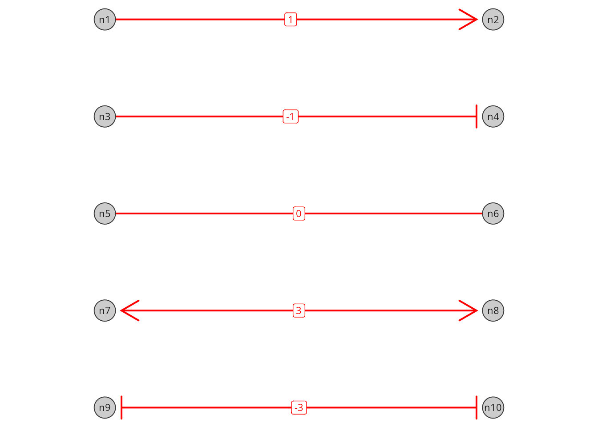
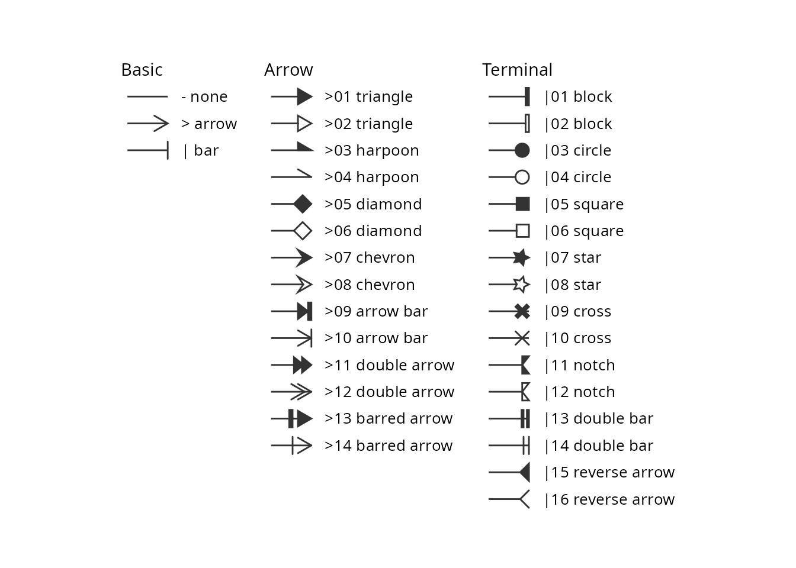
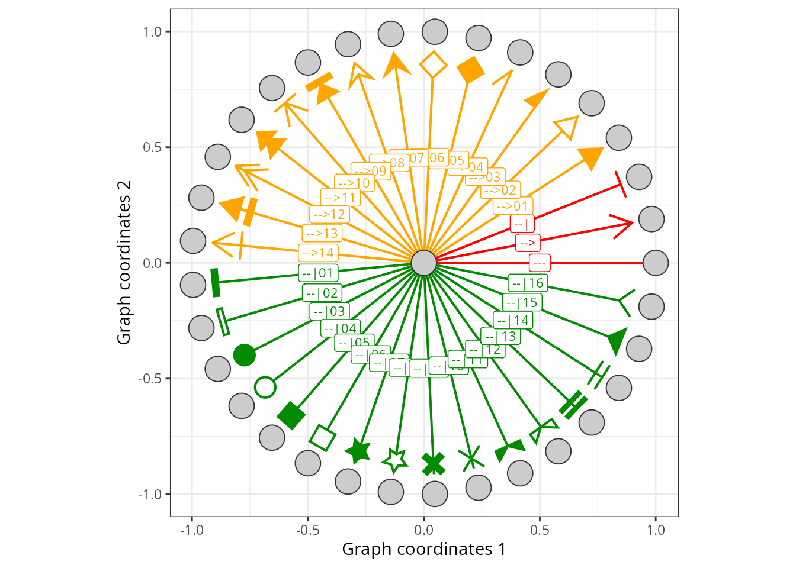
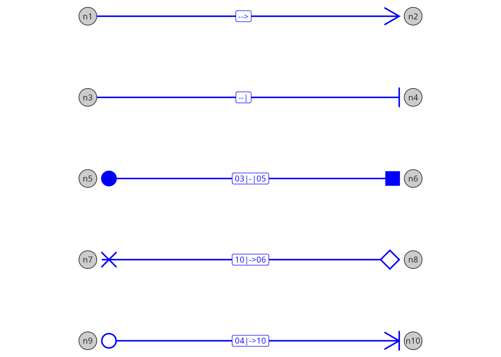

# Edge glyphs: Drawing symbols at edge ends

\

**Package**: RGraphSpace 1.5.6

``` r

# Check required version
if (packageVersion("RGraphSpace") < "1.5.6"){
  message("Need to update 'RGraphSpace' for this vignette")
  remotes::install_github("sysbiolab/RGraphSpace")
}
```

## Overview

Edge glyphs are the symbols drawn at the ends of an edge: arrowheads,
bars, and other shapes. In *RGraphSpace*, each edge carries an
`arrowType` code that names one glyph for its source end and one for its
target end, and
[`geom_edgespace()`](https://sysbiolab.github.io/RGraphSpace/reference/geom_edgespace.md)
draws them wherever the edge meets a node.

``` r

#--- Load packages
library("RGraphSpace")
library("igraph")
library("ggplot2")
library("patchwork")
```

## Three levels of glyph codes

Glyphs can be set at three levels, from the simplest to the most
expressive:

1.  **Integer codes**, such as `1` (arrow) or `-1` (bar), for common
    edge forms;
2.  **Basic token codes**, such as `"-->"` or `"--|"`, which provide a
    visual representation of the edge;
3.  **Extended token codes**, such as `"01<->01"`, which add modifiers
    (two-digit numbers) to select specific glyphs from the package’s
    collection.

Start with integer codes, use basic token codes when you want to see the
edge form in the code, and add modifiers when you need the extended
vocabulary.

### Set up a graph for demonstration

Here we use an undirected bipartite graph, where glyphs can be placed at
either end of an edge. The `arrowType` attribute can be set on the
*igraph* object before constructing the `GraphSpace`, or modified
afterwards using
[`gs_edge_attr()`](https://sysbiolab.github.io/RGraphSpace/reference/GraphSpace-attributes.md).

``` r

# Create a toy undirected bipartite graph with 10 nodes and 5 edges
g_bip <- make_bipartite_graph(1:10 %% 2, 1:10)

# Make a GraphSpace with a bipartite layout, rotated so that the
# bipartite connections run from left to right
gs_bip <- GraphSpace(g_bip, layout = layout_as_bipartite(g_bip))
#> Validating the 'igraph' object...
#> Vertex attribute 'name' missing; assigning names... 
#> Creating a 'GraphSpace' object...
gs_bip <- rotateGraphSpace(gs_bip)
#> Rotating raw coordinates 90 degrees clockwise...

# Undirected graphs default to "---" (no glyphs)
gs_edge_attr(gs_bip, "arrowType")
#> [1] "---" "---" "---" "---" "---"
```

### Integer codes

Integer codes are the simplest way to set the common edge forms, built
from arrows and bars:

- `0`, no glyphs;
- `1`, arrow at the end, and `-1`, bar at the end;
- `2`, arrow at the start, and `-2`, bar at the start;
- `3`, arrows at both ends, and `-3`, bars at both ends;
- `4`, bar at the start and arrow at the end, and `-4`, arrow at the
  start and bar at the end.

Directed graphs accept `0`, `1`, and `-1`, since only the end glyph is
drawn; undirected graphs accept all nine codes. Integer codes are stored
as given, so
[`gs_edge_attr()`](https://sysbiolab.github.io/RGraphSpace/reference/GraphSpace-attributes.md)
returns the integers rather than their token codes.

``` r

# Integer codes, one per edge
gs_edge_attr(gs_bip, "arrowType") <- c(1, -1, 0, 3, -3)
gs_edge_attr(gs_bip, "arrowType")
#> [1]  1 -1  0  3 -3
```

``` r

# Plot the graph; each edge is labelled with its integer code
ggplot(gs_bip) + 
  geom_edgespace(aes(label = arrowType), 
    label_size = 3, linewidth = 0.7, 
    arrow_size = 3, colour = "red") + 
  geom_nodespace(aes(label = name)) + 
  theme_void() + theme(aspect.ratio = 1)
```



### Basic token codes

Each integer code has an equivalent basic token code, which draws the
same form as a picture of the edge: `">"` is an arrow, `"|"` a bar, and
`"-"` no glyph. A code composes two tokens around a shaft as
*start*`-`*end*: the left token is drawn at the source end, the right
token at the target end. The start token is written mirrored, so `1` is
`"-->"`, `2` is `"<--"`, and `3` is `"<->"` (see
[`?GraphSpace`](https://sysbiolab.github.io/RGraphSpace/reference/GraphSpace-methods.md)
for the full table).

``` r

# The same forms as basic token codes
gs_edge_attr(gs_bip, "arrowType") <- c("-->", "--|", "---", "<->", "|-|")
gs_edge_attr(gs_bip, "arrowType")
#> [1] "-->" "--|" "---" "<->" "|-|"
```

### Extended token codes

Extended token codes add a *modifier* to a basic token: a two-digit
glyph number that refines the basic glyph into a shape of the same kind.
The basic token sets the kind, arrow (`">"`) or terminal (`"|"`), and
the modifier selects the glyph within it: `">01"` is a triangle, `">02"`
an open triangle, and `"|04"` a ring. Because modifiers are numbered
within each kind, the same number selects different glyphs for arrows
and terminals (`">07"` is a chevron, `"|07"` a star). At the start of a
code the modifier comes first, so `"01<->01"` has triangles at both
ends.

The levels can be mixed in the same attribute, so a single edge can be
upgraded without rewriting the others:

``` r

# Integer and token codes mixed in one attribute; all are stored as
# token codes
gs_edge_attr(gs_bip, "arrowType") <- c(1, -1, 0, "01<->01", "04|-|04")
gs_edge_attr(gs_bip, "arrowType")
#> [1] "-->"     "--|"     "---"     "01<->01" "04|-|04"
```

The next sections describe the glyph collection behind extended token
codes.

## The edge glyph collection

The
[`glyph_list()`](https://sysbiolab.github.io/RGraphSpace/reference/glyph_list.md)
function returns the edge glyphs available for use in `arrowType` codes.
The glyphs are organized into three groups: the basic glyphs, arrows,
and terminals. Arrows and terminals are numbered within their kind; most
shapes come in pairs of consecutive numbers, a filled form (odd)
followed by its open form (even), and shapes with a single form follow
the pairs.

``` r

# List the glyph vocabulary
glyph_lt <- glyph_list()

glyph_lt
#>    token          name    group     draw
#> 1      -          none    basic polyline
#> 2      >         arrow    basic polyline
#> 3      |           bar    basic segments
#> 4    >01      triangle    arrow  polygon
#> 5    >02      triangle    arrow polyline
#> 6    >03       harpoon    arrow  polygon
#> 7    >04       harpoon    arrow polyline
#> 8    >05       diamond    arrow  polygon
#> 9    >06       diamond    arrow polyline
#> 10   >07       chevron    arrow  polygon
#> 11   >08       chevron    arrow polyline
#> 12   >09     arrow bar    arrow  polygon
#> 13   >10     arrow bar    arrow segments
#> 14   >11  double arrow    arrow  polygon
#> 15   >12  double arrow    arrow segments
#> 16   >13  barred arrow    arrow  polygon
#> 17   >14  barred arrow    arrow segments
#> 18   |01         block terminal  polygon
#> 19   |02         block terminal polyline
#> 20   |03        circle terminal   circle
#> 21   |04        circle terminal polyline
#> 22   |05        square terminal  polygon
#> 23   |06        square terminal polyline
#> 24   |07          star terminal  polygon
#> 25   |08          star terminal polyline
#> 26   |09         cross terminal  polygon
#> 27   |10         cross terminal segments
#> 28   |11         notch terminal  polygon
#> 29   |12         notch terminal polyline
#> 30   |13    double bar terminal  polygon
#> 31   |14    double bar terminal segments
#> 32   |15 reverse arrow terminal  polygon
#> 33   |16 reverse arrow terminal polyline
```

``` r

# Plot the glyph collection
plot(glyph_lt, by_group = TRUE)
```



## Writing token codes

A token starts with `">"` for an arrow or `"|"` for a terminal,
optionally followed by a two-digit modifier. Codes combine a start and
an end token, for example:

- `"-->"`: arrow at the end;
- `"<->"`: arrows at both ends;
- `"01<->01"`: triangles at both ends;
- `"|->06"`: bar at the start, open diamond at the end;
- `"|03"`: circle at the end (stored as `"--|03"`).

A few rules apply to all token codes, basic or extended:

- **Standalone tokens** are read as the end token, e.g. `">01"` is
  stored as `"-->01"`.
- **Canonical form**: codes are stored with a single-dash shaft, so
  `"<-->01"` is stored as `"<->01"`.
- **Directed graphs** draw only the end glyph, so a start glyph is
  dropped with a warning; their default code is `"-->"`. Undirected
  graphs draw both ends; their default is `"---"`.
- **Invalid codes** fall back to the default, with a warning that
  explains the problem.

## Showing all glyphs on a graph

Next, we build a directed star graph with one edge per token, so that
every glyph is drawn at the tip of an edge. Each standalone token is
read as the end glyph of its edge.

``` r

# Make a directed star graph, pointing outward from a central node
gtoy_star <- make_star(nrow(glyph_lt)+1, mode="out")
  
# Assign glyph tokens to arrow types
E(gtoy_star)$arrowType <- glyph_lt$token

# Colour edges by glyph group; glyphs take attributes of their edge
groups <- unique(glyph_lt$group)
group_cols <- setNames(c("red","orange","green4"), groups)
E(gtoy_star)$edgeColor <- group_cols[glyph_lt$group]

# Make a GraphSpace, with a star layout
gs_star <- GraphSpace(gtoy_star, 
  layout = layout_as_star(gtoy_star))
#> Validating the 'igraph' object...
#> Vertex attribute 'name' missing; assigning names... 
#> Ignoring graph-level attributes: 'name', 'mode', 'center'
#> Creating a 'GraphSpace' object...

gs_star
#> A GraphSpace-class object for:
#> IGRAPH 416752b DN-- 34 33 -- 
#> + attr: x (v/n), y (v/n), name (v/c), nodeLabel (v/c), nodeSize (v/n),
#> | edgeColor (e/c), arrowType (e/c)
#> + node spatial boundaries: raw graph
#> | x: [-1, 1] (cols)
#> | y: [-1, 1] (rows)
```

``` r

# Plot the graph with glyphs; 'arrow_size' scales all glyphs, 
# and the 'label' aesthetic labels each edge with its token
ggplot(gs_star) + 
  geom_edgespace(aes(label = arrowType), label_size = 3, 
    linewidth = 0.7, arrow_size = 3) + 
  geom_nodespace() + 
  theme_gspace_coords(theme = theme_bw())
```



## Assigning glyphs to edges

Here we reuse the bipartite graph from the first section, now with
extended token codes at both ends of its edges.

``` r

# Assign one arrowType code per edge: the left token is drawn at the
# source end, the right token at the target end
gs_edge_attr(gs_bip, "arrowType") <- 
  c("->", "-|", "03|-|05", "10|->06", "04|->10")

# Codes are stored in canonical form
gs_edge_attr(gs_bip, "arrowType")
#> [1] "-->"     "--|"     "03|-|05" "10|->06" "04|->10"
```

``` r

# Plot the graph with the assigned glyphs
ggplot(gs_bip) + 
  geom_edgespace(aes(label = arrowType), 
    label_size = 3, linewidth = 0.7, 
    arrow_size = 3, colour = "blue") + 
  geom_nodespace(aes(label = name)) + 
  theme_void() + theme(aspect.ratio = 1)
```



\

## Explaining glyphs with a legend

Glyphs are not mapped to *ggplot2* aesthetics, so they never appear in a
*ggplot2* legend. Instead,
[`glyph_legend()`](https://sysbiolab.github.io/RGraphSpace/reference/glyph_legend.md)
draws a standalone legend with the same renderer used for edges, which
can be shown on its own or added to a plot.

``` r

# Get interaction types
interactions <- unique(gs_edge_attr(gs_bip, "arrowType"))

# Build the legend; optionally match edge colour and line width
leg <- glyph_legend(interactions, legend_title = "Interaction", 
  colour = "blue", linewidth = 0.7, ncol = 1)
plot(leg)
```


``` r

# Name each interaction type after its meaning
names(interactions) <- c('Activation' , 'Inhibition', 'Binding', 
  'Unknown', 'Transport')

# Build the legend
leg <- glyph_legend(interactions, legend_title = "Interaction", 
  colour = "blue", linewidth = 0.7, ncol = 1)
plot(leg)
```


The legend is a *grid* object, so it can be combined with a *ggplot*
using the *patchwork* package.

``` r

# Add the legend to the right of the plot (requires patchwork)
p <- ggplot(gs_bip) + 
  geom_edgespace(linewidth = 0.7, arrow_size = 3, colour = "blue") + 
  geom_nodespace(aes(label = name)) + 
  theme_void() + theme(aspect.ratio = 1)
p + leg + patchwork::plot_layout(widths = c(1, 0.2))
```


## Building new glyphs

Every glyph is a *prototype*, a small object holding a fixed shape, how
it is drawn, and the token that selects it. The built-in prototypes are
exported objects (`GlyphArrow1`, `GlyphChevron1`, …; see
[`?glyph_collection`](https://sysbiolab.github.io/RGraphSpace/reference/glyph_collection.md)).

The `shape` is a two-column matrix of points, described relative to the
edge end rather than to the plot. The first column (x) gives the
position along the edge, while the second (y) specifies the transverse
offset across the edge, with positive and negative values on opposite
sides. The origin is where the edge meets the node.

``` r

# The arrowhead, with one row per point (arm, tip, arm)
GlyphArrow$shape
#>      [,1]       [,2]
#> [1,]   -1  0.5773503
#> [2,]    0  0.0000000
#> [3,]   -1 -0.5773503
```

The same kind of matrix can be drawn in different ways, specified by the
prototype’s drawing primitive. The arrowhead is a `"polyline"`, so its
points are joined in order, from arm to tip to arm. The cross is drawn
as `"segments"`, which takes points in pairs, each pair forming one
stroke.

``` r

# The cross, with rows 1-2 forming one stroke 
# and rows 3-4 the other
GlyphCross1$shape
#>             [,1]       [,2]
#>  [1,] -0.8302944  0.5000000
#>  [2,] -0.5000000  0.1697056
#>  [3,] -0.1697056  0.5000000
#>  [4,]  0.0000000  0.3302944
#>  [5,] -0.3302944  0.0000000
#>  [6,]  0.0000000 -0.3302944
#>  [7,] -0.1697056 -0.5000000
#>  [8,] -0.5000000 -0.1697056
#>  [9,] -0.8302944 -0.5000000
#> [10,] -1.0000000 -0.3302944
#> [11,] -0.6697056  0.0000000
#> [12,] -1.0000000  0.3302944
GlyphCross1$draw
#> [1] "polygon"
```

Prototypes can be plotted for visual inspection, one or several side by
side.

``` r

# Plot three built-in prototypes side by side
plot(GlyphArrow, GlyphChevron1, GlyphCross1)
```


New prototypes are built with
[`glyph_proto()`](https://sysbiolab.github.io/RGraphSpace/reference/glyph_proto.md),
from a shape, a drawing primitive, and a token; open outlines can also
set an `offset`, so the edge line stops at the outline instead of
crossing it.

``` r

# A new glyph (reversed triangle)
m <- rbind(c(-1, 0), c(0, 0.6), c(0, -0.6))
new_glyph <- glyph_proto(shape = m, token = ">91", draw = "polygon")

# Compare with the built-in triangle
plot(GlyphTriangle1, new_glyph)
```


Glyphs built this way are for previewing only and cannot be used in
`arrowType` codes, because the vocabulary is fixed when the package
loads. New glyphs are added as package contributions, in the
`gspace-glyph-collection.R` source file, which contains the glyph
collection; see
[`?glyph_proto`](https://sysbiolab.github.io/RGraphSpace/reference/glyph_proto.md)
for details on the available drawing primitives and token rules.

\

## Session information

    #> R version 4.6.1 (2026-06-24)
    #> Platform: x86_64-pc-linux-gnu
    #> Running under: Ubuntu 24.04.5 LTS
    #> 
    #> Matrix products: default
    #> BLAS:   /usr/lib/x86_64-linux-gnu/openblas-pthread/libblas.so.3 
    #> LAPACK: /usr/lib/x86_64-linux-gnu/openblas-pthread/libopenblasp-r0.3.26.so;  LAPACK version 3.12.0
    #> 
    #> locale:
    #>  [1] LC_CTYPE=en_US.UTF-8       LC_NUMERIC=C              
    #>  [3] LC_TIME=en_US.UTF-8        LC_COLLATE=en_US.UTF-8    
    #>  [5] LC_MONETARY=en_US.UTF-8    LC_MESSAGES=en_US.UTF-8   
    #>  [7] LC_PAPER=en_US.UTF-8       LC_NAME=C                 
    #>  [9] LC_ADDRESS=C               LC_TELEPHONE=C            
    #> [11] LC_MEASUREMENT=en_US.UTF-8 LC_IDENTIFICATION=C       
    #> 
    #> time zone: America/Sao_Paulo
    #> tzcode source: system (glibc)
    #> 
    #> attached base packages:
    #> [1] stats     graphics  grDevices utils     datasets  methods   base     
    #> 
    #> other attached packages:
    #> [1] patchwork_1.3.2   igraph_2.3.3      RGraphSpace_1.5.6 ggplot2_4.0.3    
    #> 
    #> loaded via a namespace (and not attached):
    #>  [1] sass_0.4.10        generics_0.1.4     tidyr_1.3.2        lattice_0.23-1    
    #>  [5] digest_0.6.39      magrittr_2.0.5     evaluate_1.0.5     grid_4.6.1        
    #>  [9] RColorBrewer_1.1-3 fastmap_1.2.0      jsonlite_2.0.0     Matrix_1.7-6      
    #> [13] ggrastr_1.0.2      purrr_1.2.2        scales_1.4.0       textshaping_1.0.5 
    #> [17] jquerylib_0.1.4    cli_3.6.6          rlang_1.3.0        tidygraph_1.3.1   
    #> [21] withr_3.0.3        cachem_1.1.0       yaml_2.3.12        otel_0.2.0        
    #> [25] ggbeeswarm_0.7.3   tools_4.6.1        dplyr_1.2.1        vctrs_0.7.3       
    #> [29] R6_2.6.1           lifecycle_1.0.5    fs_2.1.0           htmlwidgets_1.6.4 
    #> [33] vipor_0.4.7        ragg_1.5.2         pkgconfig_2.0.3    beeswarm_0.4.0    
    #> [37] desc_1.4.3         pkgdown_2.2.0      pillar_1.11.1      bslib_0.11.0      
    #> [41] gtable_0.3.6       glue_1.8.1         systemfonts_1.3.2  xfun_0.59         
    #> [45] tibble_3.3.1       tidyselect_1.2.1   rstudioapi_0.19.0  knitr_1.51        
    #> [49] dichromat_2.0-1    farver_2.1.2       htmltools_0.5.9    labeling_0.4.3    
    #> [53] rmarkdown_2.32     compiler_4.6.1     S7_0.2.2
