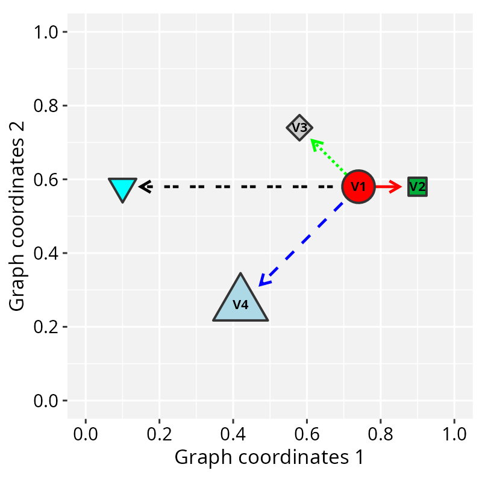
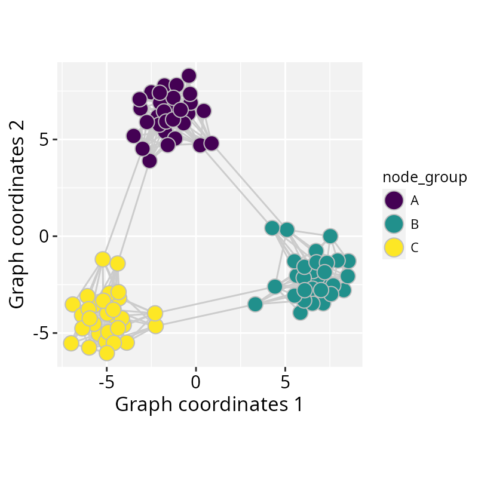
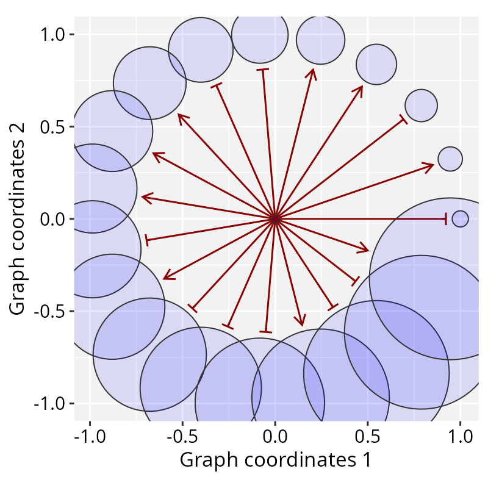
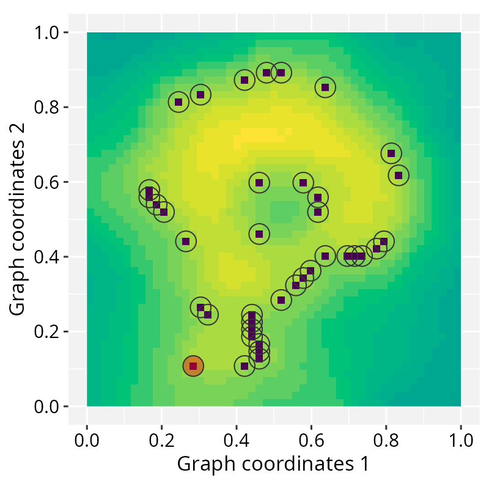

# Getting started with RGraphSpace

  
**Package**: RGraphSpace 1.2.3

## Introductory vignettes

These tutorials introduce *RGraphSpace* using simple toy examples:
[*building a graph
space*](https://sysbiolab.github.io/RGraphSpace/articles/building-graphspace.md)
walks through basic graph conventions; [*customizing
aesthetics*](https://sysbiolab.github.io/RGraphSpace/articles/using-geoms.md)
demonstrates how to set up `geoms` to handle graph data types; and
[*fine-tuning
scales*](https://sysbiolab.github.io/RGraphSpace/articles/scales-and-offsets.md)
describes the trade-offs involved in synchronizing node and edge layers.

###### Building GraphSpace

###### Customizing Aesthetics

###### Fine-tuning Scales

------------------------------------------------------------------------

## General applications

These tutorials showcase *RGraphSpace* applied to real-world scenarios:
[*mapping graphs to
images*](https://sysbiolab.github.io/RGraphSpace/articles/mapping-images.md)
illustrates the use of images as spatial references; [*interoperability
with ggraph &
sf*](https://sysbiolab.github.io/RGraphSpace/articles/interoperability.md)
details integration strategies; and [*interactive
visualization*](https://sysbiolab.github.io/RGraphSpace/articles/interactive.md)
demonstrates manual graph layout refinement.

###### Graphs to Images

###### Interoperability

###### Interactive Visualization

## Other examples

Vignettes illustrating how *RGraphSpace* can be used in combination with
*PathwaySpace* to project network signals.

- <https://sysbiolab.github.io/PathwaySpace/>
