# Getting Started with RGraphSpace

  
**Package**: RGraphSpace 1.5.3

For a self-contained introduction that works offline, run
**vignette(“RGraphSpace”)** after installing the package.

## Introductory vignettes

These tutorials introduce *RGraphSpace* using simple toy examples:
[*building a graph
space*](https://sysbiolab.github.io/RGraphSpace/articles/building-graphspace.md)
walks through basic graph conventions; [*customizing
aesthetics*](https://sysbiolab.github.io/RGraphSpace/articles/customizing-aesthetics.md)
demonstrates how to set up `geoms` to handle graph data types;
[*fine-tuning
scales*](https://sysbiolab.github.io/RGraphSpace/articles/scales-and-offsets.md)
describes the trade-offs involved in synchronizing node and edge layers;
and
[*geometries*](https://sysbiolab.github.io/RGraphSpace/articles/geometries.md)
demonstrates how to attach `sf` geometries to nodes as custom markers.

[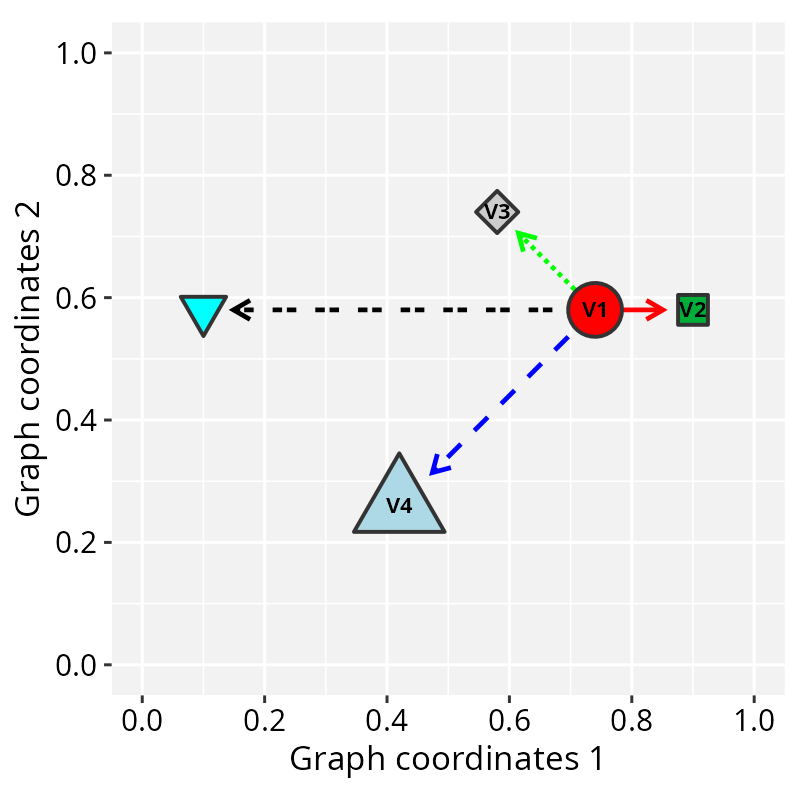](https://sysbiolab.github.io/RGraphSpace/articles/building-graphspace.md)

###### Building GraphSpace

[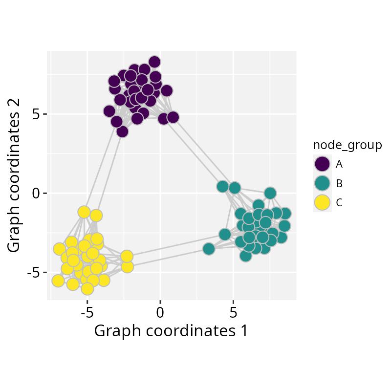](https://sysbiolab.github.io/RGraphSpace/articles/customizing-aesthetics.md)

###### Customizing Aesthetics

[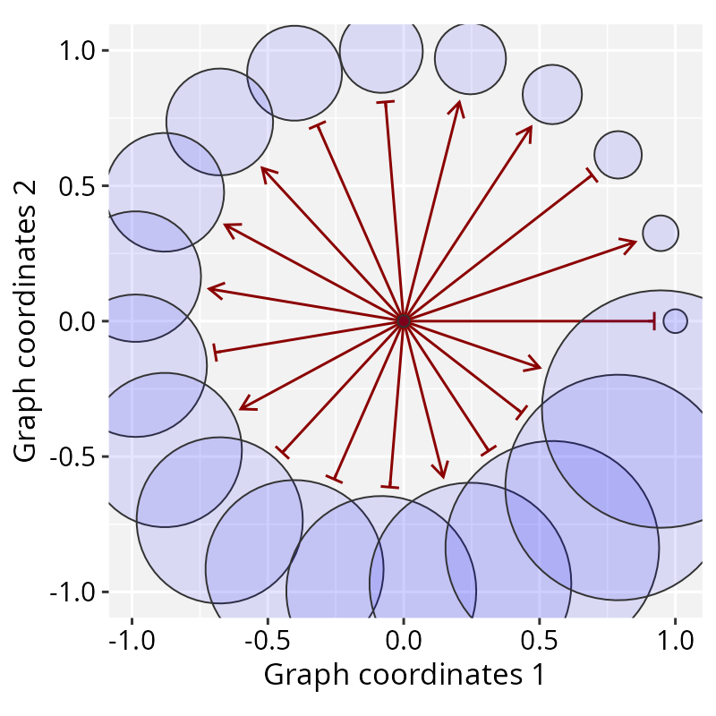](https://sysbiolab.github.io/RGraphSpace/articles/scales-and-offsets.md)

###### Fine-tuning Scales

[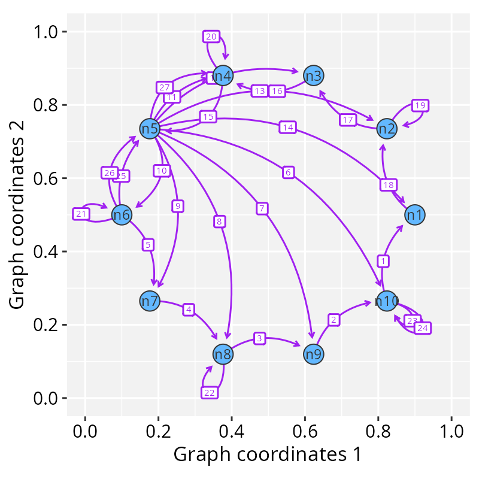](https://sysbiolab.github.io/RGraphSpace/articles/curved-edges.md)

###### Curved Edges and Loops

[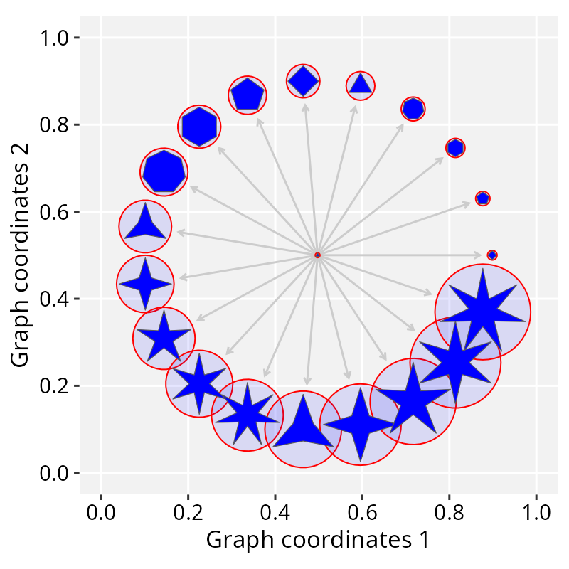](https://sysbiolab.github.io/RGraphSpace/articles/geometries.md)

###### Geometries and Nodes

------------------------------------------------------------------------

## General applications

These tutorials showcase *RGraphSpace* for general applications:
[*mapping graphs to
images*](https://sysbiolab.github.io/RGraphSpace/articles/mapping-images.md)
illustrates the use of images as spatial references; [*interoperability
with ggraph &
sf*](https://sysbiolab.github.io/RGraphSpace/articles/interoperability.md)
demonstrates some integration strategies, building a graph from
real-world geographic data and comparing it against `ggraph`’s own
layout approach; and [*interactive
visualization*](https://sysbiolab.github.io/RGraphSpace/articles/interactive.md)
demonstrates manual graph layout refinement.

[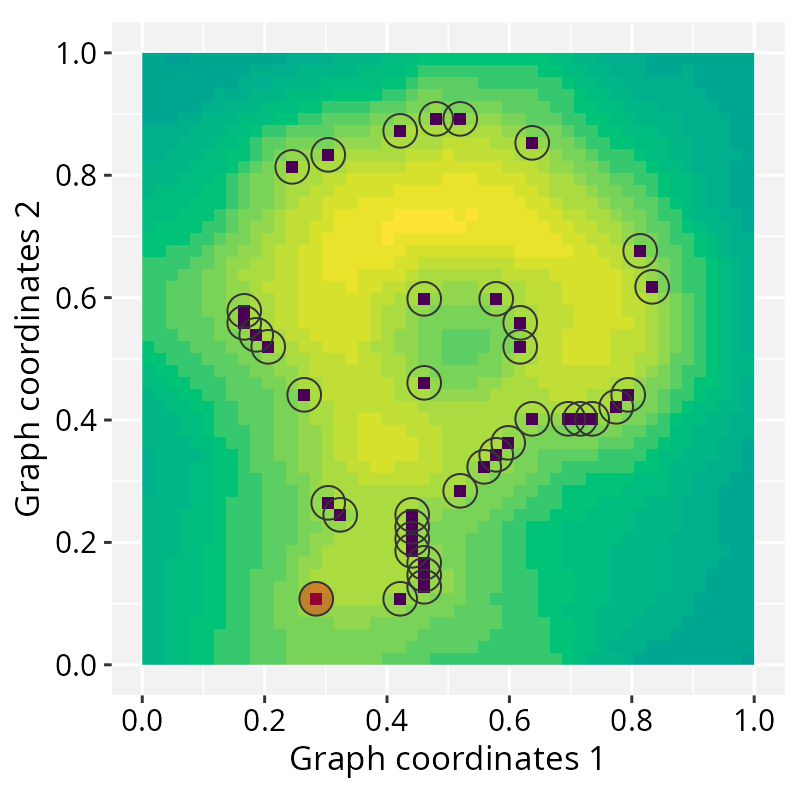](https://sysbiolab.github.io/RGraphSpace/articles/mapping-images.md)

###### Graphs to Images

###### Interoperability

[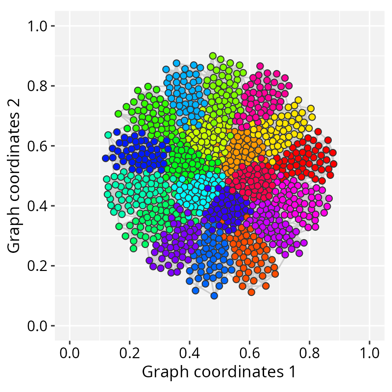](https://sysbiolab.github.io/RGraphSpace/articles/interactive.md)

###### Interactive Visualization

## Advanced workflows

These tutorials showcase *RGraphSpace* applied to real-world scenarios:
[*high-dimensional
data*](https://sysbiolab.github.io/RGraphSpace/articles/high-dimensional.md)
demonstrates how to integrate high-dimensional feature data; [*spatial
feature
data*](https://sysbiolab.github.io/RGraphSpace/articles/spatial-data.md)
shows how to attach those features to spatially-organized data;
[*spatial
segmentation1*](https://sysbiolab.github.io/RGraphSpace/articles/spatial-segmentation1.md)
walks through attaching real cell-segmentation boundaries to a
`GraphSpace` from a `Seurat` object; [*spatial
segmentation2*](https://sysbiolab.github.io/RGraphSpace/articles/spatial-segmentation2.md)
and [*spatial
segmentation2*](https://sysbiolab.github.io/RGraphSpace/articles/spatial-segmentation3.md)
demonstrate building a `GraphSpace` from a `SpatialExperiment` object,
including tissue image integration.

[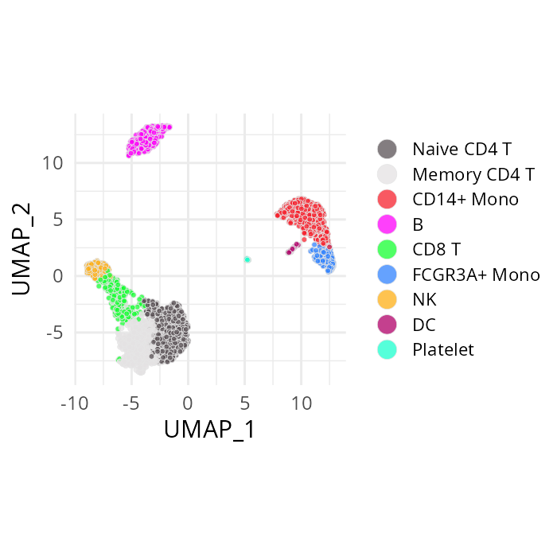](https://sysbiolab.github.io/RGraphSpace/articles/high-dimensional.md)

###### High-Dimensional Data

[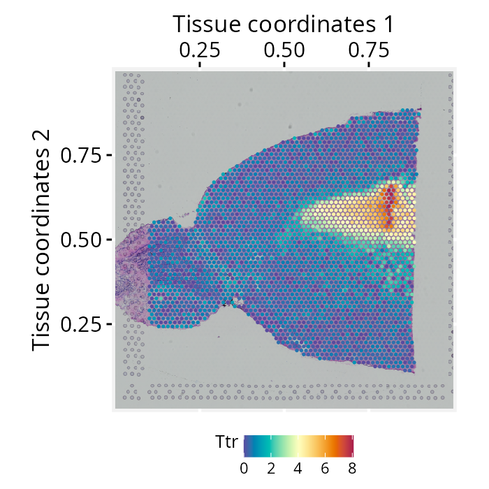](https://sysbiolab.github.io/RGraphSpace/articles/spatial-data.md)

###### Spatial Feature Data

[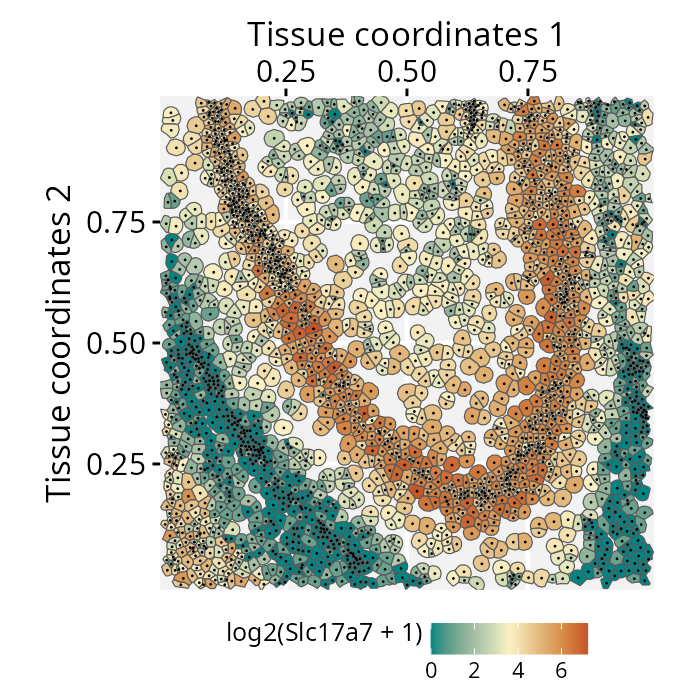](https://sysbiolab.github.io/RGraphSpace/articles/spatial-segmentation1.md)

###### Spatial Segmentation1

[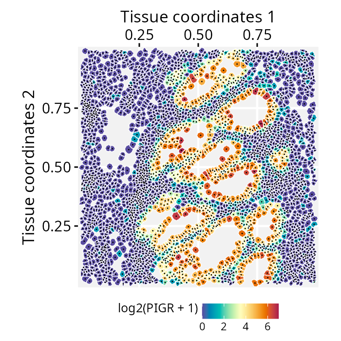](https://sysbiolab.github.io/RGraphSpace/articles/spatial-segmentation2.md)

###### Spatial Segmentation2

[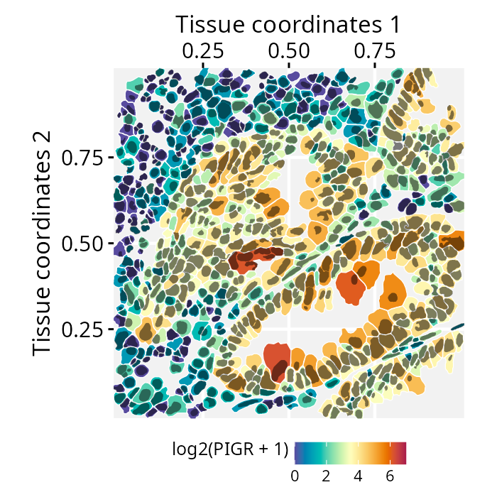](https://sysbiolab.github.io/RGraphSpace/articles/spatial-segmentation3.md)

###### Spatial Segmentation3

## *PathwaySpace* workflows

These tutorials illustrate how *RGraphSpace* integrates with
*PathwaySpace* to project and visualize network signals in a
high-dimensional context.

- [https://sysbiolab.github.io/PathwaySpace/](https://sysbiolab.github.io/PathwaySpace/)
