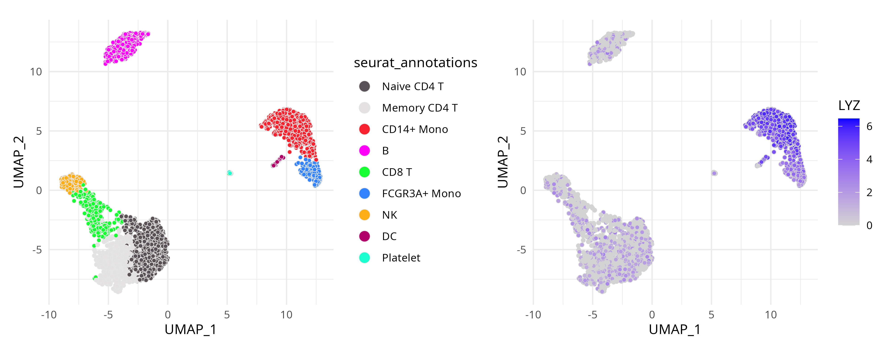

# Extending ggplot2 Grammar to High-Dimensional Data

**Package**: RGraphSpace 1.4.1  

## Overview

While developing *RGraphSpace*, the challenge of representing graph
structures in *ggplot2* highlighted a core design restriction: that
plotting data must be expressed in tabular form, typically as a single
`data.frame` (Wickham 2016). This approach works remarkably well for
most applications, but becomes too restrictive when dealing with data
objects composed of multiple interdependent components.

In this vignette, we explore how the `ggplot-GraphSpace` interface can
be applied to high-dimensional data, enabling direct interaction with
the *ggplot2* grammar and its aesthetic mapping mechanisms without
repeated conversion into flat tabular representations. We demonstrate
this approach using the *Seurat* package (Hao et al. 2024). `Seurat`
objects encapsulate multiple coordinated representations of single-cell
data, making them representative examples of high-dimensional data that
cannot be naturally expressed as a single `data.frame`.

## Before you start

This vignette assumes prior experience with
[*Seurat*](https://satijalab.org/seurat/) (Hao et al. 2024), especially
for handling transcriptomics data.

**Note:**
If you are new to *Seurat*, we recommend reviewing its [visualization
tutorials](https://satijalab.org/seurat/articles/visualization_vignette)
before proceeding.

**Computational requirement:**

- Hardware: RAM \>= 16 GB

- Software: R (\>=4.5) and RStudio

## Required packages


Before proceeding, ensure that all packages described in the
[*Installation
Instructions*](https://sysbiolab.github.io/RGraphSpace/articles/install.md)
are installed.

``` r

# Check versions
if (packageVersion("RGraphSpace") < "1.4.1"){
  message("Need to update 'RGraphSpace' for this vignette")
  remotes::install_github("sysbiolab/RGraphSpace")
}
if (packageVersion("Seurat") < "5.5.0"){
  message("Need to update 'Seurat' for this vignette")
  remotes::install_github("satijalab/Seurat")
}
```

## Setting input data

``` r

# Load packages
library("RGraphSpace")
library("Seurat")
library("SeuratObject")
library("SeuratData")
library("patchwork")
```

### Loading the dataset

We will use the `pbmc3k` dataset from the *SeuratData* package,
consisting of single-cell transcriptomics data from peripheral blood
mononuclear cells. This dataset is commonly used to showcase *Seurat*
workflows (Hao et al. 2024).

``` r

# Install a Seurat dataset (required only once)
SeuratData::InstallData("pbmc3k")
```

``` r

# Check manifest of installed datasets
SeuratData::InstalledData()

# Load the 'pbmc3k' dataset
seurat_obj <- LoadData("pbmc3k", type = "pbmc3k.final")
```

``` r

## Common Seurat preprocessing workflow.
## Shown for reference only, as the 'pbmc3k' 
## dataset has already been preprocessed.
# seurat_obj <- NormalizeData(seurat_obj)
# seurat_obj <- ScaleData(seurat_obj)
# seurat_obj <- FindVariableFeatures(seurat_obj)
# seurat_obj <- RunPCA(seurat_obj)
# seurat_obj <- RunUMAP(seurat_obj, dims = 1:30)
```

## *Seurat* reference plots

Before introducing the `ggplot-GraphSpace` interface, we first reproduce
two typical *Seurat* visualizations: a cluster-level embedding
(`DimPlot`) and a feature expression map (`FeaturePlot`). These examples
provide a useful baseline for the corresponding visualizations
constructed later with `ggplot-GraphSpace`.

``` r

cpal <- DiscretePalette(nlevels(seurat_obj$seurat_annotations), 
  palette = "polychrome")

# Left: cluster-level embedding
p1 <- DimPlot(seurat_obj, pt.size = 1, cols = cpal) + 
  theme_minimal() + theme(aspect.ratio = 1)

# Right: feature expression map
p2 <- FeaturePlot(seurat_obj, features = "LYZ", 
  cols = c("lightgrey", "blue"), pt.size = 1) + 
  theme_minimal() + theme(aspect.ratio = 1)

p1 + p2
```


Note that `DimPlot` and `FeaturePlot` are high-level functions.
Internally, *Seurat* extracts the relevant data and generates `ggplot`
objects. While convenient, the underlying data structures are not
directly exposed to the user, making advanced use of the *ggplot2*
grammar more difficult. For example, defining custom aesthetic mappings
or interoperating with other visualization workflows would require extra
data extraction steps.

## Exposing the *ggplot2* grammar

We now apply
[`as.GraphSpace()`](https://sysbiolab.github.io/RGraphSpace/reference/as.GraphSpace.md)
to expose the `Seurat` object’s underlying high-dimensional data
directly to *ggplot2* (for additional details, see the [*coercing
high-dimensional
data*](https://sysbiolab.github.io/RGraphSpace/articles/high-dimensional.html#hd-coercion)
section).

``` r

# Create a GraphSpace from 'seurat_obj'
gs <- as.GraphSpace(seurat_obj, space = "embedding", reduction = "umap")

gs
# A GraphSpace-class object for:
# IGRAPH 1393201 UN-- 2638 0 -- 
# + attr: x (v/n), y (v/n), name (v/c), nodeLabel (v/c), nodeSize (v/n), orig.ident (v/x),
# | nCount_RNA (v/n), nFeature_RNA (v/n), seurat_annotations (v/x), percent.mt (v/n),
# | RNA_snn_res.0.5 (v/x), seurat_clusters (v/x), arrowType (e/n)
# + features: 13714 (AL627309.1, AP006222.2, RP11-206L10.2, RP11-206L10.9, ...)
```

With the `GraphSpace` object ready, we reproduce the same plots using
*ggplot2* geoms and aesthetic mappings.

``` r

cpal <- DiscretePalette(nlevels(gs$seurat_annotations), 
  palette = "polychrome")

# Left: cluster-level embedding
p3 <- ggplot(gs) + 
  geom_nodespace(mapping = aes(fill = seurat_annotations),
    size = 1.5, color = "grey90", stroke = 0.3) +
  scale_fill_manual(values = cpal) +
  labs(x = "UMAP_1", y = "UMAP_2") +
  theme_gspace_legend(discrete_fill = TRUE) +
  theme_minimal() + theme(aspect.ratio = 1)

# Right: feature expression map
p4 <- ggplot(gs) + 
  geom_nodespace(mapping = aes(fill = LYZ), 
    size = 1.5, color = "lightgrey", stroke = 0.3) +
  scale_fill_continuous(palette = c("lightgrey", "blue")) +
  labs(x = "UMAP_1", y = "UMAP_2")  +
  theme_minimal() + theme(aspect.ratio = 1)

p3 + p4
```



The resulting plots are essentially the same, but users now have full
flexibility to interact directly with the *ggplot2* grammar and its rich
ecosystem of extensions and companion packages.

## Coercing high-dimensional data

The
[`as.GraphSpace()`](https://sysbiolab.github.io/RGraphSpace/reference/as.GraphSpace.md)
function provides a convenient way to coerce high-dimensional data into
a `GraphSpace` object. However, no coercion method can anticipate every
possible data structure. Below, we show how to access the relevant
components of a `Seurat` object and use them to construct a `GraphSpace`
manually. For another coercion example, see the [*spatial
data*](https://sysbiolab.github.io/RGraphSpace/articles/spatial-data.html#sp-coercion)
tutorial.

``` r

# Extract UMAP embeddings as node coordinates
coords <- Embeddings(seurat_obj, reduction = "umap")
coords <- coords[, seq_len(2)] |> as.data.frame()
colnames(coords) <- c("x", "y")

# Extract cell metadata
metadata <- seurat_obj[[]]

# Merge coordinates and metadata using common cell identifiers
ids <- intersect(rownames(coords), rownames(metadata))
coords <- cbind(coords[ids, ], metadata[ids, ])

# Construct a GraphSpace object
# Metadata become node attributes
gs <- GraphSpace(coords)

# Add high-dimensional feature data
# Stored separately for lazy aesthetic mapping
gs_fdata(gs) <- SeuratObject::LayerData(seurat_obj, layer = "data")

# Optional: normalize node coordinates
gs <- normalizeGraphSpace(gs, mar = 0.01)
```

## Session information

    #> R version 4.6.0 (2026-04-24)
    #> Platform: x86_64-pc-linux-gnu
    #> Running under: Ubuntu 24.04.4 LTS
    #> 
    #> Matrix products: default
    #> BLAS:   /usr/lib/x86_64-linux-gnu/openblas-pthread/libblas.so.3 
    #> LAPACK: /usr/lib/x86_64-linux-gnu/openblas-pthread/libopenblasp-r0.3.26.so;  LAPACK version 3.12.0
    #> 
    #> locale:
    #>  [1] LC_CTYPE=en_US.UTF-8       LC_NUMERIC=C              
    #>  [3] LC_TIME=en_US.UTF-8        LC_COLLATE=en_US.UTF-8    
    #>  [5] LC_MONETARY=en_US.UTF-8    LC_MESSAGES=en_US.UTF-8   
    #>  [7] LC_PAPER=en_US.UTF-8       LC_NAME=C                 
    #>  [9] LC_ADDRESS=C               LC_TELEPHONE=C            
    #> [11] LC_MEASUREMENT=en_US.UTF-8 LC_IDENTIFICATION=C       
    #> 
    #> time zone: America/Sao_Paulo
    #> tzcode source: system (glibc)
    #> 
    #> attached base packages:
    #> [1] stats     graphics  grDevices utils     datasets  methods   base     
    #> 
    #> other attached packages:
    #>  [1] patchwork_1.3.2           stxBrain.SeuratData_0.1.2
    #>  [3] ssHippo.SeuratData_3.1.4  pbmc3k.SeuratData_3.1.4  
    #>  [5] SeuratData_0.2.2.9002     Seurat_5.5.0             
    #>  [7] SeuratObject_5.4.0        sp_2.2-1                 
    #>  [9] RGraphSpace_1.4.1         ggplot2_4.0.3            
    #> 
    #> loaded via a namespace (and not attached):
    #>   [1] RColorBrewer_1.1-3     rstudioapi_0.18.0      jsonlite_2.0.0        
    #>   [4] magrittr_2.0.5         spatstat.utils_3.2-3   ggbeeswarm_0.7.3      
    #>   [7] farver_2.1.2           rmarkdown_2.31         fs_2.1.0              
    #>  [10] ragg_1.5.2             vctrs_0.7.3            ROCR_1.0-12           
    #>  [13] spatstat.explore_3.8-1 htmltools_0.5.9        sass_0.4.10           
    #>  [16] sctransform_0.4.3      parallelly_1.47.0      KernSmooth_2.23-26    
    #>  [19] bslib_0.11.0           htmlwidgets_1.6.4      desc_1.4.3            
    #>  [22] ica_1.0-3              fontawesome_0.5.3      plyr_1.8.9            
    #>  [25] plotly_4.12.0          zoo_1.8-15             cachem_1.1.0          
    #>  [28] igraph_2.3.2           mime_0.13              lifecycle_1.0.5       
    #>  [31] pkgconfig_2.0.3        Matrix_1.7-5           R6_2.6.1              
    #>  [34] fastmap_1.2.0          fitdistrplus_1.2-6     future_1.70.0         
    #>  [37] shiny_1.13.0           digest_0.6.39          tensor_1.5.1          
    #>  [40] RSpectra_0.16-2        irlba_2.3.7            textshaping_1.0.5     
    #>  [43] progressr_0.19.0       spatstat.sparse_3.2-0  httr_1.4.8            
    #>  [46] polyclip_1.10-7        abind_1.4-8            compiler_4.6.0        
    #>  [49] withr_3.0.2            S7_0.2.2               fastDummies_1.7.6     
    #>  [52] MASS_7.3-65            rappdirs_0.3.4         tools_4.6.0           
    #>  [55] vipor_0.4.7            lmtest_0.9-40          otel_0.2.0            
    #>  [58] beeswarm_0.4.0         httpuv_1.6.17          future.apply_1.20.2   
    #>  [61] goftest_1.2-3          glue_1.8.1             nlme_3.1-169          
    #>  [64] promises_1.5.0         grid_4.6.0             Rtsne_0.17            
    #>  [67] cluster_2.1.8.2        reshape2_1.4.5         generics_0.1.4        
    #>  [70] gtable_0.3.6           spatstat.data_3.1-9    tidyr_1.3.2           
    #>  [73] data.table_1.18.4      tidygraph_1.3.1        spatstat.geom_3.8-1   
    #>  [76] RcppAnnoy_0.0.23       ggrepel_0.9.8          RANN_2.6.2            
    #>  [79] pillar_1.11.1          stringr_1.6.0          spam_2.11-4           
    #>  [82] RcppHNSW_0.7.0         later_1.4.8            splines_4.6.0         
    #>  [85] dplyr_1.2.1            lattice_0.22-9         survival_3.8-6        
    #>  [88] deldir_2.0-4           tidyselect_1.2.1       miniUI_0.1.2          
    #>  [91] pbapply_1.7-4          knitr_1.51             gridExtra_2.3         
    #>  [94] scattermore_1.2        xfun_0.58              matrixStats_1.5.0     
    #>  [97] stringi_1.8.7          lazyeval_0.2.3         yaml_2.3.12           
    #> [100] evaluate_1.0.5         codetools_0.2-20       tibble_3.3.1          
    #> [103] cli_3.6.6              uwot_0.2.4             xtable_1.8-8          
    #> [106] reticulate_1.46.0      systemfonts_1.3.2      jquerylib_0.1.4       
    #> [109] Rcpp_1.1.1-1.1         globals_0.19.1         spatstat.random_3.5-0 
    #> [112] png_0.1-9              ggrastr_1.0.2          spatstat.univar_3.2-0 
    #> [115] parallel_4.6.0         pkgdown_2.2.0          dotCall64_1.2         
    #> [118] listenv_0.10.1         viridisLite_0.4.3      scales_1.4.0          
    #> [121] ggridges_0.5.7         crayon_1.5.3           purrr_1.2.2           
    #> [124] rlang_1.2.0            cowplot_1.2.0

Hao, Yuhan, Tim Stuart, Madeline H Kowalski, et al. 2024. “Dictionary
Learning for Integrative, Multimodal and Scalable Single-Cell Analysis.”
*Nature Biotechnology* 42 (2): 293–304.
<https://doi.org/10.1038/s41587-023-01767-y>.

Wickham, Hadley. 2016. *Ggplot2: Elegant Graphics for Data Analysis*.
Springer-Verlag New York. <https://ggplot2.tidyverse.org>.
