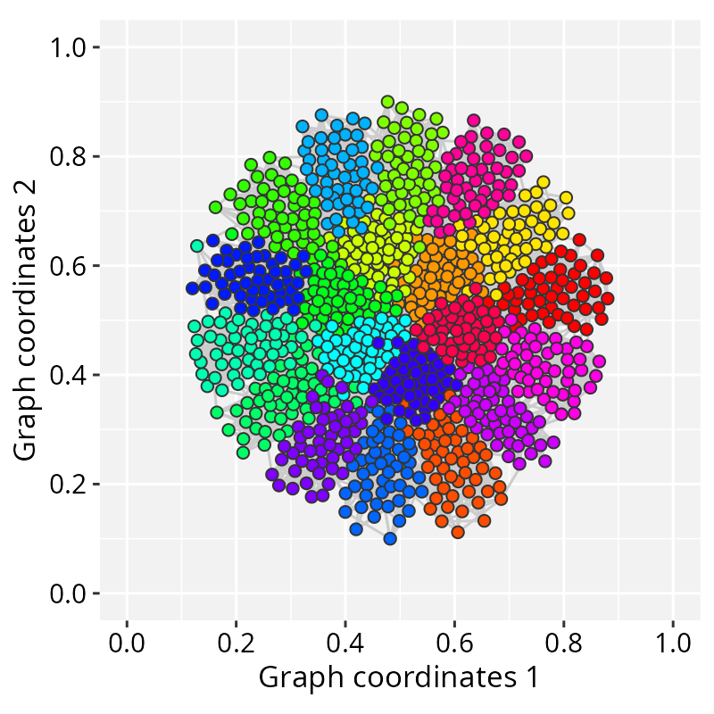

# Interactive visualization

  
**Package**: RGraphSpace 1.2.3

## Overview

While static plots are essential for documentation and publication,
interactive visualization allows us to explore the local neighborhoods
and global architecture of a network in real-time. By connecting
*RGraphSpace* with specialized interactive tools, we can move beyond
fixed layouts to dynamic manipulation.

The following example demonstrates interoperability between
*RGraphSpace* and *RedeR*, an R/Bioconductor package for interactive
network visualization and manipulation.

``` r

# Install RedeR, a graph package for interactive visualization
if(!require("BiocManager", quietly = TRUE)){
  install.packages("BiocManager")
}
if(!require("RedeR", quietly = TRUE)){
  BiocManager::install("RedeR")
}
```

## System requirements

*RedeR* will need the Java Runtime Environment (JRE; version \>=11). To
ensure your environment is ready, you can check the installed Java
version directly from R:

``` r

library("RedeR")
RedPort(checkJava=TRUE)
# RedeR will need Java Runtime Environment (Java >=11)
# Checking Java version installed on this system...
# openjdk version "21.0.10" 2026-01-20
# OpenJDK Runtime Environment (build 21.0.10+7-Ubuntu-124.04)
# OpenJDK 64-Bit Server VM (build 21.0.10+7-Ubuntu-124.04, mixed mode, sharing)

# Note: The output may vary, but ensure your system meets the minimum requirement.
```

## A ‘round-trip’ workflow

Before jumping into the interactive interface, we can use a standard
*RGraphSpace* call to verify the graph’s structure and current layout.
This provides a baseline for comparison once we start modifying the
network dynamically.

``` r

library("RedeR")
library("RGraphSpace")
library("igraph")
data(gtoy1, package = "RGraphSpace")
plotGraphSpace(gtoy1, add.labels = TRUE)
```


The main advantage of this interoperability comes from the “round-trip”
workflow. You can send a graph space to *RedeR*, use its force-directed
algorithms to manually refine the layout, and then pull that updated
geometry back into **R** for further analysis and plotting with
*ggplot2*.

The following steps demonstrate the launch, manipulation, and retrieval
process:

``` r

# Launch the RedeR application
startRedeR()
resetRedeR()

# Send 'gtoy1' to the RedeR interface
addGraphToRedeR(gtoy1, unit="npc")
relaxRedeR()

# Fetch 'gtoy1' with a fresh layout
gtoy1_2 <- getGraphFromRedeR(unit="npc")

# Check the round trip...
plotGraphSpace(gtoy1_2, add.labels = TRUE)

## Note that for the round trip, shapes and line types are
## partially compatible between ggplot2 and RedeR.

# ...alternatively, just update the graph layout
gtoy1_2 <- updateLayoutFromRedeR(g=gtoy1)

# ...check the updated layout
plotGraphSpace(gtoy1_2, add.labels = TRUE)
```


## Fine-tuning large graphs

Large networks frequently present layout challenges. In such scenarios,
automated static layouts may not resolve visual clutter, making
interactive adjustments essential for graph clarity and spatial
organization.

The following example demonstrates how to project a large modular graph
into `RGraphSpace` using a combination of automated layouts and
interactive refinement.

``` r

# Make a large modular graph
nmod = 20
size = 50
gtoy2 <- sample_islands(
  islands.n = nmod,     # number of modules
  islands.size = size,  # nodes per module
  islands.pin = 0.25,   # edges within modules (prob)
  n.inter = 5)          # edges between modules

# Assign module membership
V(gtoy2)$module <- rep(seq_len(nmod), each = size)

# Assign colors and node size
V(gtoy2)$nodeColor <- rainbow(nmod)[V(gtoy2)$module]
V(gtoy2)$nodeSize <- 2
  
# Assign numeric variables to nodes and edges
gs_gtoy2 <- GraphSpace(gtoy2, layout = layout_with_kk(gtoy2))

plotGraphSpace(gs_gtoy2)
```


The layout can then be fine-tuned interactively:

``` r

# Launch the RedeR application
startRedeR()
resetRedeR()

# Send 'gtoy2' to the RedeR interface
addGraphToRedeR(gs_graph(gs_gtoy2), unit="npc")

#--- Fine-tune the force-directed layout:
# p1: edge target length (default = 100)
# p2: edge stiffness (default = 100)
# p5: node movement limit (default = 100)
relaxRedeR(p1 = 10, p2 = 50, p5 = 1)

# Update the graph layout
gtoy2_2 <- updateLayoutFromRedeR(g=gs_graph(gs_gtoy2))

# ...check the updated layout
plotGraphSpace(gtoy2_2, add.labels = FALSE)
```



## Session information

    #> R version 4.6.0 (2026-04-24)
    #> Platform: x86_64-pc-linux-gnu
    #> Running under: Ubuntu 24.04.4 LTS
    #> 
    #> Matrix products: default
    #> BLAS:   /usr/lib/x86_64-linux-gnu/openblas-pthread/libblas.so.3 
    #> LAPACK: /usr/lib/x86_64-linux-gnu/openblas-pthread/libopenblasp-r0.3.26.so;  LAPACK version 3.12.0
    #> 
    #> locale:
    #>  [1] LC_CTYPE=en_US.UTF-8       LC_NUMERIC=C              
    #>  [3] LC_TIME=en_US.UTF-8        LC_COLLATE=en_US.UTF-8    
    #>  [5] LC_MONETARY=en_US.UTF-8    LC_MESSAGES=en_US.UTF-8   
    #>  [7] LC_PAPER=en_US.UTF-8       LC_NAME=C                 
    #>  [9] LC_ADDRESS=C               LC_TELEPHONE=C            
    #> [11] LC_MEASUREMENT=en_US.UTF-8 LC_IDENTIFICATION=C       
    #> 
    #> time zone: America/Sao_Paulo
    #> tzcode source: system (glibc)
    #> 
    #> attached base packages:
    #> [1] stats     graphics  grDevices utils     datasets  methods   base     
    #> 
    #> other attached packages:
    #> [1] igraph_2.3.1      RGraphSpace_1.2.3 ggplot2_4.0.3     RedeR_3.8.0      
    #> 
    #> loaded via a namespace (and not attached):
    #>  [1] gtable_0.3.6       jsonlite_2.0.0     dplyr_1.2.1        compiler_4.6.0    
    #>  [5] tidyselect_1.2.1   ggbeeswarm_0.7.3   tidyr_1.3.2        jquerylib_0.1.4   
    #>  [9] systemfonts_1.3.2  scales_1.4.0       textshaping_1.0.5  yaml_2.3.12       
    #> [13] fastmap_1.2.0      R6_2.6.1           labeling_0.4.3     generics_0.1.4    
    #> [17] knitr_1.51         htmlwidgets_1.6.4  tibble_3.3.1       desc_1.4.3        
    #> [21] bslib_0.10.0       pillar_1.11.1      RColorBrewer_1.1-3 rlang_1.2.0       
    #> [25] cachem_1.1.0       xfun_0.57          fs_2.1.0           sass_0.4.10       
    #> [29] S7_0.2.2           otel_0.2.0         cli_3.6.6          withr_3.0.2       
    #> [33] pkgdown_2.2.0      magrittr_2.0.5     digest_0.6.39      grid_4.6.0        
    #> [37] rstudioapi_0.18.0  beeswarm_0.4.0     lifecycle_1.0.5    vipor_0.4.7       
    #> [41] ggrastr_1.0.2      vctrs_0.7.3        evaluate_1.0.5     glue_1.8.1        
    #> [45] farver_2.1.2       ragg_1.5.2         tidygraph_1.3.1    purrr_1.2.2       
    #> [49] rmarkdown_2.31     tools_4.6.0        pkgconfig_2.0.3    htmltools_0.5.9
