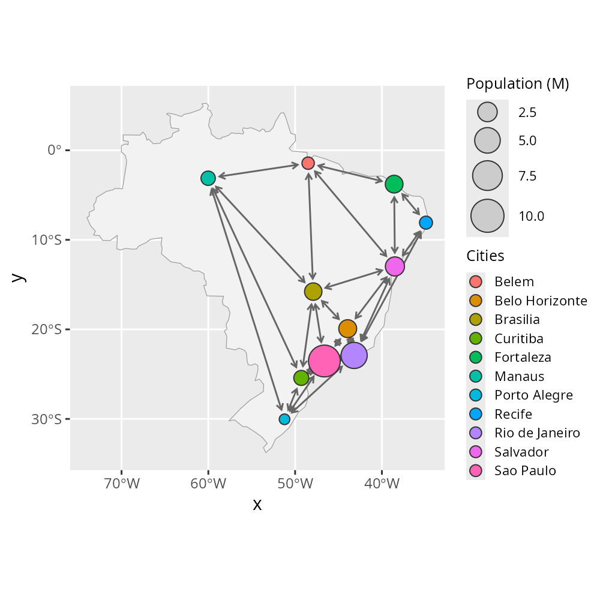

# Interoperability with 'ggraph' and 'sf'

  
**Package**: RGraphSpace 1.3.0

## Overview

*RGraphSpace* is designed to be a seamless extension to existing network
analysis workflows, not a replacement. Whether using *igraph* for
heavy-duty computations or *tidygraph* for tidy data manipulation,
*RGraphSpace* `geoms` automatically recognize these objects on the fly.
The main motivation behind *RGraphSpace* was to address the challenge of
scaling network elements without disrupting alignment with image
features. For practical examples, see [*mapping graphs to
images*](https://sysbiolab.github.io/RGraphSpace/articles/mapping-images.md);
see also [*PathwaySpace*](https://sysbiolab.github.io/PathwaySpace/)
tutorials for use-case scenarios involving reference image backgrounds.

**Why use *RGraphSpace* with *ggraph*?**

While *ggraph* is a wonderful framework for relational data, precise
edge-node alignment requires additional handling when node sizes vary
dynamically. This limitation arises from a fundamental trade-off in
*ggplot2*: scaling the point `size` aesthetic is tied to a fixed
physical legend representation, causing node dimensions to depend on
device scaling rather than the normalized coordinate space. For most
applications this is not an issue, but it becomes critical when graphs
must be spatially aligned with reference images. *RGraphSpace* addresses
this through specialized `geoms` that automatically compensate for
alignment shifts introduced by node scaling. The trade-off for this
higher level of automation is that the user has fewer customization
options compared to the *ggraph* approach. This is exactly why using
*RGraphSpace* alongside *ggraph* makes sense: it provides precise
spatial alignment between graph elements and reference backgrounds while
preserving interoperability with the extensive layout and styling
flexibility of the *ggraph* grammar.

## Required packages

``` r

# Check required packages for this vignette
if(!require("sf", quietly = TRUE)){
  install.packages("sf")
}
if(!require("maps", quietly = TRUE)){
  install.packages("maps")
}
if(!require("geometry", quietly = TRUE)){
  install.packages("geometry")
}
if(!require("rnaturalearth", quietly = TRUE)){
  install.packages("rnaturalearth")
}
if(!require("tidygraph", quietly = TRUE)){
  install.packages("tidygraph")
}
if(!require("ggraph", quietly = TRUE)){
  install.packages("ggraph")
}
```

``` r

# Load packages
library("RGraphSpace")
library("igraph")
library("sf")
library("maps")
library("geometry")
library("rnaturalearth")
library("tidygraph")
library("ggraph")
```

## Setting basic input data

The following example demonstrates the interoperability between
*RGraphSpace* and *ggraph* using both *igraph* and *tidygraph* objects,
and managing spatial data with *sf*, the standard infrastructure for
spatial data analysis in `R` (Pebesma and Bivand 2023). Integrating
network structures with spatial data often creates a headache with
mismatched coordinate systems and scales, which makes this example
particularly interesting to showcase how these packages handle that
complexity.

Next, we build a spatial network of cities; then *RGraphSpace* `geoms`
are plugged into *ggraph* and *sf* workflows.

``` r

# Load a map and transform projection
map_sf <- ne_countries(country = "Brazil", returnclass = "sf")
map_proj <- st_transform(map_sf)

# Filter major cities by regional capitals
data(world.cities, package = "maps")
r_capitals <- c(
  "Aracaju", "Belem", "Belo Horizonte", "Boa Vista", "Brasilia", 
  "Campo Grande", "Cuiaba", "Curitiba", "Florianopolis", "Fortaleza", 
  "Goiania", "Joao Pessoa", "Macapa", "Maceio", "Manaus", "Natal", 
  "Palmas", "Porto Alegre", "Porto Velho", "Recife", "Rio Branco", 
  "Rio de Janeiro", "Salvador", "Sao Luis", "Sao Paulo", "Teresina", 
  "Vitoria"
)
cities <- subset(world.cities, country.etc == "Brazil" & 
    name %in% r_capitals & pop > 1200000)

# Create Delaunay triangulation edges
# Note: the edges hold no particular meaning beyond
# demonstrating integration between coordinate systems
tri <- delaunayn(cities[,c("lat","long")])
edges <- unique(rbind(tri[,c(1,2)], tri[,c(2,3)], tri[,c(1,3)] ))

# Build an 'igraph' using city coordinates
igraph_cities <- igraph::graph_from_edgelist(edges, directed = FALSE)
igraph::V(igraph_cities)$x <- cities$long
igraph::V(igraph_cities)$y <- cities$lat
igraph::V(igraph_cities)$Cities <- cities$name
igraph::V(igraph_cities)$`Population (M)` <- cities$pop/1000000
igraph::E(igraph_cities)$arrowType <- 3
```

## Different input, same output

The following options all produce the same visual output, demonstrating
how these packages integrate different types of input data.

``` r

# Option 1: Passing an 'igraph' object directly to the geoms
ggplot() +
  geom_sf(data = map_proj, fill = "grey95", color = "grey60") +
  geom_edgespace(color = "grey40", arrow_size = 0.5, data = igraph_cities) +
  geom_nodespace(aes(fill = Cities, size = `Population (M)`), data = igraph_cities) +
  scale_size(range = c(3, 9)) +
  inject_nodespace() + 
  theme_gray() +
  theme_gspace_legend(key_fill = TRUE)

# Option 2: Passing a 'tbl_graph' object
gr <- as_tbl_graph(igraph_cities)
ggplot() +
  geom_sf(data = map_proj, fill = "grey95", color = "grey60") +
  geom_edgespace(color = "grey40", arrow_size = 0.5, data = gr) +
  geom_nodespace(aes(fill = Cities, size = `Population (M)`), data = gr) +
  scale_size(range = c(3, 9)) +
  inject_nodespace() + 
  theme_gray() +
  theme_gspace_legend(key_fill = TRUE)

# Option 3: Integration within a 'ggraph' workflow
gr <- as_tbl_graph(igraph_cities)
ggraph(graph = gr, x= gr$x, y = gr$y) +
  geom_sf(data = map_proj, fill = "grey95", color = "grey60") +
  geom_edgespace(color = "grey40", arrow_size = 0.5) +
  geom_nodespace(aes(fill = Cities, size = `Population (M)`)) +
  scale_size(range = c(3, 9)) +
  inject_nodespace() + 
  theme_gray() +
  theme_gspace_legend(key_fill = TRUE)

# Option 4: Passing a native 'GraphSpace' object
gs <- GraphSpace(igraph_cities)
ggplot(gs) +
  geom_sf(data = map_proj, fill = "grey95", color = "grey60") +
  geom_edgespace(color = "grey40", arrow_size = 0.5) +
  geom_nodespace(aes(fill = Cities, size = `Population (M)`)) +
  scale_size(range = c(3, 9)) +
  inject_nodespace() + 
  theme_gray() +
  theme_gspace_legend(key_fill = TRUE)
```



## Session information

    #> R version 4.6.0 (2026-04-24)
    #> Platform: x86_64-pc-linux-gnu
    #> Running under: Ubuntu 24.04.4 LTS
    #> 
    #> Matrix products: default
    #> BLAS:   /usr/lib/x86_64-linux-gnu/openblas-pthread/libblas.so.3 
    #> LAPACK: /usr/lib/x86_64-linux-gnu/openblas-pthread/libopenblasp-r0.3.26.so;  LAPACK version 3.12.0
    #> 
    #> locale:
    #>  [1] LC_CTYPE=en_US.UTF-8       LC_NUMERIC=C              
    #>  [3] LC_TIME=en_US.UTF-8        LC_COLLATE=en_US.UTF-8    
    #>  [5] LC_MONETARY=en_US.UTF-8    LC_MESSAGES=en_US.UTF-8   
    #>  [7] LC_PAPER=en_US.UTF-8       LC_NAME=C                 
    #>  [9] LC_ADDRESS=C               LC_TELEPHONE=C            
    #> [11] LC_MEASUREMENT=en_US.UTF-8 LC_IDENTIFICATION=C       
    #> 
    #> time zone: America/Sao_Paulo
    #> tzcode source: system (glibc)
    #> 
    #> attached base packages:
    #> [1] stats     graphics  grDevices utils     datasets  methods   base     
    #> 
    #> other attached packages:
    #> [1] ggraph_2.2.2        tidygraph_1.3.1     rnaturalearth_1.2.0
    #> [4] geometry_0.5.2      maps_3.4.3          sf_1.1-0           
    #> [7] igraph_2.3.1        RGraphSpace_1.3.0   ggplot2_4.0.3      
    #> 
    #> loaded via a namespace (and not attached):
    #>  [1] gtable_0.3.6       beeswarm_0.4.0     xfun_0.57          bslib_0.10.0      
    #>  [5] htmlwidgets_1.6.4  ggrepel_0.9.8      vctrs_0.7.3        tools_4.6.0       
    #>  [9] generics_0.1.4     tibble_3.3.1       proxy_0.4-29       pkgconfig_2.0.3   
    #> [13] KernSmooth_2.23-26 RColorBrewer_1.1-3 S7_0.2.2           desc_1.4.3        
    #> [17] lifecycle_1.0.5    compiler_4.6.0     farver_2.1.2       textshaping_1.0.5 
    #> [21] ggforce_0.5.0      graphlayouts_1.2.3 vipor_0.4.7        htmltools_0.5.9   
    #> [25] class_7.3-23       sass_0.4.10        yaml_2.3.12        pillar_1.11.1     
    #> [29] pkgdown_2.2.0      jquerylib_0.1.4    tidyr_1.3.2        MASS_7.3-65       
    #> [33] classInt_0.4-11    cachem_1.1.0       viridis_0.6.5      abind_1.4-8       
    #> [37] tidyselect_1.2.1   digest_0.6.39      dplyr_1.2.1        purrr_1.2.2       
    #> [41] magic_1.6-1        polyclip_1.10-7    fastmap_1.2.0      grid_4.6.0        
    #> [45] cli_3.6.6          magrittr_2.0.5     e1071_1.7-17       withr_3.0.2       
    #> [49] scales_1.4.0       ggbeeswarm_0.7.3   rmarkdown_2.31     otel_0.2.0        
    #> [53] gridExtra_2.3      ragg_1.5.2         memoise_2.0.1      evaluate_1.0.5    
    #> [57] knitr_1.51         ggrastr_1.0.2      viridisLite_0.4.3  rlang_1.2.0       
    #> [61] Rcpp_1.1.1-1.1     glue_1.8.1         DBI_1.3.0          tweenr_2.0.3      
    #> [65] rstudioapi_0.18.0  jsonlite_2.0.0     R6_2.6.1           systemfonts_1.3.2 
    #> [69] fs_2.1.0           units_1.0-1

## References

Pebesma, Edzer, and Roger Bivand. 2023. *Spatial Data Science: With
Applications in R*. Chapman; Hall/CRC.
<https://doi.org/10.1201/9780429459016>.
