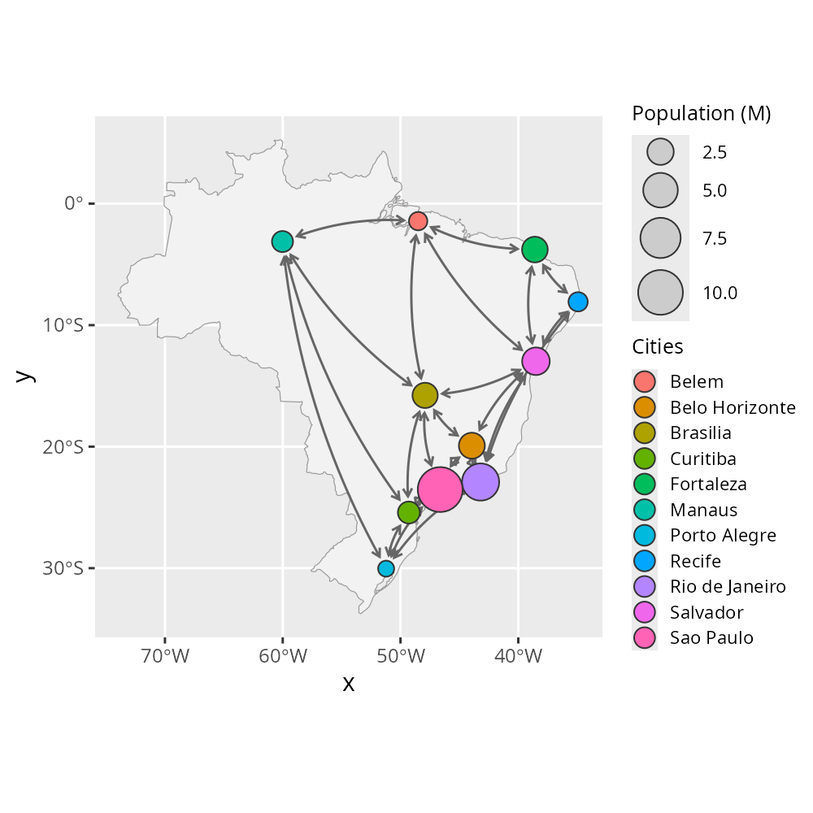

# Interoperability with 'ggraph' and 'sf'

  
**Package**: RGraphSpace 1.5.1

## Overview

*RGraphSpace* is designed to be a seamless extension to existing network
analysis workflows, not a replacement. Whether using *igraph* (Csardi
and Nepusz 2006) for heavy-duty computations or *tidygraph* (Pedersen
2025) for tidy data manipulation, *RGraphSpace* `geoms` automatically
recognize these objects on the fly. The main motivation behind
*RGraphSpace* was to address the challenge of scaling network elements
without disrupting alignment with image features. For practical
examples, see [*mapping graphs to
images*](https://sysbiolab.github.io/RGraphSpace/articles/mapping-images.md);
see also [*PathwaySpace*](https://sysbiolab.github.io/PathwaySpace/)
tutorials for use-case scenarios involving reference image backgrounds.

## Required packages


Before proceeding, ensure that all packages described in the
[*Installation
Instructions*](https://sysbiolab.github.io/RGraphSpace/articles/install.md)
are installed.

``` r

# Check required version
if (packageVersion("RGraphSpace") < "1.5.1"){
  message("Need to update 'RGraphSpace' for this vignette")
  remotes::install_github("sysbiolab/RGraphSpace")
}
```

``` r

# Load packages
library("RGraphSpace")
library("igraph")
library("tidygraph")
library("ggraph")
library("sf")
library("maps")
library("geometry")
library("flightsbr")
library("airportr")
```

## Why use *RGraphSpace* with *ggraph*?

While *ggraph* is a wonderful framework for relational data, precise
edge-node alignment requires additional handling when node sizes vary
dynamically. This limitation arises from a fundamental trade-off in
*ggplot2*: scaling `size` aesthetic is tied to a fixed physical legend
representation, causing node dimensions to depend on device scaling
rather than the normalized coordinate space. For most applications this
is not an issue, but it becomes critical when graphs must be spatially
aligned with reference images. *RGraphSpace* addresses this through
specialized `geoms` that automatically compensate for alignment shifts
introduced by node scaling. The trade-off for this higher level of
automation is that the user has fewer customization options compared to
the *ggraph* approach. This is exactly why using *RGraphSpace* alongside
*ggraph* makes sense: it provides precise spatial alignment between
graph elements and reference frames while preserving interoperability
with the extensive layout and styling flexibility of the *ggraph*
grammar.

### Setting basic input data

The following example demonstrates the interoperability between
*RGraphSpace* and *ggraph* using both *igraph* and *tidygraph* objects,
and managing spatial data with *sf*, the standard infrastructure for
spatial data analysis in `R` (Pebesma and Bivand 2023). Integrating
network structures with spatial data often creates a headache with
mismatched coordinate systems and scales, which makes this example
particularly interesting to showcase how these packages handle that
complexity.

Next, we build a spatial network of cities; then *RGraphSpace* `geoms`
are plugged into *ggraph* and *sf* workflows.

``` r

# Load a map and transform projection
map_sf <- st_as_sf(map("world", regions = "Brazil", fill = TRUE))

# Filter major cities by regional capitals
data(world.cities, package = "maps")
r_capitals <- c(
  "Aracaju", "Belem", "Belo Horizonte", "Boa Vista", "Brasilia", 
  "Campo Grande", "Cuiaba", "Curitiba", "Florianopolis", "Fortaleza", 
  "Goiania", "Joao Pessoa", "Macapa", "Maceio", "Manaus", "Natal", 
  "Palmas", "Porto Alegre", "Porto Velho", "Recife", "Rio Branco", 
  "Rio de Janeiro", "Salvador", "Sao Luis", "Sao Paulo", "Teresina", 
  "Vitoria"
)
cities <- subset(world.cities, country.etc == "Brazil" & 
    name %in% r_capitals & pop > 1200000)

# Create Delaunay triangulation edges
# Note: the edges hold no particular meaning beyond
# demonstrating integration between coordinate systems
tri <- delaunayn(cities[,c("lat","long")])
edges <- unique(rbind(tri[,c(1,2)], tri[,c(2,3)], tri[,c(1,3)] ))

# Build an 'igraph' using city coordinates
igraph_cities <- igraph::graph_from_edgelist(edges, directed = FALSE)
igraph::V(igraph_cities)$x <- cities$long
igraph::V(igraph_cities)$y <- cities$lat
igraph::V(igraph_cities)$Cities <- cities$name
igraph::V(igraph_cities)$`Population (M)` <- cities$pop/1000000
igraph::E(igraph_cities)$arrowType <- 3
```

### Different input, same output

The following options all produce the same visual output, demonstrating
how these packages integrate different types of input data.

``` r

# Option 1: Passing a 'GraphSpace' object directly to ggplot()
gs <- GraphSpace(igraph_cities)
ggplot(gs) +
  geom_sf(data = map_sf, fill = "grey95", color = "grey60") +
  geom_edgespace(color = "grey40", curve = -0.1) +
  geom_nodespace(aes(fill = Cities, size = `Population (M)`)) +
  scale_size(range = c(3, 9)) +
  theme_gray() +
  theme_gspace_legend(discrete_fill = TRUE)

# Option 2: Passing an 'igraph' object to RGraphSpace geoms
# inject_nodespace() required — no GraphSpace object passed to ggplot()
ggplot() +
  geom_sf(data = map_sf, fill = "grey95", color = "grey60") +
  geom_edgespace(color = "grey40", curve = -0.1, data = igraph_cities) +
  geom_nodespace(aes(fill = Cities, size = `Population (M)`), 
    data = igraph_cities) +
  scale_size(range = c(3, 9)) +
  inject_nodespace() + 
  theme_gray() +
  theme_gspace_legend(discrete_fill = TRUE)

# Option 3: Passing a 'tbl_graph' object to RGraphSpace geoms
# inject_nodespace() required — no GraphSpace object passed to ggplot()
gr <- as_tbl_graph(igraph_cities)
ggplot() +
  geom_sf(data = map_sf, fill = "grey95", color = "grey60") +
  geom_edgespace(color = "grey40", curve = -0.1, data = gr) +
  geom_nodespace(aes(fill = Cities, size = `Population (M)`), data = gr) +
  scale_size(range = c(3, 9)) +
  inject_nodespace() + 
  theme_gray() +
  theme_gspace_legend(discrete_fill = TRUE)

# Option 4: Integrating RGraphSpace geoms into a ggraph workflow
# inject_nodespace() required — no GraphSpace object passed to ggplot()
gr <- as_tbl_graph(igraph_cities)
ggraph(graph = gr, x= gr$x, y = gr$y) +
  geom_sf(data = map_sf, fill = "grey95", color = "grey60") +
  geom_edgespace(color = "grey40", curve = -0.1) +
  geom_nodespace(aes(fill = Cities, size = `Population (M)`)) +
  scale_size(range = c(3, 9)) +
  inject_nodespace() +
  theme_gray() +
  theme_gspace_legend(discrete_fill = TRUE)
```

Although all four approaches produce the same visualization, only
*Option 1* provides automatic node-edge synchronization. When a
`GraphSpace` object is passed directly to
[`ggplot()`](https://ggplot2.tidyverse.org/reference/ggplot.html)
(Option 1), clipping metadata propagate automatically between node and
edge layers and no additional calls are needed. In all other workflows
(Options 2–4),
[`inject_nodespace()`](https://sysbiolab.github.io/RGraphSpace/reference/inject_nodespace.md)
must be called explicitly to trigger this synchronization. This is the
only functional difference between the four approaches; the visual
output is identical.



## Using *RGraphSpace* with *sf* under non-linear projections

This vignette demonstrates how to use *RGraphSpace* to visualize graph
data within an *sf* spatial coordinate system under a non-linear
projection. The example uses Brazilian aviation data, in which airports
are represented as nodes and flights as directed edges, drawn over a
basemap of Brazil. We retrieve flight records from *flightsbr* (Pereira
2022) and airport registries from *airportr* (Shkolnik 2019). The
projection’s meridians converge toward the pole, so the graph needs to
recognize the coordinate system in order to be drawn as part of the map
rather than on top of it.

### Setting basic input data

Pre-processing sets up a reference map, retrieves the aviation data, and
assembles it into node and edge tables. The basemap is a country outline
from the *maps* package (Becker et al. 2025), converted to an `sf`
object.

``` r

# Load a reference map
map_sf <- st_as_sf(map("world", regions = "Brazil", fill = TRUE, plot = FALSE))
```

Flight records and airport registries are published separately and use
different code systems, so airport identifiers must be harmonized before
the two can be matched.

``` r

# Get flights (for edges) -- this data uses IATA codes
flightsbr_2024 <- flightsbr::read_flights(date = 2024,
  select = c("sg_iata_origem" , "sg_iata_destino")
)

# Get airports (for nodes) -- this data uses ICAO codes
flightsbr_airports <- flightsbr::read_airports(type = "all") |>
  dplyr::filter(codigo_oaci %in% airportr::airports$ICAO) 

# Map valid ICAO to IATA codes
flightsbr_airports <- flightsbr_airports |>
  dplyr::left_join( dplyr::select(airportr::airports, ICAO, IATA),
    by = c("codigo_oaci" = "ICAO")) |> dplyr::filter(IATA != "\\N") |>
  dplyr::relocate(IATA)
```

Flights are aggregated into unique routes, and the two datasets are then
reduced to the airports and routes common to both, so that every edge
has endpoints in the node table.

``` r

# Aggregate flights by counts
flight_counts <- flightsbr_2024 |> na.omit() |>
  dplyr::filter(sg_iata_origem != sg_iata_destino) |>
  dplyr::count(sg_iata_origem, sg_iata_destino, name = "counts") |>
  dplyr::arrange(counts)

# Keep only airports that actually appear in 'flight_counts'
active_airports <- flightsbr_airports |>
  dplyr::filter(IATA %in% c(flight_counts$sg_iata_origem, 
    flight_counts$sg_iata_destino)) |>
  dplyr::select(IATA, longitude, latitude, type) |> na.omit()

# Keep flights that map to 'active_airports'
flight_counts <- flight_counts |>
  dplyr::filter(sg_iata_origem  %in% active_airports$IATA,
    sg_iata_destino %in% active_airports$IATA)

# Count departures
active_airports$departures <- tapply(flight_counts$counts,
  flight_counts$sg_iata_origem, sum)[active_airports$IATA]
```

### Building the graph

With the flight and airport tables prepared, we can generate an `igraph`
object using the flights as edges and the airports as vertices. The
graph is directed, preserving the direction of each departure-arrival
pair, and edge counts represent the number of flights on each unique
route.

``` r

# Make an igraph with flight records
igraph_flights <- graph_from_data_frame(flight_counts,
  directed = TRUE, vertices = active_airports)
```

Although `GraphSpace` coordinates are normally rescaled to a unit
square, here we keep the original latitude and longitude values, which
must match the coordinates of the `sf` object.

``` r

# Create a GraphSpace object
gs_flight <- GraphSpace(igraph_flights)

# Assign latitude and longitude to coordinates
gs_flight$x <- gs_flight$longitude
gs_flight$y <- gs_flight$latitude
```

### Rendering over the map

The graph can now be rendered over the `sf` basemap, with `colour`
representing the number of flights (log₁₀ scale) and `fill`
distinguishing airport types.

``` r

ggplot(data = gs_flight) +
  geom_sf(data = map_sf, color = "grey") +
  coord_sf(crs = 5880, default_crs = 4326) +
  geom_edgespace(aes(colour = log10(counts), 
    alpha = counts/max(counts)), coord_warp = 1) + 
  geom_nodespace(aes(fill = type, 
    label = ifelse(departures > 10000, name, NA)), 
    size = 1.5, colour = NA) +
  scale_colour_continuous(palette = c("cyan", "blue")) +
  scale_fill_discrete(palette = c("#F8766D", "#00BFC4")) + 
  scale_alpha_continuous(range = c(0.2, 1), guide = "none") +
  labs(title = "Domestic Flight Network in Brazil, 2024", 
    colour = "Flights\n(log10 scale)",
    fill = "Airport type", y = "Latitude", x = "Longitude") +
  theme_gspace_legend(discrete_fill = TRUE) +
  theme_minimal()
```


In this example,
[`coord_sf()`](https://ggplot2.tidyverse.org/reference/ggsf.html)
projects the plot into *EPSG:5880* (`crs = 5880`), a non-linear system
pairing the *SIRGAS 2000* datum with the Brazil Polyconic projection,
while `default_crs = 4326` declares that the node coordinates are
longitude and latitude in *WGS 84* (World Geodetic System 1984).

The curved gridlines are the projection’s signature: meridians converge
toward the pole, so lines of constant longitude are no longer vertical.
Edges curve in the same direction, following the projection rather than
cutting across it, which is what makes graph and map read as one object
rather than two overlaid images. The bend is strongest for long routes
and negligible for short ones, since it tracks how much the projection
deforms the space each edge crosses. It reflects the geometry of the
projection, not the route an aircraft flies.

The strength of this effect is controlled by `coord_warp`, which
defaults to 1, the exact deviation introduced by the projection. Larger
values exaggerate the bend, useful where it is otherwise too subtle to
read, though they may give erratic results under strongly warped
coordinate systems. Setting `coord_warp = 0` disables the adjustment, so
edges are drawn as straight chords between projected endpoints.

### A more extreme projection

The polyconic projection used above bends the space gently, so the
effect on edges is subtle. It becomes unmistakable under a stronger
projection. Here the same network is viewed from the south pole, where
meridians radiate outward rather than merely converging, and a subset of
long-haul routes is used so that individual edges stay legible.

``` r

# Reference map: all countries, for a hemisphere-wide view
world_sf <- st_as_sf(map("world", fill = TRUE, plot = FALSE))

# A few widely separated airports, chosen to span longitude
hubs <- c("GRU", "MAO", "BEL", "REC", "POA", "CGB", "PVH", "MCP")

gs_hubs <- gs_flight[gs_flight$name %in% hubs, ]
```

``` r

ggplot(data = gs_hubs) +
  geom_sf(data = world_sf, fill = "grey95", color = "grey70") +
  geom_edgespace(aes(colour = counts), 
    arrow_offset = 0.03, arrow_size = 1) +
  geom_nodespace(aes(label = name), size = 2, 
    fill = "#F8766D", colour = NA) +
  scale_colour_continuous(palette = c("cyan", "blue")) +
  labs(subtitle = "Same network under a polar projection",
    colour = "Flights\n(raw counts)", 
    y = "Latitude", x = "Longitude") +
  theme_gspace_legend() + theme_minimal() +
  coord_sf(crs = "+proj=laea +lat_0=-90 +lon_0=-50", 
    default_crs = 4326,
    xlim = c(-75, -30), ylim = c(-35, 6))
```


A complementary version of this vignette is available in the
[*PreprocessingAviationData*](https://github.com/flaviogckessler/PreprocessingAviationData)
repository.

## Session information

    #> R version 4.6.1 (2026-06-24)
    #> Platform: x86_64-pc-linux-gnu
    #> Running under: Ubuntu 24.04.4 LTS
    #> 
    #> Matrix products: default
    #> BLAS:   /usr/lib/x86_64-linux-gnu/openblas-pthread/libblas.so.3 
    #> LAPACK: /usr/lib/x86_64-linux-gnu/openblas-pthread/libopenblasp-r0.3.26.so;  LAPACK version 3.12.0
    #> 
    #> locale:
    #>  [1] LC_CTYPE=en_US.UTF-8       LC_NUMERIC=C              
    #>  [3] LC_TIME=en_US.UTF-8        LC_COLLATE=en_US.UTF-8    
    #>  [5] LC_MONETARY=en_US.UTF-8    LC_MESSAGES=en_US.UTF-8   
    #>  [7] LC_PAPER=en_US.UTF-8       LC_NAME=C                 
    #>  [9] LC_ADDRESS=C               LC_TELEPHONE=C            
    #> [11] LC_MEASUREMENT=en_US.UTF-8 LC_IDENTIFICATION=C       
    #> 
    #> time zone: America/Sao_Paulo
    #> tzcode source: system (glibc)
    #> 
    #> attached base packages:
    #> [1] stats     graphics  grDevices utils     datasets  methods   base     
    #> 
    #> other attached packages:
    #>  [1] airportr_0.1.3    flightsbr_1.1.1   geometry_0.5.2    maps_3.4.3       
    #>  [5] sf_1.1-1          ggraph_2.2.2      tidygraph_1.3.1   igraph_2.3.3     
    #>  [9] RGraphSpace_1.5.1 ggplot2_4.0.3    
    #> 
    #> loaded via a namespace (and not attached):
    #>  [1] tidyselect_1.2.1   viridisLite_0.4.3  dplyr_1.2.1        vipor_0.4.7       
    #>  [5] farver_2.1.2       viridis_0.6.5      S7_0.2.2           fastmap_1.2.0     
    #>  [9] janitor_2.2.1      tweenr_2.0.3       digest_0.6.39      timechange_0.4.0  
    #> [13] lifecycle_1.0.5    magrittr_2.0.5     compiler_4.6.1     rlang_1.2.0       
    #> [17] sass_0.4.10        tools_4.6.1        yaml_2.3.12        data.table_1.18.4 
    #> [21] knitr_1.51         labeling_0.4.3     graphlayouts_1.2.4 htmlwidgets_1.6.4 
    #> [25] classInt_0.4-11    curl_7.1.0         xml2_1.6.0         RColorBrewer_1.1-3
    #> [29] abind_1.4-8        KernSmooth_2.23-26 withr_3.0.3        purrr_1.2.2       
    #> [33] desc_1.4.3         grid_4.6.1         polyclip_1.10-7    e1071_1.7-17      
    #> [37] scales_1.4.0       MASS_7.3-66        cli_3.6.6          rmarkdown_2.31    
    #> [41] ragg_1.5.2         generics_0.1.4     otel_0.2.0         rstudioapi_0.19.0 
    #> [45] httr_1.4.8         magic_1.6-1        DBI_1.3.0          pbapply_1.7-4     
    #> [49] ggbeeswarm_0.7.3   cachem_1.1.0       ggforce_0.5.0      proxy_0.4-29      
    #> [53] stringr_1.6.0      rvest_1.0.5        parallel_4.6.1     selectr_0.6-0     
    #> [57] ggrastr_1.0.2      vctrs_0.7.3        Matrix_1.7-6       jsonlite_2.0.0    
    #> [61] ggrepel_0.9.8      archive_1.1.13     beeswarm_0.4.0     systemfonts_1.3.2 
    #> [65] fontawesome_0.5.3  tidyr_1.3.2        jquerylib_0.1.4    units_1.0-1       
    #> [69] glue_1.8.1         pkgdown_2.2.0      stringi_1.8.7      lubridate_1.9.5   
    #> [73] gtable_0.3.6       tibble_3.3.1       parzer_0.4.4       pillar_1.11.1     
    #> [77] htmltools_0.5.9    R6_2.6.1           textshaping_1.0.5  evaluate_1.0.5    
    #> [81] lattice_0.22-9     snakecase_0.11.1   memoise_2.0.1      bslib_0.11.0      
    #> [85] class_7.3-23       Rcpp_1.1.1-1.1     gridExtra_2.3.1    xfun_0.59         
    #> [89] fs_2.1.0           pkgconfig_2.0.3

## References

Becker, Richard A., Allan R. Wilks, Ray Brownrigg, Thomas P. Minka, and
Alex Deckmyn. 2025. *Maps: Draw Geographical Maps*.
<https://doi.org/10.32614/CRAN.package.maps>.

Csardi, Gabor, and Tamas Nepusz. 2006. “The Igraph Software Package for
Complex Network Research.” *InterJournal* Complex Systems: 1695.
<https://igraph.org/>.

Pebesma, Edzer, and Roger Bivand. 2023. *Spatial Data Science: With
Applications in R*. Chapman; Hall/CRC.
<https://doi.org/10.1201/9780429459016>.

Pedersen, Thomas Lin. 2025. *Tidygraph: A Tidy API for Graph
Manipulation*. <https://tidygraph.data-imaginist.com>.

Pereira, Rafael H. M. 2022. “Flightsbr: Download Flight and Airport Data
from Brazil.” *OSF Preprints*, ahead of print.
<https://doi.org/10.31219/osf.io/jdv7u>.

Shkolnik, Dmitry. 2019. *Airportr: Convenience Tools for Working with
Airport Data*. <https://doi.org/10.32614/CRAN.package.airportr>.
