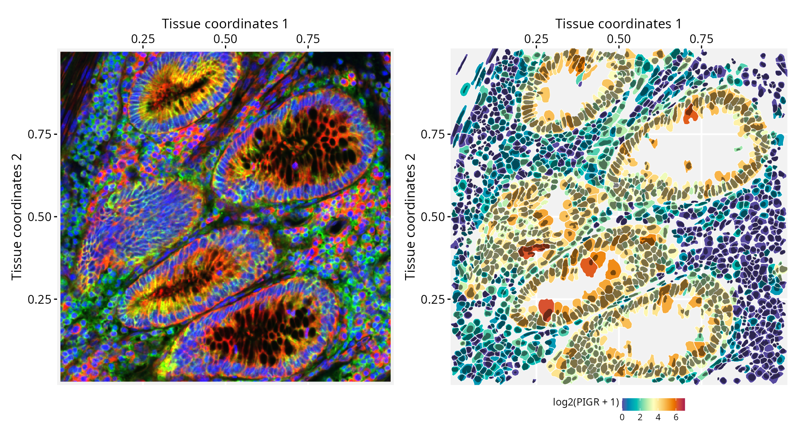

# Working with nested geometries and high-resolution images

**Package**: RGraphSpace 1.5.4  

## Overview

This tutorial demonstrates how *RGraphSpace* works with nested
geometries and high-resolution images. We will use data from the same
study on human colorectal cancer (CRC) tissue featured in our
[*spatial-segmentation2*](https://sysbiolab.github.io/RGraphSpace/articles/spatial-segmentation2.md)
vignette, but from the Xenium In Situ dataset (Oliveira et al. 2025).
Although this dataset targets a focused panel of ~420 genes (541 total
features, including controls), it provides higher-resolution single-cell
boundaries for mapping subcellular localization. To handle the large
tissue image, *RGraphSpace* stores it as a lazy `SpatRaster` object and
renders only the region under view, keeping memory manageable even for
multi-gigapixel images.

## Before you start

This vignette assumes familiarity with
[*SpatialExperiment*](https://www.bioconductor.org/packages/SpatialExperiment/)
(Righelli et al. 2022), particularly for handling Xenium spatial
transcriptomics data.

**Note:**
If you are new to *SpatialExperiment*, we recommend reviewing the OSTA’s
[Xenium
Workflow](https://bioconductor.org/books/release/OSTA/pages/img-workflow-xenium.html)
before proceeding.

**Computational requirement:**

- Hardware: Workstation with RAM ≥ 32 GB (≥ 64 GB for higher-resolution
  image levels)

- Software: R (≥4.5); RStudio recommended

## Required packages


Before proceeding, ensure that all packages described in the
[*Installation
Instructions*](https://sysbiolab.github.io/RGraphSpace/articles/install.md)
are installed.

``` r

# Check versions
if (packageVersion("RGraphSpace") < "1.5.4"){
  message("Need to update 'RGraphSpace' for this vignette")
  remotes::install_github("sysbiolab/RGraphSpace")
}
```

## Setting input data

``` r

# Load packages
library("RGraphSpace")
library("SpatialFeatureExperiment")
library("sf")
library("terra")
library("patchwork")
```

### Download the dataset

The **Xenium In Situ, Sample P2 CRC** dataset (Oliveira et al. 2025) is
available from the [10x
Genomics](https://www.10xgenomics.com/platforms/visium/product-family/dataset-human-crc)
repository. The repository provides a batch download option from the
terminal, using `wget` or `curl`; the `wget` command is reproduced
below, selecting the relevant files for this tutorial.

``` bash
# Download output files in a 'localdir' directory
wget https://cf.10xgenomics.com/samples/xenium/2.0.0/Xenium_V1_Human_Colon_Cancer_P2_CRC_Add_on_FFPE/Xenium_V1_Human_Colon_Cancer_P2_CRC_Add_on_FFPE_outs.zip

# Extract the outputs
unzip Xenium_V1_Human_Colon_Cancer_P2_CRC_Add_on_FFPE_outs.zip
```

### Loading with *SpatialFeatureExperiment*

We load the dataset with
[`readXenium()`](https://pachterlab.github.io/SpatialFeatureExperiment/reference/readXenium.html),
importing both the cell and nucleus segmentations, and assign unique
gene symbols to the row names.

``` r

# Set path to data directory
localdir <- "path/to/data/directory"

# Load data from 'localdir'
sfe <- readXenium(localdir, segmentations = c("cell", "nucleus"), flip = "none")

# Assign unique symbols to rownames
rownames(sfe) <-  make.unique(rowData(sfe)$Symbol)
```

The Xenium image is a four-channel fluorescence stack, where each
channel captures a different aspect of tissue morphology: DAPI (nuclei),
membrane markers (cell boundaries), 18S rRNA (cytoplasm), and
αSMA/Vimentin (stroma). To use it as a spatial background, we load the
stack as a *SpatRaster* object, which lets us combine channels into a
false-color RGB image.

``` r

# Xenium 'morphology_focus' is a 4-channel fluorescence image:
# [[1]] DAPI                         (nuclei)
# [[2]] ATP1A1 / E-Cadherin / CD45   (cell boundaries)
# [[3]] 18S rRNA                     (cytoplasm)
# [[4]] alphaSMA / Vimentin          (stroma)

# The downloaded image is an OME-TIFF pyramid consisting of four 
# files, each containing multiple resolution levels
bfi <- SpatialExperiment::getImg(sfe, image_id = "morphology_focus")

# Check resolution levels: 
# Smaller index = finer resolution (1L = full, 4L = coarse)
RBioFormats::read.metadata(imgSource(bfi))
#> series res sizeX sizeY sizeC sizeZ sizeT total
#> 1      1   31395 34224 4     1     1     4    
#> 1      2   15697 17112 4     1     1     4    
#> 1      3   7848  8556  4     1     1     4    
#> 1      4   3924  4278  4     1     1     4 
#> ...

# Extract one pyramid level and write it to disk at 4L
# (we used 2L resolution for the plots in this tutorial)
sri <- toSpatRasterImage(bfi, resolution = 4L)

# Read the extracted level as a SpatRaster, keeping the raster 
# data on disk until accessed
r_spat <- terra::rast(imgSource(sri))

# Quick visual check, rotated 90° clockwise. 
# We down-sample BEFORE rotating: Transforming the full-resolution 
# raster can cause a crash or memory overflow.
r_small <- terra::spatSample(r_spat, size = 4e5, 
  method = "regular", as.raster = TRUE)
terra::plotRGB(terra::trans(terra::flip(r_small, "vertical")),
  r = 3, g = 2, b = 1, stretch = "lin")
```

For this RGB image we set the fluorescence channels to show ‘cytoplasm’
in red, ‘cell boundaries’ in green, and ‘nuclei’ in blue.


## Creating a GraphSpace object

Convert the `SpatialFeatureExperiment` object into a `GraphSpace`.

``` r

# Coerce 'SpatialFeatureExperiment' to 'GraphSpace'
gs <- as.GraphSpace(sfe, assay = "counts")
```

### Attach tissue image and geometries

``` r

# Add tissue image
gs_image(gs) <- r_spat

# Add cell geometry 
gs_geometry(gs, "cell_geometry") <- cellSeg(sfe)

# Add nucleus geometry 
gs_geometry(gs, "nucleus_geometry") <- nucSeg(sfe)
```

Unlike datasets with pre-aligned image and coordinates, this Xenium data
needs a pixel-per-micron scale factor to align the graph with the
attached tissue image, converting between the node coordinates (in
microns) and the image (in pixels). We derive this factor from the
image’s extent and dimensions: the square root of the pixel-to-micron
area ratio gives pixels per micron.

``` r

# Image area in microns (from the spatial extent)
e <- terra::ext(r_spat)
area_microns <- (e$xmax - e$xmin) * (e$ymax - e$ymin)

# Image area in pixels (nrow x ncol)
d <- dim(r_spat)
area_pixels <- (d[1] * d[2])

# Linear scale factor: pixels per micron
lsf <- sqrt( area_pixels / area_microns )

#-- this print shows lsf computed for 4L resolution
#-- (see Xenium image load)
lsf
#> 0.5882353

# Set the scale factor on the GraphSpace object
gs_scale_factor(gs) <- lsf
```

### Normalize node and geometry coordinates

Next, we examine the spatial boundaries of the nodes relative to the
image. The node coordinates fall within the image dimensions.

``` r

gs
#> A GraphSpace-class object for:
#> IGRAPH fec0602 UN-- 340837 0 -- 
#> + attr: x (v/n), y (v/n), name (v/c), nodeLabel (v/c), nodeSize (v/n),
#> | transcript_counts (v/n), control_probe_counts (v/n), control_codeword_counts
#> | (v/n), unassigned_codeword_counts (v/n), deprecated_codeword_counts (v/n),
#> | total_counts (v/n), cell_area (v/n), nucleus_area (v/n), sample_id (v/c),
#> | arrowType (e/n)
#> + node payload: 2 (cell_geometry, nucleus_geometry)
#> + features: 541 (ABCC8, ACP5, ACTA2, ADH1C, ...)
#> + samples: 340837 (aaaadaba-1, aaaadgga-1, ...)
#> + node spatial boundaries: raw graph
#> | x: [12, 3915] (cols)
#> | y: [11, 4277] (rows)
#> + image spatial boundaries: raw image
#> | x: [1, 3924] (cols)
#> | y: [1, 4278] (rows)
```

We normalize the node coordinates to the image space, with
`norm.geometry = TRUE` so the cell and nucleus polygons are normalized
alongside the nodes. We then rotate the object to match the orientation
of the tissue image shown above.

``` r

# Normalize node coordinates to the image space
# -- this may take a few secs due to the large number of geometries!
gs <- normalizeGraphSpace(gs, mar = 0, norm.geometry = TRUE)

# Rotate to match the tissue image orientation
gs <- rotateGraphSpace(gs, clockwise = TRUE)
```

## Spatial feature visualization

``` r

# Inspect the data range
# log2(range(gs[["fdata"]]) + 1)

# Set color palette and data range for use across plots
cpal <- hcl.colors(100, palette = "Spectral", rev = T)
data_range <- c(0, 7)

# Set a reusable theme
my_theme <- theme_gspace_coords(theme = "th3", is_norm = TRUE, 
  xlab = "Tissue coordinates 1", ylab = "Tissue coordinates 2")
```

We now plot the full coordinate space with nodes colored by *PIGR*
expression over the tissue image, and cells showing no expression made
transparent. A box marks a region of interest to crop next. For this
wide view, we set the background image to one channel, with ‘cytoplasm’
in blue.

``` r

# Plot node-level PIGR expression over the tissue image; 
# a box marks the region of interest
p <- ggplot(gs) + 
  annotation_gspace_image(gs, rgb_channels = c(NA, NA, 3)) + 
  geom_nodespace(mapping = aes(colour = log2(PIGR + 1), 
    alpha = as.numeric(PIGR > 0)  ), size = 0.3, pch = 19) +
  scale_colour_continuous(palette = cpal, limits = data_range) +
  scale_alpha_identity() + my_theme +
  annotate("rect", 
    xmin = 0.5, xmax = 0.8, 
    ymin = 0.3, ymax = 0.65, 
    colour = "white", fill = NA, 
    lty = "21", lwd = 1)

p
```


As we crop into smaller regions, *RGraphSpace* re-renders the viewed
window into a display canvas whose resolution is capped by `maxpixels`.
Because this fixed pixel budget now covers a smaller area, zooming in
yields progressively finer detail. The default works well in most cases.

``` r

# Current pixel budget for the display canvas (adjustable if needed)
gs_image_maxpixels(gs)
#> 4e+06

# Crop to the marked region and re-normalize coordinates to the new space
gs_crop1 <- cropGraphSpace(gs, 
  xmin = 0.5, xmax = 0.8, 
  ymin = 0.3, ymax = 0.65)
gs_crop1 <- normalizeGraphSpace(gs_crop1, mar = 0, norm.geometry = TRUE)
gs_crop1 <- rotateGraphSpace(gs_crop1, clockwise = TRUE)
```

Zooming further, a second box outlines a smaller region for a closer
view.

``` r

# Plot the cropped region; a second box marks the next crop
p <- ggplot(gs_crop1) + 
  annotation_gspace_image(gs_crop1, rgb_channels = c(NA, NA, 3)) + 
  geom_nodespace(mapping = aes(colour = log2(PIGR + 1), 
    alpha = as.numeric(PIGR > 0)), size = 0.7, pch = 19) +
  scale_colour_continuous(palette = cpal, limits = data_range) +
  scale_alpha_identity() + my_theme +
  annotate("rect", 
    xmin = 0.2, xmax = 0.5, 
    ymin = 0.6, ymax = 0.9, 
    fill = NA, colour = "white", 
    lty = "21", lwd = 1)

p
```


Crop to this smaller region.

``` r

# Crop to the smaller region and re-normalize coordinates
gs_crop2 <- cropGraphSpace(gs_crop1, 
  xmin = 0.2, xmax = 0.5, 
  ymin = 0.6, ymax = 0.9)
gs_crop2 <- normalizeGraphSpace(gs_crop2, mar = 0, norm.geometry = TRUE)
gs_crop2 <- rotateGraphSpace(gs_crop2, clockwise = TRUE)
```

At this resolution, the real cell segmentation boundaries can be drawn
side-by-side with the corresponding tissue image, alongside the node
centroids. In this plot, we can observe the high-definition tissue image
on the left and its correct alignment with cell segmentation on the
right. The RGB image features ‘cytoplasm’ in red, ‘cell boundaries’ in
green, and ‘nuclei’ in blue.

``` r

p1 <- ggplot(gs_crop2) + 
  annotation_gspace_image(gs_crop2, rgb_channels = c(3, 2, 1)) + 
  my_theme

p2 <- ggplot(gs_crop2) + 
  geom_sf( aes(geometry = cell_geometry, fill = log2(PIGR + 1) ), 
    colour = adjustcolor("white", 1)) +
  geom_nodespace(colour = "black", size = 0.1, pch = 19) +
  scale_fill_continuous(palette = cpal, limits = data_range) +
  scale_colour_identity() + my_theme +
    annotate("rect", 
    xmin = 0.2, xmax = 0.7, 
    ymin = 0.2, ymax = 0.7, 
    fill = NA, colour = "red4", 
    lty = "21", lwd = 1) 

p1 + p2
```


``` r

# Crop to the smaller region and re-normalize coordinates
gs_crop3 <- cropGraphSpace(gs_crop2, 
  xmin = 0.2, xmax = 0.7, 
  ymin = 0.2, ymax = 0.7)
gs_crop3 <- normalizeGraphSpace(gs_crop3, mar = 0, norm.geometry = TRUE)
gs_crop3 <- rotateGraphSpace(gs_crop3, clockwise = TRUE)
```

Finally, we reach a zoom level that allows us to examine subcellular
structures (left), with cell and nucleus segmentations overlaid as
nested geometries (right). The cell geometries are filled according to
*PIGR* expression levels, while the nucleus outlines are shown in
semi-transparent black.

``` r

p1 <- ggplot(gs_crop3) + 
  annotation_gspace_image(gs_crop3, rgb_channels = c(3, 2, 1)) + 
  my_theme

p2 <- ggplot(gs_crop3) + 
  geom_sf( aes(geometry = cell_geometry, fill = log2(PIGR + 1) ), 
    colour = adjustcolor("white", 1)) +
  geom_sf( aes(geometry = nucleus_geometry), 
    fill = adjustcolor("black", 0.5), colour = NA) +
  scale_fill_continuous(palette = cpal, limits = data_range) +
  scale_colour_identity() + my_theme

p1 + p2
```



## Session information

    #> R version 4.6.1 (2026-06-24)
    #> Platform: x86_64-pc-linux-gnu
    #> Running under: Ubuntu 24.04.4 LTS
    #> 
    #> Matrix products: default
    #> BLAS:   /usr/lib/x86_64-linux-gnu/openblas-pthread/libblas.so.3 
    #> LAPACK: /usr/lib/x86_64-linux-gnu/openblas-pthread/libopenblasp-r0.3.26.so;  LAPACK version 3.12.0
    #> 
    #> locale:
    #>  [1] LC_CTYPE=en_US.UTF-8       LC_NUMERIC=C              
    #>  [3] LC_TIME=en_US.UTF-8        LC_COLLATE=en_US.UTF-8    
    #>  [5] LC_MONETARY=en_US.UTF-8    LC_MESSAGES=en_US.UTF-8   
    #>  [7] LC_PAPER=en_US.UTF-8       LC_NAME=C                 
    #>  [9] LC_ADDRESS=C               LC_TELEPHONE=C            
    #> [11] LC_MEASUREMENT=en_US.UTF-8 LC_IDENTIFICATION=C       
    #> 
    #> time zone: America/Sao_Paulo
    #> tzcode source: system (glibc)
    #> 
    #> attached base packages:
    #> [1] stats     graphics  grDevices utils     datasets  methods   base     
    #> 
    #> other attached packages:
    #> [1] patchwork_1.3.2                 terra_1.9-34                   
    #> [3] sf_1.1-2                        SpatialFeatureExperiment_1.14.0
    #> [5] RGraphSpace_1.5.4               ggplot2_4.0.3                  
    #> 
    #> loaded via a namespace (and not attached):
    #>   [1] RColorBrewer_1.1-3          rstudioapi_0.19.0          
    #>   [3] jsonlite_2.0.0              wk_0.9.5                   
    #>   [5] magrittr_2.0.5              TH.data_1.1-5              
    #>   [7] ggbeeswarm_0.7.3            magick_2.9.1               
    #>   [9] farver_2.1.2                rmarkdown_2.32             
    #>  [11] fs_2.1.0                    ragg_1.5.2                 
    #>  [13] vctrs_0.7.3                 spdep_1.4-2                
    #>  [15] DelayedMatrixStats_1.34.0   RCurl_1.98-1.19            
    #>  [17] htmltools_0.5.9             S4Arrays_1.12.0            
    #>  [19] BiocNeighbors_2.6.0         Rhdf5lib_2.0.0             
    #>  [21] s2_1.1.11                   SparseArray_1.12.2         
    #>  [23] rhdf5_2.56.0                LearnBayes_2.15.2          
    #>  [25] sass_0.4.10                 spData_2.3.5               
    #>  [27] KernSmooth_2.23-27          bslib_0.11.0               
    #>  [29] htmlwidgets_1.6.4           desc_1.4.3                 
    #>  [31] fontawesome_0.5.3           sandwich_3.1-3             
    #>  [33] zoo_1.8-15                  cachem_1.1.0               
    #>  [35] igraph_2.3.3                lifecycle_1.0.5            
    #>  [37] pkgconfig_2.0.3             Matrix_1.7-6               
    #>  [39] R6_2.6.1                    fastmap_1.2.0              
    #>  [41] MatrixGenerics_1.24.0       digest_0.6.39              
    #>  [43] S4Vectors_0.50.1            dqrng_0.4.1                
    #>  [45] textshaping_1.0.5           GenomicRanges_1.64.0       
    #>  [47] beachmat_2.28.0             spatialreg_1.4-3           
    #>  [49] abind_1.4-8                 compiler_4.6.1             
    #>  [51] proxy_0.4-29                withr_3.0.3                
    #>  [53] backports_1.5.1             S7_0.2.2                   
    #>  [55] tiff_0.1-12                 BiocParallel_1.46.0        
    #>  [57] DBI_1.3.0                   HDF5Array_1.40.0           
    #>  [59] R.utils_2.13.0              MASS_7.3-66                
    #>  [61] DelayedArray_0.38.2         rjson_0.2.23               
    #>  [63] classInt_0.4-11             tools_4.6.1                
    #>  [65] units_1.0-1                 vipor_0.4.7                
    #>  [67] otel_0.2.0                  beeswarm_0.4.0             
    #>  [69] R.oo_1.27.1                 glue_1.8.1                 
    #>  [71] h5mread_1.4.0               nlme_3.1-170               
    #>  [73] EBImage_4.54.0              rhdf5filters_1.24.0        
    #>  [75] grid_4.6.1                  generics_0.1.4             
    #>  [77] gtable_0.3.6                R.methodsS3_1.8.2          
    #>  [79] class_7.3-24                tidyr_1.3.2                
    #>  [81] data.table_1.18.4           tidygraph_1.3.1            
    #>  [83] sp_2.2-1                    XVector_0.52.0             
    #>  [85] BiocGenerics_0.58.1         pillar_1.11.1              
    #>  [87] limma_3.68.4                splines_4.6.1              
    #>  [89] dplyr_1.2.1                 lattice_0.23-1             
    #>  [91] survival_3.8-9              deldir_2.0-4               
    #>  [93] tidyselect_1.2.1            SingleCellExperiment_1.34.0
    #>  [95] locfit_1.5-9.12             scuttle_1.22.0             
    #>  [97] sfheaders_0.4.5             knitr_1.51                 
    #>  [99] IRanges_2.46.0              Seqinfo_1.2.0              
    #> [101] edgeR_4.10.1                SummarizedExperiment_1.42.0
    #> [103] stats4_4.6.1                xfun_0.59                  
    #> [105] Biobase_2.72.0              statmod_1.5.2              
    #> [107] DropletUtils_1.32.0         matrixStats_1.5.0          
    #> [109] fftwtools_0.9-11            yaml_2.3.12                
    #> [111] boot_1.3-32                 evaluate_1.0.5             
    #> [113] codetools_0.2-20            tibble_3.3.1               
    #> [115] cli_3.6.6                   systemfonts_1.3.2          
    #> [117] jquerylib_0.1.4             dichromat_2.0-1            
    #> [119] Rcpp_1.1.2                  zeallot_0.2.0              
    #> [121] coda_0.19-4.1               png_0.1-9                  
    #> [123] ggrastr_1.0.2               parallel_4.6.1             
    #> [125] pkgdown_2.2.0               jpeg_0.1-11                
    #> [127] marginaleffects_0.32.0      sparseMatrixStats_1.24.0   
    #> [129] bitops_1.0-9                SpatialExperiment_1.22.0   
    #> [131] mvtnorm_1.4-1               scales_1.4.0               
    #> [133] e1071_1.7-17                purrr_1.2.2                
    #> [135] rlang_1.3.0                 multcomp_1.4-31

## References

Oliveira, MF, JP Romero, M Chung, et al. 2025. “High-Definition Spatial
Transcriptomic Profiling of Immune Cell Populations in Colorectal
Cancer.” *Nature Genetics* 57 (6): 1512–23.
<https://doi.org/10.1038/s41588-025-02193-3>.

Righelli, Dario, Lukas M. Weber, Helena L. Crowell, et al. 2022.
“SpatialExperiment: Infrastructure for Spatially-Resolved
Transcriptomics Data in r Using Bioconductor.” *Bioinformatics* 38 (11):
–3. https://doi.org/<https://doi.org/10.1093/bioinformatics/btac299>.
