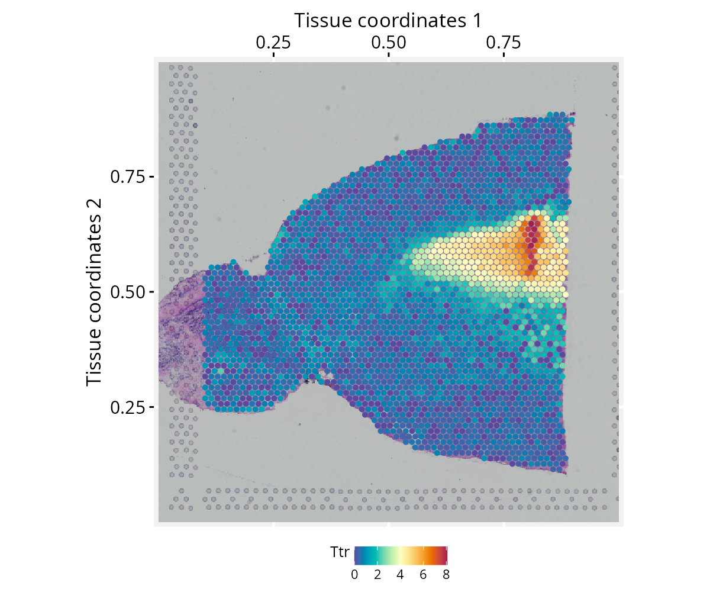
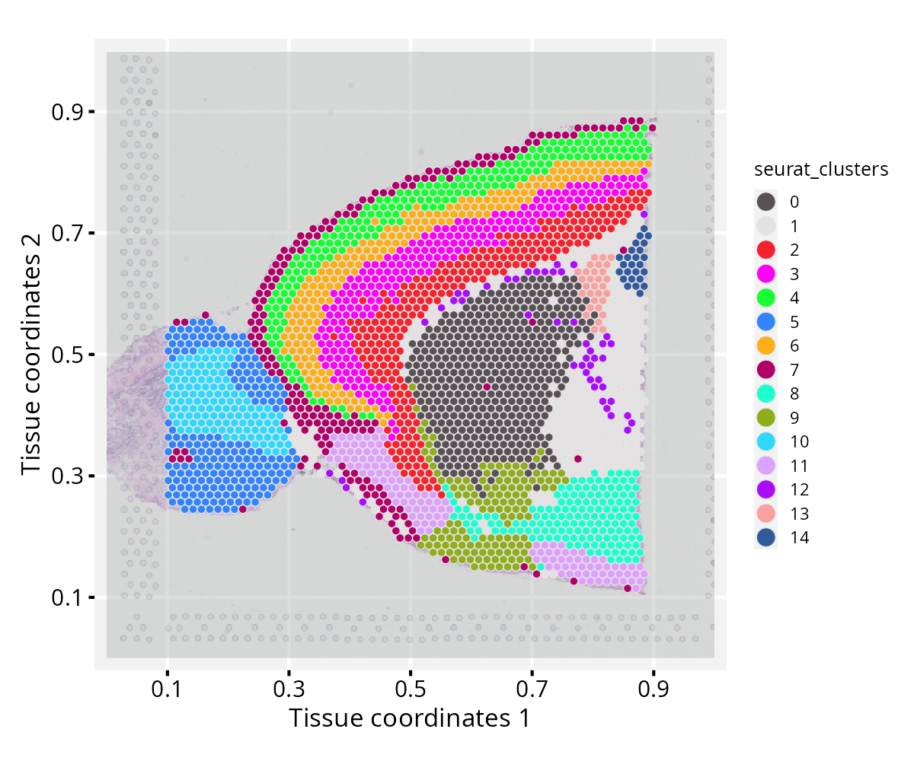

# Extending ggplot2 Grammar to Spatial Transcriptomics Data

**Package**: RGraphSpace 1.4.1  

## Overview

This vignette demonstrates how *RGraphSpace* extends the *ggplot2*
grammar to spatial transcriptomics data. We use spatial data from the
*SeuratData* package to illustrate direct mapping of spatial variables
to *ggplot2* aesthetics via the `ggplot-GraphSpace` interface.

## Before you start

This vignette assumes familiarity with
[*Seurat*](https://satijalab.org/seurat/) (Hao et al. 2024),
particularly for handling spatial transcriptomics data.

**Note:**
If you are new to *Seurat*, we recommend reviewing its [spatial analysis
tutorials](https://satijalab.org/seurat/articles/spatial_vignette)
before proceeding.

**Computational requirement:**

- Hardware: RAM \>= 16 GB

- Software: R (\>=4.5) and RStudio

## Required packages


Before proceeding, ensure that all packages described in the
[*Installation
Instructions*](https://sysbiolab.github.io/RGraphSpace/articles/install.md)
are installed.

``` r

# Check versions
if (packageVersion("RGraphSpace") < "1.4.1"){
  message("Need to update 'RGraphSpace' for this vignette")
  remotes::install_github("sysbiolab/RGraphSpace")
}
if (packageVersion("Seurat") < "5.5.0"){
  message("Need to update 'Seurat' for this vignette")
  remotes::install_github("satijalab/Seurat")
}
```

## Setting input data

``` r

# Load packages
library("RGraphSpace")
library("Seurat")
library("SeuratObject")
library("SeuratData")
```

### Loading the dataset

We will use the `stxBrain` dataset from the *SeuratData* package,
consisting of spatial transcriptomics data from sagittal mouse brain
sections generated with Visium v1 technology. This dataset is commonly
used to demonstrate *Seurat* spatial workflows (Hao et al. 2024). We
apply
[`as.GraphSpace()`](https://sysbiolab.github.io/RGraphSpace/reference/as.GraphSpace.md)
to coerce the `Seurat` object into a `GraphSpace` and show how spatial
high-dimensional variables can be mapped directly to *ggplot2*
aesthetics, anchored to the tissue image from which the data were
sampled.

``` r

# Install a Seurat dataset (required only once)
SeuratData::InstallData("stxBrain")
```

``` r

# Check manifest of installed datasets
# SeuratData::InstalledData()

# Load the 'stxBrain' dataset
seurat_obj <- LoadData("stxBrain", type = "anterior1")
```

### Preprocessing

The `stxBrain` dataset is normalized as suggested in *Seurat*’s
[spatial_vignette](https://satijalab.org/seurat/articles/spatial_vignette),
either using the
[`SCTransform()`](https://satijalab.org/seurat/reference/SCTransform.html)
and
[`NormalizeData()`](https://satijalab.org/seurat/reference/NormalizeData.html)
functions.

``` r

# NOTE: Seurat recommends using SCTransform() for processing this 
# spatial dataset, which may require more computation time. Here,
# we use log-normalization for demonstration purposes.
seurat_obj <- NormalizeData(seurat_obj)
```

### Creating a GraphSpace object

Next, we create a `GraphSpace` from the `Seurat` object; the
[`as.GraphSpace()`](https://sysbiolab.github.io/RGraphSpace/reference/as.GraphSpace.md)
converts the *Seurat* object into a `GraphSpace`, exposing its spatial
coordinates and feature data to the *ggplot2* grammar. We then attach
the tissue image and normalize node coordinates to the image space.

``` r

# Create a GraphSpace from 'seurat_obj'
gs <- as.GraphSpace(seurat_obj, space = "spatial", scale = "lowres")

# If available, add tissue image 
gs_image(gs) <- SeuratObject::GetImage(seurat_obj, mode = "raster")

# Normalize node coordinates to the image space
gs <- normalizeGraphSpace(gs)

# Inspect the 'gs' object
gs
# A GraphSpace-class object for:
# IGRAPH c4b5fdf UN-- 2696 0 -- 
# + attr: x (v/n), y (v/n), name (v/c), nodeLabel (v/c), nodeSize (v/n), cell (v/c),
# | orig.ident (v/x), nCount_Spatial (v/n), nFeature_Spatial (v/n), slice (v/n), region
# | (v/c), arrowType (e/n)
# + features: 31053 (Xkr4, Gm1992, Gm37381, Rp1, ...)
```

## Spatial feature visualization

With the `GraphSpace` object ready, we can reproduce a typical *Seurat*
spatial feature plot using standard *ggplot2* syntax. Here we map
expression of the `Ttr` gene to the colour aesthetic and display the
tissue image as a background reference.

``` r

cpal <- hcl.colors(100, palette = "Spectral", rev = TRUE)

# Reproduce a typical Seurat's spatial feature visualization
ggplot(gs) + 
  annotation_gspace_image(gs) +
  geom_nodespace(mapping = aes(colour = Ttr), size = 1, pch = 19) +
  scale_colour_continuous(palette = cpal) +
  theme_gspace_coords(theme = "th3", is_norm = TRUE, 
    xlab = "Tissue coordinates 1", ylab = "Tissue coordinates 2")
```



**Note on image alignment**: Proper spatial alignment between nodes and
the background image requires consistent coordinate conventions. Spatial
misalignment may occur if the input image and node coordinates differ in
axis orientation (e.g., top-left versus bottom-left origins). To
accommodate these differences,
[`normalizeGraphSpace()`](https://sysbiolab.github.io/RGraphSpace/reference/normalizeGraphSpace-methods.md)
provides orientation controls through the `rotate.xy`, `flip.x`, and
`flip.y` arguments. If the nodes appear misaligned with the input image,
try combinations of these parameters to correct the alignment.
Alternatively, try `flip.v` and `flip.h` arguments to apply flipping
directly to the background image.

## Spatial cluster visualization

This section requires additional preprocessing of the `stxBrain`
dataset, including normalization with
[`SCTransform()`](https://satijalab.org/seurat/reference/SCTransform.html)
and Seurat’s clustering workflow. We recommend installing the
*glmGamPoi* package beforehand, as it substantially speeds up the
[`SCTransform()`](https://satijalab.org/seurat/reference/SCTransform.html)
estimation step.

### Preprocessing

``` r

if (!require("glmGamPoi", quietly = TRUE)){
  BiocManager::install("glmGamPoi")
}
# Run vst normalization on counts
seurat_obj <- SCTransform(seurat_obj, assay = "Spatial", verbose = FALSE)
seurat_obj <- RunPCA(seurat_obj, assay = "SCT", verbose = FALSE)
seurat_obj <- FindNeighbors(seurat_obj, reduction = "pca", dims = 1:30)
seurat_obj <- FindClusters(seurat_obj, verbose = FALSE)
```

### Spatial cluster visualization

With clusters assigned, we rebuild the `GraphSpace` object from the
updated `seurat_obj` and reproduce a typical Seurat spatial cluster
plot, mapping cluster identity to the `fill` aesthetic and overlaying
the tissue image as a dimmed background.

``` r

# Re-create a GraphSpace from the updated 'seurat_obj'
gs <- as.GraphSpace(seurat_obj, space = "spatial", scale = "lowres")
gs_image(gs) <- SeuratObject::GetImage(seurat_obj, mode = "raster")
gs <- normalizeGraphSpace(gs)

# Reproduce a typical Seurat cluster visualization
cpal <- DiscretePalette(nlevels(gs$seurat_clusters), palette = "polychrome")
ggplot(gs) + 
  annotation_gspace_image(gs, opacity = 0.5) +
  geom_nodespace(mapping = aes(fill = seurat_clusters),
    size = 1.3, color = "grey90", stroke = 0.3) +
  scale_fill_manual(values = cpal) +
  theme_gspace_coords(theme = "th2", is_norm = TRUE, 
    xlab = "Tissue coordinates 1", ylab = "Tissue coordinates 2") +
  theme_gspace_legend(discrete_fill = TRUE)
```



  

## Coercing spatial data

Below, we show how to access the relevant components of a `Seurat`
object and use them to construct a `GraphSpace` manually, without
relying on
[`as.GraphSpace()`](https://sysbiolab.github.io/RGraphSpace/reference/as.GraphSpace.md).
For another coercion example, see the [*high-dimensional
data*](https://sysbiolab.github.io/RGraphSpace/articles/high-dimensional.html#hd-coercion)
tutorial.

``` r

# Extract tissue coordinates
coords <- SeuratObject::GetTissueCoordinates(object = seurat_obj, 
  scale = "lowres")
coords <- coords |> as.data.frame()
all(c("x", "y") %in% colnames(coords))
# [1] TRUE

# Extract cell metadata
metadata <- seurat_obj[[]]

# Merge coordinates and metadata using common cell identifiers
ids <- intersect(rownames(coords), rownames(metadata))
coords <- cbind(coords[ids, ], metadata[ids, ])

# Construct a GraphSpace object
# Metadata become node attributes
gs <- GraphSpace(coords)

# Add high-dimensional feature data
# Stored separately for lazy aesthetic mapping
gs_fdata(gs) <- SeuratObject::LayerData(seurat_obj, layer = "data")

# If available, add tissue image 
gs_image(gs) <- SeuratObject::GetImage(seurat_obj, mode = "raster")

# Normalize node coordinates to the image space
gs <- normalizeGraphSpace(gs)
```

## Session information

    #> R version 4.6.0 (2026-04-24)
    #> Platform: x86_64-pc-linux-gnu
    #> Running under: Ubuntu 24.04.4 LTS
    #> 
    #> Matrix products: default
    #> BLAS:   /usr/lib/x86_64-linux-gnu/openblas-pthread/libblas.so.3 
    #> LAPACK: /usr/lib/x86_64-linux-gnu/openblas-pthread/libopenblasp-r0.3.26.so;  LAPACK version 3.12.0
    #> 
    #> locale:
    #>  [1] LC_CTYPE=en_US.UTF-8       LC_NUMERIC=C              
    #>  [3] LC_TIME=en_US.UTF-8        LC_COLLATE=en_US.UTF-8    
    #>  [5] LC_MONETARY=en_US.UTF-8    LC_MESSAGES=en_US.UTF-8   
    #>  [7] LC_PAPER=en_US.UTF-8       LC_NAME=C                 
    #>  [9] LC_ADDRESS=C               LC_TELEPHONE=C            
    #> [11] LC_MEASUREMENT=en_US.UTF-8 LC_IDENTIFICATION=C       
    #> 
    #> time zone: America/Sao_Paulo
    #> tzcode source: system (glibc)
    #> 
    #> attached base packages:
    #> [1] stats     graphics  grDevices utils     datasets  methods   base     
    #> 
    #> other attached packages:
    #> [1] stxBrain.SeuratData_0.1.2 ssHippo.SeuratData_3.1.4 
    #> [3] pbmc3k.SeuratData_3.1.4   SeuratData_0.2.2.9002    
    #> [5] Seurat_5.5.0              SeuratObject_5.4.0       
    #> [7] sp_2.2-1                  RGraphSpace_1.4.1        
    #> [9] ggplot2_4.0.3            
    #> 
    #> loaded via a namespace (and not attached):
    #>   [1] RColorBrewer_1.1-3     jsonlite_2.0.0         magrittr_2.0.5        
    #>   [4] spatstat.utils_3.2-3   ggbeeswarm_0.7.3       farver_2.1.2          
    #>   [7] rmarkdown_2.31         fs_2.1.0               ragg_1.5.2            
    #>  [10] vctrs_0.7.3            ROCR_1.0-12            spatstat.explore_3.8-1
    #>  [13] htmltools_0.5.9        sass_0.4.10            sctransform_0.4.3     
    #>  [16] parallelly_1.47.0      KernSmooth_2.23-26     bslib_0.11.0          
    #>  [19] htmlwidgets_1.6.4      desc_1.4.3             ica_1.0-3             
    #>  [22] fontawesome_0.5.3      plyr_1.8.9             plotly_4.12.0         
    #>  [25] zoo_1.8-15             cachem_1.1.0           igraph_2.3.2          
    #>  [28] mime_0.13              lifecycle_1.0.5        pkgconfig_2.0.3       
    #>  [31] Matrix_1.7-5           R6_2.6.1               fastmap_1.2.0         
    #>  [34] fitdistrplus_1.2-6     future_1.70.0          shiny_1.13.0          
    #>  [37] digest_0.6.39          patchwork_1.3.2        tensor_1.5.1          
    #>  [40] RSpectra_0.16-2        irlba_2.3.7            textshaping_1.0.5     
    #>  [43] progressr_0.19.0       spatstat.sparse_3.2-0  httr_1.4.8            
    #>  [46] polyclip_1.10-7        abind_1.4-8            compiler_4.6.0        
    #>  [49] withr_3.0.2            S7_0.2.2               fastDummies_1.7.6     
    #>  [52] MASS_7.3-65            rappdirs_0.3.4         tools_4.6.0           
    #>  [55] vipor_0.4.7            lmtest_0.9-40          otel_0.2.0            
    #>  [58] beeswarm_0.4.0         httpuv_1.6.17          future.apply_1.20.2   
    #>  [61] goftest_1.2-3          glue_1.8.1             nlme_3.1-169          
    #>  [64] promises_1.5.0         grid_4.6.0             Rtsne_0.17            
    #>  [67] cluster_2.1.8.2        reshape2_1.4.5         generics_0.1.4        
    #>  [70] gtable_0.3.6           spatstat.data_3.1-9    tidyr_1.3.2           
    #>  [73] data.table_1.18.4      tidygraph_1.3.1        spatstat.geom_3.8-1   
    #>  [76] RcppAnnoy_0.0.23       ggrepel_0.9.8          RANN_2.6.2            
    #>  [79] pillar_1.11.1          stringr_1.6.0          spam_2.11-4           
    #>  [82] RcppHNSW_0.7.0         later_1.4.8            splines_4.6.0         
    #>  [85] dplyr_1.2.1            lattice_0.22-9         survival_3.8-6        
    #>  [88] deldir_2.0-4           tidyselect_1.2.1       miniUI_0.1.2          
    #>  [91] pbapply_1.7-4          knitr_1.51             gridExtra_2.3         
    #>  [94] scattermore_1.2        xfun_0.58              matrixStats_1.5.0     
    #>  [97] stringi_1.8.7          lazyeval_0.2.3         yaml_2.3.12           
    #> [100] evaluate_1.0.5         codetools_0.2-20       tibble_3.3.1          
    #> [103] cli_3.6.6              uwot_0.2.4             xtable_1.8-8          
    #> [106] reticulate_1.46.0      systemfonts_1.3.2      jquerylib_0.1.4       
    #> [109] Rcpp_1.1.1-1.1         globals_0.19.1         spatstat.random_3.5-0 
    #> [112] png_0.1-9              ggrastr_1.0.2          spatstat.univar_3.2-0 
    #> [115] parallel_4.6.0         pkgdown_2.2.0          dotCall64_1.2         
    #> [118] listenv_0.10.1         viridisLite_0.4.3      scales_1.4.0          
    #> [121] ggridges_0.5.7         crayon_1.5.3           purrr_1.2.2           
    #> [124] rlang_1.2.0            cowplot_1.2.0

Hao, Yuhan, Tim Stuart, Madeline H Kowalski, et al. 2024. “Dictionary
Learning for Integrative, Multimodal and Scalable Single-Cell Analysis.”
*Nature Biotechnology* 42 (2): 293–304.
<https://doi.org/10.1038/s41587-023-01767-y>.
