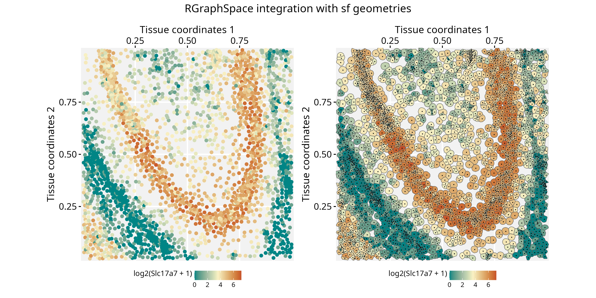

# Spatial-segmented data with Seurat and RGraphSpace

**Package**: RGraphSpace 1.5.4  

## Overview

This vignette demonstrates how *RGraphSpace* renders *sf* features using
spatial-segmented data pre-processed with the *Seurat* package (Hao et
al. 2024).

## Before you start

This vignette assumes familiarity with
[*Seurat*](https://satijalab.org/seurat/) (Hao et al. 2024),
particularly for handling spatial transcriptomics data.

**Note:**
If you are new to *Seurat*, we recommend reviewing its [spatial
segmentation
tutorials](https://satijalab.org/seurat/articles/seurat5_spatial_vignette_2)
before proceeding.

**Computational requirement:**

- Hardware: Workstation with RAM \>= 32 GB for large datasets

- Software: R (\>=4.5); RStudio recommended

## Required packages


Before proceeding, ensure that all packages described in the
[*Installation
Instructions*](https://sysbiolab.github.io/RGraphSpace/articles/install.md)
are installed.

``` r

# Check versions
if (packageVersion("RGraphSpace") < "1.5.4"){
  message("Need to update 'RGraphSpace' for this vignette")
  remotes::install_github("sysbiolab/RGraphSpace")
}
if (packageVersion("Seurat") < "5.5.1"){
  message("Need to update 'Seurat' for this vignette")
  remotes::install_github("satijalab/Seurat")
}
```

## Setting input data

``` r

# Load packages
library("RGraphSpace")
library("Seurat")
library("SeuratObject")
library("sf")
library("patchwork")
```

### Download the dataset

We will use a dataset provided by 10x Genomics to demonstrate their
[Xenium
platform](https://www.10xgenomics.com/datasets/fresh-frozen-mouse-brain-for-xenium-explorer-demo-1-standard),
consisting of spatial transcriptomics data from a fresh frozen mouse
brain. The repository provides a batch download option from the
terminal, using `wget` or `curl`; the `wget` command is reproduced
below.

**The Xenium dataset can be downloaded from the 10x Genomics
repository:**

- Repository URL: <https://www.10xgenomics.com/datasets>
- Dataset: [Fresh Frozen Mouse Brain for Xenium Explorer
  Demo](https://www.10xgenomics.com/datasets/fresh-frozen-mouse-brain-for-xenium-explorer-demo-1-standard)
- Where to find it: Output and supplemental files
- Download: “Tiny subset”
- File: Xenium_V1_FF_Mouse_Brain_Coronal_Subset_CTX_HP_outs.zip
- MD5: a39fa6d0a751db1f206c915b6419e329
- Size: 3.48 GB

``` bash
# Download output files in a 'localdir' directory
wget https://cf.10xgenomics.com/samples/xenium/1.0.2/Xenium_V1_FF_Mouse_Brain_Coronal_Subset_CTX_HP/Xenium_V1_FF_Mouse_Brain_Coronal_Subset_CTX_HP_outs.zip

# Extract the outputs
unzip Xenium_V1_FF_Mouse_Brain_Coronal_Subset_CTX_HP_outs.zip
```

### Loading the dataset

We load the Xenium dataset downloaded earlier, including its cell
segmentation boundaries.

``` r

# Set path to data directory
localdir <- "path/to/data/directory"

# Load the Xenium data
xenium.obj <- LoadXenium(localdir, fov = "fov", segmentations = "cell")
```

Seurat offers several downstream pre-processing steps at this stage,
such as `SCTransform` normalization and dimensionality reduction. These
are thoroughly documented in Seurat’s own tutorials, so we do not repeat
them here. This vignette focuses instead on using `RGraphSpace` to
manipulate and visualize the segmented data directly, for which the raw
data is sufficient.

``` r

## Optional: run the variance‐stabilizing transformation to use normalized data
# xenium.obj <- subset(xenium.obj, subset = nCount_Xenium > 0)
# xenium.obj <- SCTransform(xenium.obj, assay = "Xenium")
```

## Creating a GraphSpace object

Convert the `Seurat` object into a `GraphSpace`.

``` r

# Coerce 'Seurat' to 'GraphSpace'
gs <- as.GraphSpace(xenium.obj, space = "spatial", layer = "counts")
```

Extract the cell segmentation polygons from the `Seurat` object as an
`sf` geometry column, attach it to the nodes, and normalize both the
graph and the geometry together; since this geometry is real, spatially
meaningful data (not arbitrary shapes),
[`normalizeGeometry()`](https://sysbiolab.github.io/RGraphSpace/reference/geometry-methods.md)
is the right tool here, not
[`fitGeometry()`](https://sysbiolab.github.io/RGraphSpace/reference/geometry-methods.md).
We also rotate and flip the result to match the orientation used in
Seurat’s own related vignette.

``` r

# If available, add geometry
Images(xenium.obj)
cellseg <- xenium.obj[["fov"]]
cellseg <- cellseg$segmentations@polygons
cellseg <- SpatialPolygons(cellseg)
cellseg <- sf::st_as_sfc(cellseg)
cellseg <- sf::st_make_valid(cellseg)
gs_geometry(gs) <- cellseg

# Normalize graph and geometry coordinates
gs <- normalizeGraphSpace(gs, mar = 0)
gs <- normalizeGeometry(gs)

# Rotate and flip to follow Seurat's related vignette
gs <- rotateGraphSpace(gs)
gs <- flipGraphSpace(gs)
```

## Spatial feature visualization

With the full tissue now laid out, plot gene expression across all
cells, marking a region of interest to zoom into next.

``` r

# Set color palette and data range for use across plots
cpal <- hcl.colors(100, palette = "Geyser", rev = FALSE)
data_range <- range(log2(gs[["fdata"]] + 1))

# Main plot, expression counts of a feature (Slc17a7);
# a box marks a region of interest
p <- ggplot(gs) + 
  geom_nodespace(mapping = aes(colour = log2(Slc17a7 + 1)), 
    size = 0.4, pch = 16) +
  scale_colour_continuous(palette = cpal, limits = data_range) +
  theme_gspace_coords(theme = "th3", is_norm = TRUE, 
    xlab = "Tissue coordinates 1", ylab = "Tissue coordinates 2") +
  annotate("rect", xmin = 0.55, xmax = 0.75, ymin = 0.45, ymax = 0.65, 
    fill = NA, colour = "white", lty = "21", lwd = 1)
p
```


Crop to the marked region. Cropping does not automatically re-align
coordinates, so both the graph and the geometry need to be normalized
again afterward.

``` r

# Crop the region of interest
gs_crop <- cropGraphSpace(gs, xmin = 0.55, xmax = 0.75, ymin = 0.45, ymax = 0.65)

# Re-normalize coordinates for cropping region
gs_crop <- normalizeGraphSpace(gs_crop, mar = 0)
gs_crop <- normalizeGeometry(gs_crop)

# Rotate and flip to follow the main plot orientation
gs_crop <- rotateGraphSpace(gs_crop)
gs_crop <- flipGraphSpace(gs_crop)
```

Finally, compare the two representations side by side: nodes alone
versus the real cell segmentation shapes, with node centroids overlaid
for reference.

``` r

# Plot nodes, representing cells
p1 <- ggplot(gs_crop) + 
  geom_nodespace(mapping = aes(colour = log2(Slc17a7 + 1)), 
    size = 1.5, pch = 19) +
  scale_colour_continuous(palette = cpal, limits = data_range) +
  theme_gspace_coords(theme = "th3", is_norm = TRUE, 
    xlab = "Tissue coordinates 1", 
    ylab = "Tissue coordinates 2")

# Plot geometries, representing cells
p2 <- ggplot(gs_crop) + 
  geom_sf(mapping = aes(geometry = geometry, fill = log2(Slc17a7 + 1) )) +
  scale_fill_continuous(palette = cpal, limits = data_range) +
  geom_nodespace(colour = "black", size = 0.2, pch = 19) +
  theme_gspace_coords(theme = "th3", is_norm = TRUE, 
    xlab = "Tissue coordinates 1", 
    ylab = "Tissue coordinates 2")

p1 + p2 +
  patchwork::plot_annotation(
    title = "RGraphSpace integration with sf geometries",
    theme = theme(plot.title = element_text(hjust = 0.5)))
```



## Session information

    #> R version 4.6.1 (2026-06-24)
    #> Platform: x86_64-pc-linux-gnu
    #> Running under: Ubuntu 24.04.4 LTS
    #> 
    #> Matrix products: default
    #> BLAS:   /usr/lib/x86_64-linux-gnu/openblas-pthread/libblas.so.3 
    #> LAPACK: /usr/lib/x86_64-linux-gnu/openblas-pthread/libopenblasp-r0.3.26.so;  LAPACK version 3.12.0
    #> 
    #> locale:
    #>  [1] LC_CTYPE=en_US.UTF-8       LC_NUMERIC=C              
    #>  [3] LC_TIME=en_US.UTF-8        LC_COLLATE=en_US.UTF-8    
    #>  [5] LC_MONETARY=en_US.UTF-8    LC_MESSAGES=en_US.UTF-8   
    #>  [7] LC_PAPER=en_US.UTF-8       LC_NAME=C                 
    #>  [9] LC_ADDRESS=C               LC_TELEPHONE=C            
    #> [11] LC_MEASUREMENT=en_US.UTF-8 LC_IDENTIFICATION=C       
    #> 
    #> time zone: America/Sao_Paulo
    #> tzcode source: system (glibc)
    #> 
    #> attached base packages:
    #> [1] stats     graphics  grDevices utils     datasets  methods   base     
    #> 
    #> other attached packages:
    #> [1] patchwork_1.3.2    sf_1.1-2           Seurat_5.5.1.9001  SeuratObject_5.4.0
    #> [5] sp_2.2-1           RGraphSpace_1.5.4  ggplot2_4.0.3     
    #> 
    #> loaded via a namespace (and not attached):
    #>   [1] RColorBrewer_1.1-3     rstudioapi_0.19.0      jsonlite_2.0.0        
    #>   [4] magrittr_2.0.5         spatstat.utils_3.2-3   ggbeeswarm_0.7.3      
    #>   [7] farver_2.1.2           rmarkdown_2.32         fs_2.1.0              
    #>  [10] ragg_1.5.2             vctrs_0.7.3            ROCR_1.0-12           
    #>  [13] spatstat.explore_3.8-1 htmltools_0.5.9        sass_0.4.10           
    #>  [16] sctransform_0.4.3      parallelly_1.47.0      KernSmooth_2.23-27    
    #>  [19] bslib_0.11.0           htmlwidgets_1.6.4      desc_1.4.3            
    #>  [22] ica_1.0-3              fontawesome_0.5.3      plyr_1.8.9            
    #>  [25] plotly_4.12.0          zoo_1.8-15             cachem_1.1.0          
    #>  [28] igraph_2.3.3           mime_0.13              lifecycle_1.0.5       
    #>  [31] pkgconfig_2.0.3        Matrix_1.7-6           R6_2.6.1              
    #>  [34] fastmap_1.2.0          fitdistrplus_1.2-6     future_1.70.0         
    #>  [37] shiny_1.14.0           digest_0.6.39          tensor_1.5.1          
    #>  [40] RSpectra_0.16-2        irlba_2.3.7            textshaping_1.0.5     
    #>  [43] progressr_0.19.0       spatstat.sparse_3.2-0  httr_1.4.8            
    #>  [46] polyclip_1.10-7        abind_1.4-8            compiler_4.6.1        
    #>  [49] proxy_0.4-29           withr_3.0.3            S7_0.2.2              
    #>  [52] DBI_1.3.0              fastDummies_1.7.6      MASS_7.3-66           
    #>  [55] classInt_0.4-11        units_1.0-1            tools_4.6.1           
    #>  [58] vipor_0.4.7            lmtest_0.9-40          otel_0.2.0            
    #>  [61] beeswarm_0.4.0         httpuv_1.6.17          future.apply_1.20.2   
    #>  [64] goftest_1.2-3          glue_1.8.1             nlme_3.1-170          
    #>  [67] promises_1.5.0         grid_4.6.1             Rtsne_0.17            
    #>  [70] cluster_2.1.8.2        reshape2_1.4.5         generics_0.1.4        
    #>  [73] gtable_0.3.6           spatstat.data_3.1-9    class_7.3-24          
    #>  [76] tidyr_1.3.2            data.table_1.18.4      tidygraph_1.3.1       
    #>  [79] spatstat.geom_3.8-1    RcppAnnoy_0.0.23       ggrepel_0.9.8         
    #>  [82] RANN_2.6.2             pillar_1.11.1          stringr_1.6.0         
    #>  [85] spam_2.11-4            RcppHNSW_0.7.0         later_1.4.8           
    #>  [88] splines_4.6.1          dplyr_1.2.1            lattice_0.23-1        
    #>  [91] survival_3.8-9         deldir_2.0-4           tidyselect_1.2.1      
    #>  [94] miniUI_0.1.2           pbapply_1.7-4          knitr_1.51            
    #>  [97] gridExtra_2.3.1        scattermore_1.2        xfun_0.59             
    #> [100] matrixStats_1.5.0      stringi_1.8.9          lazyeval_0.2.3        
    #> [103] yaml_2.3.12            evaluate_1.0.5         codetools_0.2-20      
    #> [106] tibble_3.3.1           cli_3.6.6              uwot_0.2.4            
    #> [109] xtable_1.8-8           reticulate_1.46.0      systemfonts_1.3.2     
    #> [112] jquerylib_0.1.4        dichromat_2.0-1        Rcpp_1.1.2            
    #> [115] globals_0.19.1         spatstat.random_3.5-0  png_0.1-9             
    #> [118] ggrastr_1.0.2          spatstat.univar_3.2-0  parallel_4.6.1        
    #> [121] pkgdown_2.2.0          dotCall64_1.2          listenv_1.0.0         
    #> [124] viridisLite_0.4.3      e1071_1.7-17           scales_1.4.0          
    #> [127] ggridges_0.5.7         purrr_1.2.2            rlang_1.3.0           
    #> [130] cowplot_1.2.0

## References

Hao, Yuhan, Tim Stuart, Madeline H Kowalski, et al. 2024. “Dictionary
Learning for Integrative, Multimodal and Scalable Single-Cell Analysis.”
*Nature Biotechnology* 42 (2): 293–304.
<https://doi.org/10.1038/s41587-023-01767-y>.
