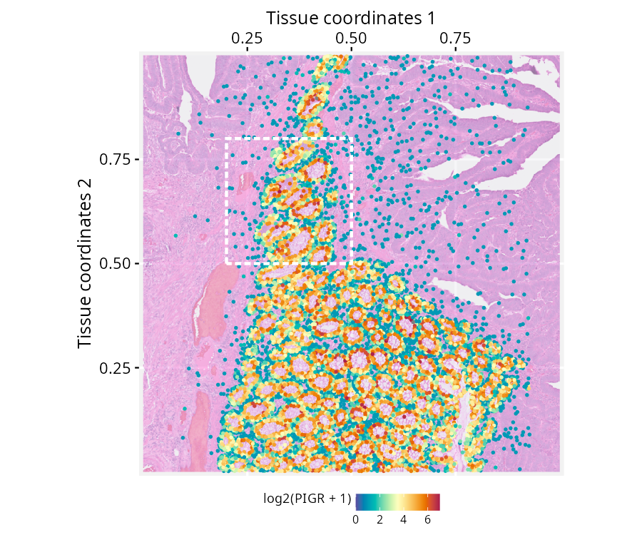
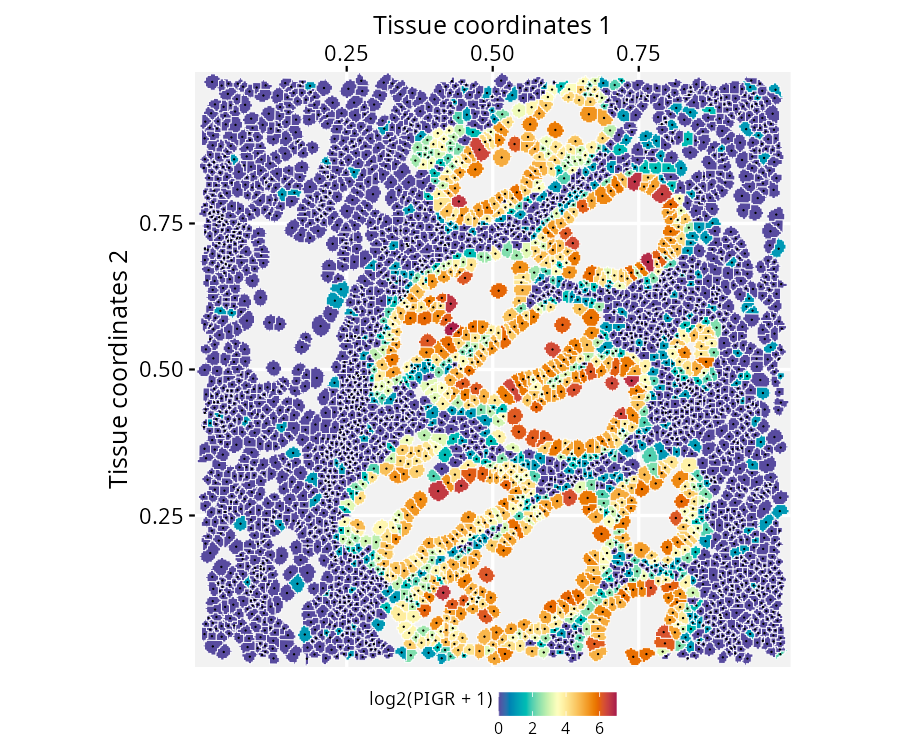

# Spatial-segmented data with SpatialExperiment and RGraphSpace

**Package**: RGraphSpace 1.5.4  

## Overview

This vignette demonstrates how *RGraphSpace* renders *sf* features using
spatial-segmented data pre-processed with the *SpatialExperiment*
package (Righelli et al. 2022) and OSTA (Dong et al. 2026). We will use
a high-definition spatial transcriptomic dataset generated by Oliveira
et al. (2025). This dataset consists of Visium HD spatial gene
expression data from formalin-fixed paraffin-embedded (FFPE) human
colorectal cancer (CRC) tissue, profiled at single-cell scale resolution
(2-µm barcoded capture features) with matched cell segmentation
boundaries derived from paired histology imaging.

## Before you start

This vignette assumes familiarity with
[*SpatialExperiment*](https://www.bioconductor.org/packages/SpatialExperiment/)
(Righelli et al. 2022), particularly for handling Visium HD spatial
transcriptomics data.

**Note:**
If you are new to *SpatialExperiment*, we recommend reviewing the OSTA’s
[Visium HD
Workflow](https://bioconductor.org/books/release/OSTA/pages/seq-workflow-visium-hd-seg.html)
before proceeding.

**Computational requirement:**

- Hardware: Workstation with RAM \>= 32 GB for large datasets

- Software: R (\>=4.5); RStudio recommended

## Required packages


Before proceeding, ensure that all packages described in the
[*Installation
Instructions*](https://sysbiolab.github.io/RGraphSpace/articles/install.md)
are installed.

``` r

# Check versions
if (packageVersion("RGraphSpace") < "1.5.4"){
  message("Need to update 'RGraphSpace' for this vignette")
  remotes::install_github("sysbiolab/RGraphSpace")
}
```

## Setting input data

``` r

# Load packages
library("RGraphSpace")
library("SpatialExperiment")
library("OSTA.data")
library("VisiumIO")
library("patchwork")
library("sf")
```

### Loading the dataset

The original Visium HD dataset is available from the [10x
Genomics](https://www.10xgenomics.com/platforms/visium/product-family/dataset-human-crc)
repository. For convenience, we retrieve this dataset from the Open
Science Framework (OSF) repository using OSTA, then load it into a
`SpatialExperiment`.

``` r

# Set a temporary directory for download
id <- "VisiumHD_HumanColon_Oliveira"
dir.create(td <- tempfile())

# Retrieve data from OSF repo
unzip(OSTA.data_load(id), exdir = td)

# Read into 'SpatialExperiment'
spe <- TENxVisiumHD(
  segmented_outputs = file.path(td, "segmented_outputs"),
  format = "h5", 
  images = "hires") |>
  import()

# Assign unique symbols to rownames
rownames(spe) <-  make.unique(rowData(spe)$Symbol)
```

At this point,
[OSTA](https://bioconductor.org/books/release/OSTA/pages/seq-workflow-visium-hd-seg.html)
provides several pre-processing recommendations, including converting to
a `SpatialFeatureExperiment`, non-spatial and spatially-aware quality
control, and cell type annotation. These are general best practices for
preparing spatial data, already thoroughly demonstrated in the OSTA
workflow itself, so we do not repeat them here. Instead, this vignette
focuses on a possible downstream application using `RGraphSpace` to
manipulate and visualize the segmented data directly. For this purpose,
we will need only raw data.

## Creating a GraphSpace object

Convert the `SpatialExperiment` object into a `GraphSpace`.

``` r

# Coerce 'SpatialExperiment' to 'GraphSpace'
gs <- as.GraphSpace(spe, assay = "counts")
```

Attach the tissue image and its scale factor, then extract the cell
segmentation polygons as an `sf` geometry column and attach them to the
nodes.

``` r

# If available, add tissue image
gs_image(gs) <- SpatialExperiment::imgRaster(spe)

# This image requires to rescale node coordinates to its resolution
gs_scale_factor(gs) <- scaleFactors(spe, image_id = "hires")

# If available, add geometry
cellseg <- metadata(spe)$cellseg
cellseg <- cellseg$geometry[match(gs$name, cellseg$cell_id)]
gs_geometry(gs, "cellseg") <- sf::st_make_valid(cellseg)
```

Next, we examine the spatial boundaries of the nodes relative to the
image. Some coordinates in this dataset fall outside the valid image
range (e.g., negative values), a known artifact of tissue sampling at
subcellular resolution (2 µm), where bins can extend beyond the tissue
boundaries. The OSTA workflow addresses a related issue for some
operations, filtering out bins that overlay empty tissue (see the [setup
section](https://bioconductor.org/books/release/OSTA/pages/seq-workflow-visium-hd-bin.html)).
These out-of-bounds nodes must also be removed here before the graph is
normalized to the image space.

``` r

gs
#> A GraphSpace-class object for:
#> IGRAPH eed9b8c UN-- 220703 0 -- 
#> + attr: x (v/n), y (v/n), name (v/c), nodeLabel (v/c), nodeSize (v/n), 
#> | sample_id (v/c), arrowType (e/n)
#> + node payload: 2 (map, cellseg)
#> + features: 18132 (SAMD11, NOC2L, KLHL17, PLEKHN1, ...)
#> + samples: 220703 (cellid_000000003-1, cellid_000000004-1, ...)
#> + node spatial boundaries: raw graph
#> | x: [3237, 5199] (cols)
#> | y: [-1, 1810] (rows)
#> + image spatial boundaries: raw image
#> | x: [1, 6000] (cols)
#> | y: [1, 3886] (rows)
```

``` r

# Remove out-of-bounds nodes
gs <- gs[gs$y > 1, ] 

# Normalize node coordinates to the image space
gs <- normalizeGraphSpace(gs, mar = 0, equal.mar = TRUE) 
```

## Spatial feature visualization

``` r

# Inspect the data range
# log2(range(gs[["fdata"]]) + 1)

# Set color palette and data range for use across plots
cpal <- hcl.colors(100, palette = "Spectral", rev = T)
data_range <- c(0, 7)

# Set a reusable theme
my_theme <- theme_gspace_coords(theme = "th3", is_norm = TRUE, 
  xlab = "Tissue coordinates 1", ylab = "Tissue coordinates 2")
```

Plot the full tissue, nodes colored by *PIGR* expression over the tissue
image, with cells showing no expression made transparent. A box marks a
region of interest to crop next.

``` r

# Plot node-level PIGR expression over the tissue image; 
# a box marks the region of interest
p <- ggplot(gs) + 
  annotation_gspace_image(gs, opacity = 0.5) +
  geom_nodespace(mapping = aes(colour = log2(PIGR + 1), 
      alpha = as.numeric(PIGR > 0)  ), size = 0.3, pch = 19) +
  scale_colour_continuous(palette = cpal, limits = data_range) +
  scale_alpha_identity() + my_theme +
  annotate("rect", 
    xmin = 0.5, xmax = 0.8, 
    ymin = 0.3, ymax = 0.65, 
    fill = NA, colour = "white",
    lty = "21", lwd = 1)

p
```


Crop to the marked region and re-normalize node coordinates to the new
space.

``` r

# Crop to the marked region and re-normalize coordinates
gs_crop1 <- cropGraphSpace(gs, 
  xmin = 0.5, xmax = 0.8, 
  ymin = 0.3, ymax = 0.65)
gs_crop1 <- normalizeGraphSpace(gs_crop1, mar = 0)
```

Zooming further, a second box marks a smaller region for a closer crop.

``` r

# Plot the cropped region; a second box marks a smaller region for a closer crop
p <- ggplot(gs_crop1) + 
  annotation_gspace_image(gs_crop1, opacity = 0.5) +
  geom_nodespace(mapping = aes(colour = log2(PIGR + 1), 
      alpha = as.numeric(PIGR > 0)), size = 0.7, pch = 19) +
  scale_colour_continuous(palette = cpal, limits = data_range) +
  scale_alpha_identity() + my_theme +
  annotate("rect", 
    xmin = 0.2, xmax = 0.5, 
    ymin = 0.5, ymax = 0.8, 
    fill = NA, colour = "white", 
    lty = "21", lwd = 1)

p
```



Crop to this smaller region. This time, the geometry is also explicitly
re-normalized, since it will be plotted directly in the next steps
rather than just the node markers.

``` r

# Crop to the smaller region and re-normalize coordinates, including the geometry
gs_crop2 <- cropGraphSpace(gs_crop1, 
  xmin = 0.2, xmax = 0.5, 
  ymin = 0.5, ymax = 0.8)
gs_crop2 <- normalizeGraphSpace(gs_crop2, mar = 0)
gs_crop2 <- normalizeGeometry(gs_crop2, name = "cellseg")
```

At this resolution, the real cell segmentation boundaries can be drawn
directly over the tissue image, alongside the node centroids. In this
plot, we can observe the correct alignment between the geometry and the
image.

``` r

# Plot segmentation boundaries over the tissue image, with node centroids
p <- ggplot(gs_crop2) + 
  annotation_gspace_image(gs_crop2, opacity = 1) +
  geom_sf( aes(geometry = cellseg), fill = NA, 
    linewidth = 0.3, colour = "cyan") +
  geom_nodespace(colour = "black", size = 0.1, pch = 19) +
  scale_fill_continuous(palette = cpal, limits = data_range) +
  my_theme
p
```


Finally, fill each cell’s own segmented shape by its *PIGR* expression
directly, with the tissue image dropped now that the shapes themselves
carry the spatial detail.

``` r

# Fill each segmented shape by PIGR expression
p <- ggplot(gs_crop2) + 
  geom_sf( aes(geometry = cellseg, fill = log2(PIGR + 1) ), 
    colour = adjustcolor("white", 1)) +
  geom_nodespace(colour = "black", size = 0.1, pch = 19) +
  scale_fill_continuous(palette = cpal, limits = data_range) +
  scale_colour_identity() + my_theme
p
```



## Coercing *SpatialExperiment* objects

Rather than relying on the `as.GraphSpace(spe, ...)` coercion method
used earlier, a `GraphSpace` can also be built manually from a
`SpatialExperiment`’s individual components. This mirrors what the
coercion method does internally, and offers more direct control over
what gets included and how. Note in particular that the expression
matrix is attached to a dedicated `@fdata` slot via
[`gs_fdata()`](https://sysbiolab.github.io/RGraphSpace/reference/GraphSpace-accessors.md),
rather than merged into the node table, keeping the high-dimensional
features available for aesthetic mapping without being treated as node
attributes.

``` r

# Extract tissue coordinates
coords <- spatialCoords(spe)
colnames(coords) <- c("x", "y")

# Extract cell data
cdata <- colData(spe)

# Merge coordinates and cdata using common cell identifiers
ids <- intersect(rownames(coords), rownames(cdata))
coords <- cbind(coords[ids, ], cdata[ids, ])

# Construct a GraphSpace object
gs <- as.GraphSpace(coords)

# If available, add high-dimensional feature data
# Stored separately for lazy aesthetic mapping
gs_fdata(gs) <- as(SummarizedExperiment::assay(spe, "counts"), "dgCMatrix")

# If available, add tissue image and set a scale factor to node coordinates 
gs_image(gs) <- SpatialExperiment::imgRaster(spe)
gs_scale_factor(gs) <- scaleFactors(spe, image_id = "hires")

# If available, add geometry
cellseg <- metadata(spe)$cellseg
cellseg <- cellseg$geometry[match(gs$name, cellseg$cell_id)]
gs_geometry(gs, "cellseg") <- sf::st_make_valid(cellseg)
```

## Session information

    #> R version 4.6.1 (2026-06-24)
    #> Platform: x86_64-pc-linux-gnu
    #> Running under: Ubuntu 24.04.4 LTS
    #> 
    #> Matrix products: default
    #> BLAS:   /usr/lib/x86_64-linux-gnu/openblas-pthread/libblas.so.3 
    #> LAPACK: /usr/lib/x86_64-linux-gnu/openblas-pthread/libopenblasp-r0.3.26.so;  LAPACK version 3.12.0
    #> 
    #> locale:
    #>  [1] LC_CTYPE=en_US.UTF-8       LC_NUMERIC=C              
    #>  [3] LC_TIME=en_US.UTF-8        LC_COLLATE=en_US.UTF-8    
    #>  [5] LC_MONETARY=en_US.UTF-8    LC_MESSAGES=en_US.UTF-8   
    #>  [7] LC_PAPER=en_US.UTF-8       LC_NAME=C                 
    #>  [9] LC_ADDRESS=C               LC_TELEPHONE=C            
    #> [11] LC_MEASUREMENT=en_US.UTF-8 LC_IDENTIFICATION=C       
    #> 
    #> time zone: America/Sao_Paulo
    #> tzcode source: system (glibc)
    #> 
    #> attached base packages:
    #> [1] stats4    stats     graphics  grDevices utils     datasets  methods  
    #> [8] base     
    #> 
    #> other attached packages:
    #>  [1] sf_1.1-2                    patchwork_1.3.2            
    #>  [3] VisiumIO_1.8.0              TENxIO_1.14.0              
    #>  [5] OSTA.data_1.4.0             SpatialExperiment_1.22.0   
    #>  [7] SingleCellExperiment_1.34.0 SummarizedExperiment_1.42.0
    #>  [9] Biobase_2.72.0              GenomicRanges_1.64.0       
    #> [11] Seqinfo_1.2.0               IRanges_2.46.0             
    #> [13] S4Vectors_0.50.1            BiocGenerics_0.58.1        
    #> [15] generics_0.1.4              MatrixGenerics_1.24.0      
    #> [17] matrixStats_1.5.0           RGraphSpace_1.5.4          
    #> [19] ggplot2_4.0.3              
    #> 
    #> loaded via a namespace (and not attached):
    #>  [1] DBI_1.3.0            httr2_1.3.0          rlang_1.3.0         
    #>  [4] magrittr_2.0.5       otel_0.2.0           e1071_1.7-17        
    #>  [7] compiler_4.6.1       RSQLite_3.53.2       systemfonts_1.3.2   
    #> [10] vctrs_0.7.3          httpcode_0.3.0       pkgconfig_2.0.3     
    #> [13] fastmap_1.2.0        dbplyr_2.6.0         magick_2.9.1        
    #> [16] XVector_0.52.0       fontawesome_0.5.3    rmarkdown_2.31      
    #> [19] tzdb_0.5.0           ggbeeswarm_0.7.3     ragg_1.5.2          
    #> [22] purrr_1.2.2          bit_4.6.0            xfun_0.59           
    #> [25] cachem_1.1.0         jsonlite_2.0.0       blob_1.3.0          
    #> [28] DelayedArray_0.38.2  R6_2.6.1             bslib_0.11.0        
    #> [31] stringi_1.8.9        RColorBrewer_1.1-3   jquerylib_0.1.4     
    #> [34] Rcpp_1.1.2           knitr_1.51           readr_2.2.0         
    #> [37] BiocBaseUtils_1.14.2 Matrix_1.7-6         igraph_2.3.3        
    #> [40] tidyselect_1.2.1     rstudioapi_0.19.0    dichromat_2.0-1     
    #> [43] abind_1.4-8          yaml_2.3.12          curl_7.1.0          
    #> [46] lattice_0.23-1       tibble_3.3.1         withr_3.0.3         
    #> [49] S7_0.2.2             evaluate_1.0.5       ggrastr_1.0.2       
    #> [52] desc_1.4.3           units_1.0-1          proxy_0.4-29        
    #> [55] BiocFileCache_3.2.0  pillar_1.11.1        filelock_1.0.3      
    #> [58] KernSmooth_2.23-27   hms_1.1.4            scales_1.4.0        
    #> [61] class_7.3-24         glue_1.8.1           tools_4.6.1         
    #> [64] BiocIO_1.22.0        fs_2.1.0             tidygraph_1.3.1     
    #> [67] grid_4.6.1           tidyr_1.3.2          beeswarm_0.4.0      
    #> [70] vipor_0.4.7          cli_3.6.6            textshaping_1.0.5   
    #> [73] S4Arrays_1.12.0      dplyr_1.2.1          gtable_0.3.6        
    #> [76] sass_0.4.10          digest_0.6.39        classInt_0.4-11     
    #> [79] SparseArray_1.12.2   crul_1.6.0           osfr_0.2.9          
    #> [82] rjson_0.2.23         htmlwidgets_1.6.4    farver_2.1.2        
    #> [85] memoise_2.0.1        htmltools_0.5.9      pkgdown_2.2.0       
    #> [88] lifecycle_1.0.5      httr_1.4.8           bit64_4.8.2

## References

Dong, Yixing E., Helena L. Crowell, and Vince Carey. 2026. *OSTA.data:
OSTA Book Data*. <https://doi.org/10.18129/B9.bioc.OSTA.data>.

Oliveira, MF, JP Romero, M Chung, et al. 2025. “High-Definition Spatial
Transcriptomic Profiling of Immune Cell Populations in Colorectal
Cancer.” *Nature Genetics* 57 (6): 1512–23.
<https://doi.org/10.1038/s41588-025-02193-3>.

Righelli, Dario, Lukas M. Weber, Helena L. Crowell, et al. 2022.
“SpatialExperiment: Infrastructure for Spatially-Resolved
Transcriptomics Data in r Using Bioconductor.” *Bioinformatics* 38 (11):
–3. https://doi.org/<https://doi.org/10.1093/bioinformatics/btac299>.
