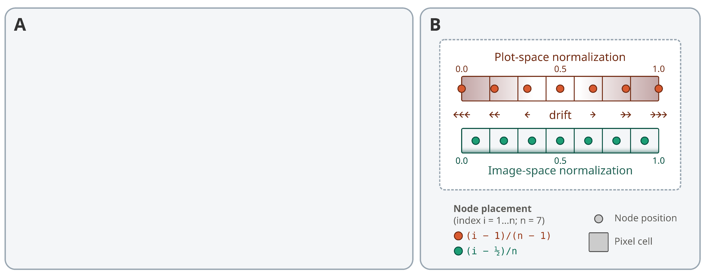

# Summary

A graph describes a network structure of nodes connected by edges, used across many areas of science to represent relationships between entities. In R, *igraph* [@Nepusz2006] provides powerful tools for network analysis, and the *ggplot2* ecosystem [@Wickham2016] for graph visualization, where nodes and edges are drawn as separate layers. Integrating the two remains challenging, however, because the geometry of these layers is not fully coordinated at rendering time, a consequence of *ggplot2*'s input model, in which each plot layer consumes a single rectangular table and is resolved independently. This design works remarkably well for most applications, but is restrictive for structures with mutually dependent components. Because layers do not share transformed state, the scaled geometry is not preserved between node and edge tables, and the two are not rendered as a single coherent object. Here we introduce *RGraphSpace*, a lightweight interface that integrates *igraph* objects with *ggplot2* graphics within a normalized coordinate space. It synchronizes node and edge layers, jointly resolving their geometry under standard aesthetic mappings. *RGraphSpace* also supports registration against external coordinate systems, such as images and maps, so that a graph becomes a spatial object aligned to a wider context rather than an isolated diagram. *RGraphSpace* is available from CRAN, with comprehensive tutorials provided on GitHub (<https://sysbiolab.github.io/RGraphSpace>).

# Statement of need

Graph visualization in R rests on two mature foundations: *igraph* [@Nepusz2006] for graph computation and *ggplot2* [@Wickham2016] for layered graphics. Tools such as *ggraph* [@Pedersen2025_2] and *GGally* [@Schloerke2025] bridge these, exposing graph layouts as *ggplot2* layers styled through standard aesthetic mappings. Graph data access has similarly matured through *tidygraph* [@Pedersen2025_1], which exposes graphs as tidy node and edge tables, and through the broader tidyomics ecosystem [@Hutchison2024], which extends this idiom to complex multi-component containers common in computational biology.

A gap remains in how a graph's components are held together during rendering. Because *ggplot2* resolves each layer independently, node and edge layers are not fully geometrically synchronized. Positional coordinates are shared and remain consistent, but other aesthetics are resolved per layer, so an edge cannot account for the scaled extent of the nodes it connects. Existing graph-oriented extensions such as *ggraph* [@Pedersen2025_2] do not synchronize node and edge geometry, regardless of how the layout was produced.

*RGraphSpace* addresses this by treating a graph as a single coherent object throughout rendering. It takes an *igraph* object and scales the graph into a normalized coordinate space in which nodes, edges, and their associated elements are resolved together. Because node and edge geometry are synchronized at rendering time, edges are drawn with respect to the scaled extent of the nodes they connect, and this correspondence is maintained as aesthetics are mapped through the standard *ggplot2* grammar. 

The normalized space serves a second purpose: it gives the graph a common spatial reference, allowing it to be registered against external coordinate systems, placing the graph within a broader spatial context. For images, spatial registration means that node coordinates are aligned and locked at the pixel level (\autoref{fig:figure1}). This alignment requires consistent coordinate conventions between the graph and the image; a mismatch in axis orientation, for example a top-left versus bottom-left origin, can cause the nodes and the image to be misaligned. Moreover, because each pixel occupies a finite square area, registering to a pixel corner rather than its center introduces a sub-pixel offset, and such errors can accumulate where high-resolution alignment is required, as in tissue photomicrographs.

{width="100%"}

# State of the field

The Grammar of Graphics [@Wilkinson2005] constructs statistical graphics by decomposing a plot into independent, composable elements: data, aesthetic mappings, geometric objects, scales, coordinate systems, and statistical transformations. A graphic is then built declaratively by combining these components. In R, the *ggplot2* package implements a layered form of this grammar [@Wickham2010], assembling graphics by adding successive layers to a shared coordinate system, and has become the dominant visualization framework in the R ecosystem.

Central to this design is how *ggplot2* consumes data: each layer is bound to a single rectangular table and resolved independently, applying its own transformations, scales, and position adjustments before being drawn [@Wickham2016]. This independence is a deliberate strength, since layers can be freely combined, reordered, and reused, and it pairs naturally with the tidy data convention [@Wickham2014], in which each variable is a column and each observation a row.

This design has allowed *ggplot2* to accommodate data structures beyond simple flat tables. The *sf* package [@Pebesma2018], for example, represents spatial vector geometry as list-columns and integrates with *ggplot2* through a dedicated `geom_sf` layer, extending the grammar to non-tabular representations while preserving its declarative interface. Graph data has received similar attention. The *ggraph* package [@Pedersen2025_2] extends *ggplot2* with an extensive family of node and edge geometries, bringing graph layouts into the grammar, while earlier tools such as the *GGally* package [@Schloerke2025] plot networks from adjacency and edge-list inputs. These packages establish that the node and edge tables of a graph can be expressed as *ggplot2* layers and styled through standard aesthetic mappings.

Alongside these visualization tools, a parallel line of work has focused on making complex data structures accessible to the tidyverse [@Wickham2019], a collection of R packages sharing a common design for data manipulation. The *tidygraph* package [@Pedersen2025_1] exposes a graph as a pair of tidy node and edge tables, allowing graph manipulation through familiar tidyverse verbs while preserving its relational structure. This tidy philosophy extends to multi-component containers common in computational biology, including *Seurat* [@Hao2024], *SummarizedExperiment* [@Huber2015], *SingleCellExperiment* [@Amezquita2020], and *SpatialExperiment* [@Righelli2022], which bundle components such as assays, metadata, reductions, spatial coordinates, and graphs within a single object. The tidyomics ecosystem [@Hutchison2024] provides interfaces for these containers (e.g., *tidyseurat* [@Mangiola2021]), exposing them to tidyverse tools, including *ggplot2*. Data access to these structures is therefore increasingly well supported, and *RGraphSpace* builds on this foundation to contribute the rendering step.

# Research impact statement

*RGraphSpace* serves as the spatial rendering foundation for *PathwaySpace* [@PathwaySpace], a package that projects network-derived signals onto spatial representations of biological pathways. This integration has supported published analyses in systems biology [@Tercan2025; @Ellrott2025], demonstrating that *RGraphSpace* provides a practical basis for downstream spatial analysis tools.

# Software design

*RGraphSpace* is built around the `GraphSpace` S4 class, which encapsulates a graph together with the components required for coherent rendering: node and edge tables, the source `igraph` object, an optional background image, and a sparse feature matrix (\autoref{fig:figure2}A). Object validity enforces alignment between these components, so node identifiers, graph vertices, and feature rows always correspond.

Rather than embedding node-associated features as node attributes, `GraphSpace` stores them in `@fdata`, a dedicated sparse-matrix slot aligned to nodes but structurally independent of the node table. When a feature is referenced in an aesthetic mapping, only the requested feature is retrieved and joined for the current plot, so graphs carrying thousands of features are never expanded into dense node tables.

The package interoperates with existing graph and container tools rather than replacing them. Graphs can be supplied as either `igraph` or `tidygraph` objects through a common interface (\autoref{fig:figure2}B). *RGraphSpace* also works with *ggraph*, accepting its layouts as input and providing geometries that can be used within *ggraph* plots. Coercion methods extend the same interface to selected multi-component containers, loading their node-associated features into the `@fdata` slot.

Node coordinates are normalized either to a unit square or to a background image, with both the source image and a render-ready copy stored in the object. This establishes a stable reference frame for registering graphs to external coordinate systems. To keep this registration precise, `normalizeGraphSpace()` maps node coordinates to pixel centers through an explicit half-pixel offset rather than to pixel corners, and the encoding is inverted exactly when the space is cropped, so alignment is preserved at the pixel level.

Rendering extends *ggplot2* through its standard build mechanisms. A `GraphSpace` supplied to `ggplot()` produces a subclassed plot that verifies the node and edge layers originate from the same graph before coordinating them. *RGraphSpace* then intercepts the build pipeline after the node layer has been fully processed, and the resulting node geometry is propagated to the edge layer, allowing edge construction to use the final rendered node representation. This synchronization makes edges node-aware, maintaining their geometric correspondence with the nodes they connect, and is available through three geometries: `geom_nodespace()`, `geom_edgespace()`, and the convenience wrapper `geom_graphspace()`.

![Architecture of RGraphSpace. (**A**) The `GraphSpace` S4 class stores a graph, its node and edge tables, node-aligned feature data as a sparse matrix, and paired source and render-ready images. Object validity enforces a shared node identity across the graph vertices, node table, and feature rows. (**B**) Graph inputs (`igraph` or `tidygraph`) are used to construct a `GraphSpace`; selected non-graph objects are handled through coercion and accessors (inset). Coordinates are normalized to a unit square or to the pixel space of a background image. At the *ggplot2* build step, the node and edge layers are synchronized, producing node-aware edges over an optional background image.\label{fig:figure2}](figure2.png){width="100%"}

# Availability and documentation

*RGraphSpace* is available on CRAN and can be installed using standard R package installation procedures. The development version is hosted on GitHub at <https://github.com/sysbiolab/RGraphSpace>, and full documentation and tutorials are available at <https://sysbiolab.github.io/RGraphSpace>. Documentation includes vignettes demonstrating the base workflow, from an `igraph` object to customized *ggplot2* visualizations (\autoref{fig:figure3}A), graph registration to background images (\autoref{fig:figure3}B), and application to single-cell and spatial feature data (\autoref{fig:figure3}C).

{width="100%"}

# AI usage disclosure

During the preparation of this work, the authors used ChatGPT (OpenAI) and Claude Code (Anthropic) to improve text readability and to audit code while using RStudio Desktop (<https://posit.co/>). The authors carefully reviewed and edited the content as needed after using these tools and assume full responsibility for the published content.

# Acknowledgements

This work was funded by CNPq (440412/2022-6 and 307144/2025-9), CAPES (Finance Code 001), and Fundação Araucária (NAPI Bioinformática).

# References
