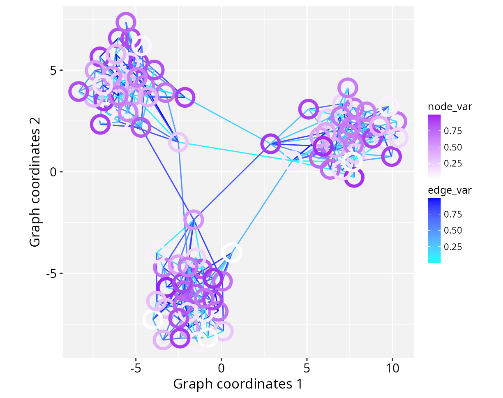
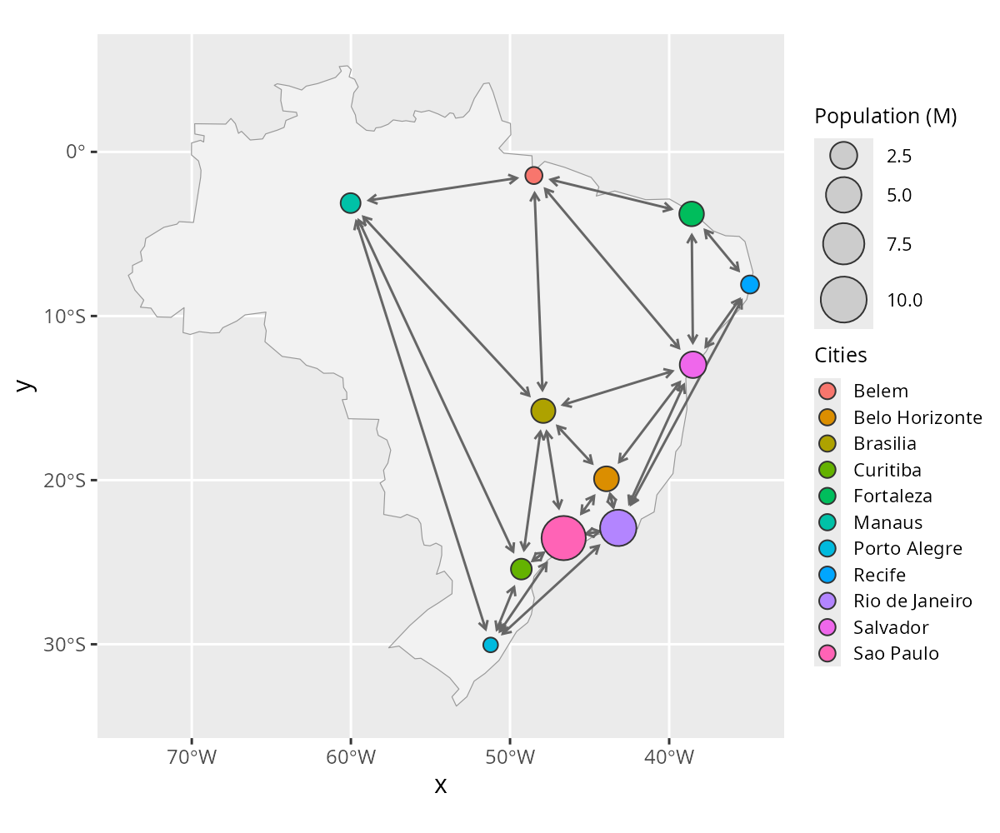
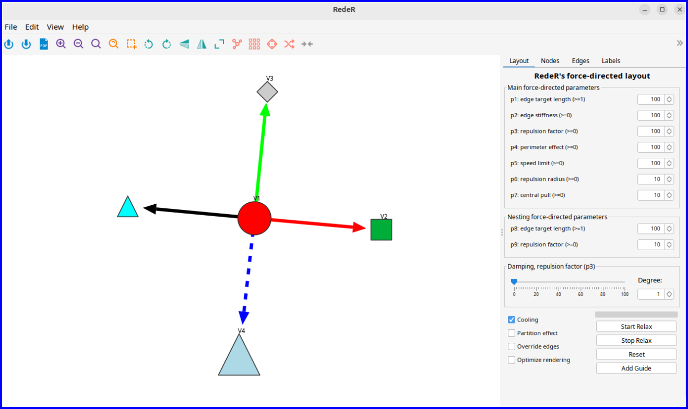

```{r setup, include=FALSE, purl=FALSE}
knitr::opts_chunk$set(
  echo = TRUE,
  collapse = TRUE,
  comment = "#>",
  fig.align = "center",
  fig.width = 7,
  fig.height = 5
  )
```

<br/>
**Package**: RGraphSpace `r packageVersion('RGraphSpace')`

# Highlights
* Native *ggplot2* interface for *igraph* objects
* Optimized *geoms* for large-scale network visualization
* Dual-anchor normalization for precise spatial alignment
* Aligns networks with background spatial references

# Overview

*RGraphSpace* is an R package that generates *ggplot2* graphics for *igraph* objects [@Nepusz2006], scaling nodes and edges to a unit space. The package implements new *ggplot2* geometric prototypes [@Wickham2016], optimized for representing large networks. This enables extensive customization of aesthetics and visual style, including colors, shapes, and line types. Three specialized `geoms` translate graph data into geometric layers (see [*using geoms*](#using-geoms)). These `geoms` use a dual-anchor normalization approach to align layers, which is critical for analysis where network elements must be accurately referenced to a spatial map. Section [*mapping graphs to images*](#mapping-graphs-to-images) illustrates how this alignment achieves pixel-level precision. In what follows, this tutorial demonstrates how to use *RGraphSpace* for side-by-side visualization of multiple graphs.

# Quick start

This section will create a toy *igraph* object to demonstrate the *RGraphSpace* workflow. The graph layout is configured manually to ensure that users can easily view all the relevant arguments needed to prepare the input data. We will use the igraph's `make_star()` function to create a simple star-like graph and then the `V()` and `E()` functions to set attributes for vertices and edges, respectively. The *RGraphSpace* package will require that all vertices have `x`, `y`, and `name` attributes.

```{r Load packages for quick start, eval=TRUE, message=FALSE}
#--- Load required packages
library("igraph")
library("ggplot2")
library("RGraphSpace")
```

```{r Toy igraph - 1, eval=TRUE, message=FALSE, results=FALSE}
# Make a 'toy' igraph with 5 nodes and 4 edges;
# ..either a directed or undirected graph
gtoy1 <- make_star(5, mode="out")

# Check whether the graph is directed or not
is_directed(gtoy1)
## [1] TRUE

# Check graph size
vcount(gtoy1)
## [1] 5
ecount(gtoy1)
## [1] 4

# Assign 'x' and 'y' coordinates to each vertex;
# ..this can be an arbitrary unit in (-Inf, +Inf)
V(gtoy1)$x <- c(0, 2, -2, -4, -8)
V(gtoy1)$y <- c(0, 0,  2, -4,  0)

# Assign a name to each vertex
V(gtoy1)$name <- paste0("n", 1:5)
```

```{r Toy igraph - 2, eval=TRUE, message=FALSE, out.width="100%"}
# Plot the 'gtoy1' using standard R graphics
plot(gtoy1)
```

```{r Toy igraph - 3, eval=TRUE, message=FALSE, out.width="80%"}
# Plot the 'gtoy1' using RGraphSpace
plotGraphSpace(gtoy1, add.labels = TRUE)
```

# *RGraphSpace* attributes

Next, we will demonstrate all vertex and edge attributes that can be passed to *RGraphSpace* methods.

## Vertex attributes

```{r Node attributes, eval=TRUE, message=FALSE}
# Node size (numeric in [0, 100], as '%' of the plot space)
V(gtoy1)$nodeSize <- c(8, 5, 5, 10, 5)

# Node shape (integer code between 0 and 25; see 'help(points)')
V(gtoy1)$nodeShape <- c(21, 22, 23, 24, 25)

# Node color (Hexadecimal or color name)
V(gtoy1)$nodeColor <- c("red", "#00ad39", "grey80", "lightblue", "cyan")

# Node line width (as in 'lwd' standard graphics; see 'help(gpar)')
V(gtoy1)$nodeLineWidth <- 1

# Node line color (Hexadecimal or color name)
V(gtoy1)$nodeLineColor <- "grey20"

# Node labels ('NA' will omit labels)
V(gtoy1)$nodeLabel <- c("V1", "V2", "V3", "V4", NA)

# Node label size (in pts)
V(gtoy1)$nodeLabelSize <- 8

# Node label color (Hexadecimal or color name)
V(gtoy1)$nodeLabelColor <- "black"

# Node transparency (in [0,1])
V(gtoy1)$nodeAlpha <- 1
```

## Edge attributes

Given a list of edges, *RGraphSpace* represents only one edge for each pair of connected vertices. If there are multiple edges connecting the same vertex pairs, it will display the line attributes of the first edge in the list.

```{r Edge attributes - 1, eval=TRUE, message=FALSE}
# Edge width (as in 'lwd' standard graphics; see 'help(gpar)')
E(gtoy1)$edgeLineWidth <- 0.8

# Edge color (Hexadecimal or color name)
E(gtoy1)$edgeLineColor <- c("red","green","blue","black")

# Edge type (as in 'lty' standard graphics; see 'help(gpar)')
E(gtoy1)$edgeLineType <- c("solid", "11", "dashed", "2124")

# Edge transparency (in [0,1])
E(gtoy1)$edgeAlpha <- 1
```

## Arrowhead attributes

**Arrowhead in directed graphs**: By default, an arrow will be drawn for each edge according to its left-to-right orientation in the edge list (*e.g.* `A -> B`).

```{r Edge attributes - 2, eval=TRUE, message=FALSE}
# Arrowhead types in directed graphs (integer code or character)
## 0 = "---", 1 = "-->", -1 = "--|"
E(gtoy1)$arrowType <- 1
``` 

**Arrowhead in undirected graphs**: By default, no arrow will be drawn in undirected graphs.

```{r Edge attributes - 3, eval=TRUE, message=FALSE}
# Arrowhead types in undirected graphs (integer or character code)
##  0 = "---"
##  1 = "-->",  2 = "<--",  3 = "<->",  4 = "|->",
## -1 = "--|", -2 = "|--", -3 = "|-|", -4 = "<-|", 
E(gtoy1)$arrowType <- 1
# Note: in undirected graphs, this attribute overrides the 
# edge's orientation in the edge list
```

... and plot the updated *igraph* object with *RGraphSpace*:
 
```{r A shortcut for RGraphSpace, eval=TRUE, message=FALSE, out.width="80%"}
# Plot the updated 'gtoy1' using RGraphSpace
plotGraphSpace(gtoy1, add.labels = TRUE)
```


# Using *ggplot2* geoms {#using-geoms}

## Visual integration and aesthetics mapping

This section illustrates how *RGraphSpace* integrates with the *ggplot2* using `geoms` building blocks. Graph attributes stored within the `GraphSpace` object can be handled in two ways:

* **Identity mapping:** Graph attributes are interpreted as "identity values" (such as `nodeColor`, `nodeSize`, or `nodeShape`) and are displayed exactly as they are, without further scaling or mapping.

* **Dynamic aesthetic mapping:** Graph attributes are mapped to  *aesthetics* (such as `colour`, `size`, and `shape`) and rendered through standard *ggplot2* scales, which automatically generate synchronized legends.

### The *GraphSpace* geoms

To facilitate this integration, *RGraphSpace* implements three specialized `geoms` designed to handle graph data types within a *ggplot2* workflow:

1. **`geom_graphspace()`**: A high-level convenience layer that processes both nodes and edges in a single call. 
2. **`geom_nodespace()`**: Dedicated to rendering nodes. Inherits `GeomPoint` aesthetic mappings, modified to inform the edge layer on node states. It can be used with the `inject_nodespace()` function to adjust edge offsets when the `size` aesthetic is applied to nodes.
3. **`geom_edgespace()`**: Handles the relational data between nodes. Inherits `GeomSegment` aesthetic mappings; unlike standard segments, it is "node-aware" and dynamically calibrates start and end points to connected nodes. 

In the following example, we create a small modular graph containing variables of different types in order to demonstrate these *geoms*.

```{r Load a toy graph, eval=TRUE, message=FALSE, out.width="80%"}
# Make a toy modular graph
library("igraph")
gtoy2 <- sample_islands(
  islands.n = 3,       # number of modules
  islands.size = 30,   # nodes per module
  islands.pin = 0.25,  # probability of edges within modules
  n.inter = 2)         # edges between modules

# Assign module membership to nodes
V(gtoy2)$module <- rep(1:3, each = 30)

# Assign colors to nodes
V(gtoy2)$nodeColor <- rainbow(3)[V(gtoy2)$module]

# Assign a categorical variable to nodes
V(gtoy2)$node_group <- c("A", "B", "C")[V(gtoy2)$module]

# Assign numeric variables to nodes and edges
V(gtoy2)$node_var <- runif(vcount(gtoy2))
E(gtoy2)$edge_var <- runif(ecount(gtoy2))

# Create a GraphSpace from the toy igraph
gs <- GraphSpace(gtoy2)
```

## Plotting identity values

In this example, `nodeColor` already contains the final colour values stored in the `GraphSpace` object. The colours will be displayed as-is by the `geom_graphspace()` function. This approach is particularly useful when nodes have been pre-processed with specific color schemes and you want the visual output without further mapping.

```{r, eval=TRUE, message=FALSE, include = FALSE}
edge_var <- node_var <- nodeColor <- node_group <- NULL
```

```{r Plot identity values, eval=TRUE, message=FALSE, out.width="70%"}
ggplot() + 
  geom_graphspace(colour = "grey", data = gs) +
  theme(aspect.ratio = 1)
```

The trade-off on this approach is that, on one hand, all attributes reflect the original data directly, but no legend is accessible. This is because identity scales bypass the scaling and guide-building process of **ggplot2**. If a legend is required to explain the meaning of these colors, the attribute should be mapped as a variable (e.g., `aes(fill = attribute)`) using standard discrete or continuous scales.

## Mapping categorical variables

In this example, the node categorical variable `node_group` is mapped to the `fill` aesthetic.

```{r Map aesthetics to categorical variables, eval=TRUE, message=FALSE, out.width="70%"}
ggplot() + 
  geom_graphspace(aes(fill = node_group), 
    colour = "grey", data = gs) +
  scale_fill_viridis_d(option = "viridis") +
  theme_gspace_coords()
```

## Mapping numeric variables

In this example, node and edge numeric variables are mapped to `fill` and `colour` aesthetics, respectively.

```{r Map aesthetics to numeric variables, eval=TRUE, message=FALSE, out.width="70%"}
# Map aesthetics to numeric variables
ggplot() + 
  geom_edgespace(aes(colour = edge_var), data = gs) +
  geom_nodespace(aes(fill = node_var), 
    colour = "grey", data = gs) +
  scale_colour_continuous(palette = c("cyan","blue")) +
  scale_fill_continuous(palette = c("white","purple")) +
  theme_gspace_coords()
```

## Using separate colour scales

When multiple geoms use the same aesthetic (for example `colour`) but require mapping to different variables with independent scales, the *ggnewscale* package can be used to introduce a new scale [@Campitelli2025].

```{r Map aesthetics to separate colour scales, eval=FALSE, message=FALSE, out.width="70%"}
if (!require("ggnewscale", quietly = TRUE)) {
  install.packages("ggnewscale")
}
library("ggnewscale")
ggplot() + 
  geom_edgespace(aes(colour = edge_var), data = gs) +
  scale_colour_continuous(palette = c("cyan","blue")) +
  ggnewscale::new_scale_colour() +
  geom_nodespace(aes(colour = node_var), 
    data = gs, stroke = 2, fill = NA) +
  scale_colour_continuous(palette = c("white","purple")) +
  theme_gspace_coords()
```

```{r toy_newscale.png, eval=FALSE, message=FALSE, echo=FALSE, include=FALSE, purl=FALSE}
# gg <- ggplot() + 
#   geom_edgespace(aes(colour = edge_var), data = gs) +
#   scale_colour_continuous(palette = c("cyan","blue")) +
#   ggnewscale::new_scale_colour() +
#   geom_nodespace(aes(colour = node_var), 
#     data = gs, stroke = 2, fill = NA) +
#   scale_colour_continuous(palette = c("white","purple")) +
#   theme_gspace_coords()
# ggsave(filename = "./figs/toy_newscale.png", height=NA, width=NA,
#   units="in", device="png", dpi=200, plot=gg)
```

```{r toy_newscale, echo=FALSE, out.width = '70%', purl=FALSE}

```


# Mapping graphs to images

Images can be used as spatial references for graphs. When a raster image is provided, pixel coordinates define where nodes are positioned, supporting the construction of graphs from image features.

As an example, topographic features extracted from the `volcano` matrix are mapped to graph nodes and visualized over a raster image.

```{r Mapping images to graph space, eval=TRUE, message=FALSE, out.width="80%"}
# Extract pixel coordinates for a specific intensity quantile.
coords <- which(volcano == quantile(volcano, 0.85), arr.ind = TRUE)

# Mark target pixels with '0'; it will appear as black in the background. 
# This creates a visual anchor to verify the alignment precision.
volcano2 <- volcano
volcano2[coords] <- 0

# Create an igraph object from the pixel coordinates; 
# note that at this stage, 'y' represents matrix row indices.
gtoy3 <- igraph::make_empty_graph(n = nrow(coords))
igraph::V(gtoy3)$y <- coords[,1]
igraph::V(gtoy3)$x <- coords[,2]

# Highlight the bottom-row vertex (max 'y' index) to demonstrate alignment; 
# since matrix indexing is top-down, this accounts for the default flip 
# between matrix and plot coordinate systems.
igraph::V(gtoy3)$nodeColor <- NA
bottom_row <- which.max(igraph::V(gtoy3)$y)
igraph::V(gtoy3)$nodeColor[bottom_row] <- adjustcolor("red", 0.4)

# Initialize a GraphSpace object
gs <- GraphSpace(gtoy3)

# Map graph coordinates to the image space; by default,
# 'y' row indices will be flipped (see comments below).
gs <- normalizeGraphSpace(gs, image = as_colorraster(volcano2) )

# Render the graph with the raster as background
plotGraphSpace(gs, add.image = TRUE)
```

**Note on image alignment**: Proper spatial alignment between nodes and the background image requires consistent coordinate conventions. Spatial misalignment may occur if the input image and node coordinates differ in axis orientation (e.g., top-left versus bottom-left origins). To accommodate these differences, `normalizeGraphSpace()` provides orientation controls through the `rotate.xy`, `flip.x`, and `flip.y` arguments. If the nodes appear misaligned with the input image, try combinations of these parameters to correct the alignment. Alternatively, try `flip.v` and `flip.h` arguments to apply flipping directly to the background image.


# Interoperability with other packages

*RGraphSpace* is designed to be a seamless extension for existing network analysis workflows, not a replacement for it. Whether using *igraph* for heavy-duty computations or *tidygraph* for tidy data manipulation, *RGraphSpace* `geoms` automatically recognize these objects and project them into the graphic space on the fly.

**Why use *RGraphSpace* with *ggraph*?**

While *ggraph* is a wonderful framework for relational data, it often struggles with precise edge-node alignment when node sizes vary dynamically. *RGraphSpace* enhances this through specialized `geoms` for edge clipping that automatically account for dynamic node scaling. Furthermore, edge construction is fully automated for both directed and undirected graphs, derived from graph interaction rules without the need for manual adjustments.

The trade-off for this higher level of automation is that the user has fewer low-level options compared to the *ggraph* approach. This is exactly why using *RGraphSpace* alongside *ggraph* makes sense: you get precise alignment between the graph and a reference background while retaining the vast layout and styling flexibility of the *ggraph* grammar.

## Geospatial networks

Integrating network structures with geographic data often involves a clash of coordinate systems and scale units. The following example demonstrates the interoperability between *RGraphSpace* and *ggraph* using both *igraph* and *tidygraph* objects, while managing spatial data with *sf*, the standard infrastructure for spatial data analysis in `R` [@Pebesma2023]. 

```{r Check required packages, eval=FALSE, message=FALSE}
# Check for required packages before running the example
if(!require("sf", quietly = TRUE)){
  install.packages("sf")
}
if(!require("maps", quietly = TRUE)){
  install.packages("maps")
}
if(!require("geometry", quietly = TRUE)){
  install.packages("geometry")
}
if(!require("rnaturalearth", quietly = TRUE)){
  install.packages("rnaturalearth")
}
if(!require("tidygraph", quietly = TRUE)){
  install.packages("tidygraph")
}
if(!require("ggraph", quietly = TRUE)){
  install.packages("ggraph")
}
```

Next, we build a spatial network of cities to show how *RGraphSpace* `geoms` can be plugged into *ggraph* and *sf* workflows.

```{r Interoperability - 1, eval=FALSE, message=FALSE, out.width="80%"}
library("RGraphSpace")
library("igraph")
library("sf")
library("maps")
library("geometry")
library("rnaturalearth")
library("tidygraph")
library("ggraph")

# Load a map and transform projection
map_sf <- ne_countries(country = "Brazil", returnclass = "sf")
map_proj <- st_transform(map_sf)

# Filter major cities by regional capitals
data(world.cities, package = "maps")
r_capitals <- c(
  "Aracaju", "Belem", "Belo Horizonte", "Boa Vista", "Brasilia", 
  "Campo Grande", "Cuiaba", "Curitiba", "Florianopolis", "Fortaleza", 
  "Goiania", "Joao Pessoa", "Macapa", "Maceio", "Manaus", "Natal", 
  "Palmas", "Porto Alegre", "Porto Velho", "Recife", "Rio Branco", 
  "Rio de Janeiro", "Salvador", "Sao Luis", "Sao Paulo", "Teresina", 
  "Vitoria"
)
cities <- subset(world.cities, country.etc == "Brazil" & 
    name %in% r_capitals & pop > 1200000)

# Create Delaunay triangulation edges
# Note: the edges hold no particular meaning beyond
# demonstrating integration between coordinate systems
tri <- delaunayn(cities[,c("lat","long")])
edges <- unique(rbind(tri[,c(1,2)], tri[,c(2,3)], tri[,c(1,3)] ))

# Build an 'igraph' using city coordinates
igraph_cities <- igraph::graph_from_edgelist(edges, directed = FALSE)
igraph::V(igraph_cities)$x <- cities$long
igraph::V(igraph_cities)$y <- cities$lat
igraph::V(igraph_cities)$Cities <- cities$name
igraph::V(igraph_cities)$`Population (M)` <- cities$pop/1000000
igraph::E(igraph_cities)$arrowType <- 3
```

... and now plot; all the options below will produce the same visual output, demonstrating *RGraphSpace* geoms for different input workflows:

```{r Interoperability - 2, eval=FALSE, message=FALSE, out.width="80%"}
# Option 1: Passing an 'igraph' object directly to the geoms
ggplot() +
  geom_sf(data = map_proj, fill = "grey95", color = "grey60") +
  geom_edgespace(color = "grey40", arrow_size = 0.5, data = igraph_cities) +
  geom_nodespace(aes(fill = Cities, size = `Population (M)`), data = igraph_cities) +
  scale_size(range = c(3, 9)) +
  inject_nodespace() + 
  theme_gray() +
  theme_gspace_legend(key_fill = TRUE)

# Option 2: Passing a 'tidygraph' object
gr <- as_tbl_graph(igraph_cities)
ggplot() +
  geom_sf(data = map_proj, fill = "grey95", color = "grey60") +
  geom_edgespace(color = "grey40", arrow_size = 0.5, data = gr) +
  geom_nodespace(aes(fill = Cities, size = `Population (M)`), data = gr) +
  scale_size(range = c(3, 9)) +
  inject_nodespace() + 
  theme_gray() +
  theme_gspace_legend(key_fill = TRUE)

# Option 3: Integration within a 'ggraph' workflow
gr <- as_tbl_graph(igraph_cities)
ggraph(graph = gr, x= gr$x, y = gr$y) +
  geom_sf(data = map_proj, fill = "grey95", color = "grey60") +
  geom_edgespace(color = "grey40", arrow_size = 0.5) +
  geom_nodespace(aes(fill = Cities, size = `Population (M)`)) +
  scale_size(range = c(3, 9)) +
  inject_nodespace() + 
  theme_gray() +
  theme_gspace_legend(key_fill = TRUE)

# Option 4: Passing a native 'GraphSpace' object
gs <- GraphSpace(igraph_cities)
ggplot() +
  geom_sf(data = map_proj, fill = "grey95", color = "grey60") +
  geom_edgespace(color = "grey40", arrow_size = 0.5, data = gs) +
  geom_nodespace(aes(fill = Cities, size = `Population (M)`), data = gs) +
  scale_size(range = c(3, 9)) +
  inject_nodespace() + 
  theme_gray() +
  theme_gspace_legend(key_fill = TRUE)
```

```{r toy_sf.png, eval=FALSE, message=FALSE, echo=FALSE, include=FALSE, purl=FALSE}
# gg <- ggplot() +
#   geom_sf(data = map_proj, fill = "grey95", color = "grey60") +
#   geom_edgespace(color = "grey40", arrow_size = 0.5,
#     arrow_offset = 0.01, data = gs) +
#   geom_nodespace(aes(fill = Cities, size = `Population (M)`),
#     data = gs) +
#   scale_size(range = c(3, 9)) +
#   scale_fill_discrete() +
#   inject_nodespace() +
#   theme_gspace_legend(key_fill = TRUE)
# ggsave(filename = "./figs/toy_sf.png", height=5, width=6,
#   units="in", device="png", dpi=200, plot=gg)
```

```{r toymap, echo=FALSE, out.width = '75%', purl=FALSE}

```


## Interactive visualization

The following example demonstrates interoperability between *RGraphSpace* and *RedeR*, an R/Bioconductor package for interactive network visualization and manipulation.

```{r A shortcut for RedeR, eval=FALSE, message=FALSE}
# Load RedeR, a graph package for interactive visualization
## Note: this example requires Bioc >= 3.19
if(!require("BiocManager", quietly = TRUE)){
  install.packages("BiocManager")
  #BiocManager::install(version = "3.19")
}
if(!require("RedeR", quietly = TRUE)){
  BiocManager::install("RedeR")
}

# Launch the RedeR application
library("RedeR")
startRedeR()
resetRedeR()
data(gtoy1, package = "RGraphSpace")

# Send 'gtoy1' to the RedeR interface
addGraphToRedeR(gtoy1, unit="npc")
relaxRedeR()

# Fetch 'gtoy1' with a fresh layout
gtoy1_2 <- getGraphFromRedeR(unit="npc")

# Check the round trip...
plotGraphSpace(gtoy1_2, add.labels = TRUE)

## Note that for the round trip, shapes and line types are
## partially compatible between ggplot2 and RedeR.

# ...alternatively, just update the graph layout
gtoy1_2 <- updateLayoutFromRedeR(g=gtoy1)

# ...check the updated layout
plotGraphSpace(gtoy1_2, add.labels = TRUE)
```

```{r toygraph, echo=FALSE, out.width = '95%', purl=FALSE}

```


## Other examples

The following vignettes illustrate how *RGraphSpace* can be used in combination with *PathwaySpace* to project network signals on landscape images.

[Projection of network signals](https://sysbiolab.github.io/PathwaySpace/){target="_blank" rel="noopener"}

# Citation

If you use *RGraphSpace*, please cite:

* Sysbiolab Team. "RGraphSpace: A lightweight interface between igraph and ggplot2 graphics." R package, 2023. Doi: 10.32614/CRAN.package.RGraphSpace

* Castro MA, Wang X, Fletcher MN, Meyer KB, Markowetz F (2012). "RedeR: R/Bioconductor package for representing modular structures, nested networks and multiple levels of hierarchical associations." *Genome Biology*, 13(4), R29. Doi: 10.1186/gb-2012-13-4-r29


# Session information
```{r label='Session information', eval=TRUE, echo=FALSE}
sessionInfo()
```


# References

