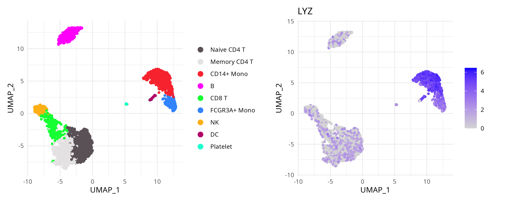

```{r setup, include=FALSE, purl=FALSE}
knitr::opts_chunk$set(
  echo = TRUE,
  collapse = TRUE,
  comment = "#>",
  fig.align = "center",
  fig.width = 7,
  fig.height = 5
  )
```

**Package**: RGraphSpace `r packageVersion('RGraphSpace')`
<br/>

# Overview

While developing *RGraphSpace*, the challenge of representing graph structures in *ggplot2* highlighted a core design restriction: that plotting data must be expressed in tabular form, typically as a single `data.frame` [@Wickham2016]. This approach works remarkably well for most applications, but becomes too restrictive when dealing with data objects composed of multiple interdependent components.

In this vignette, we explore how the `ggplot-GraphSpace` interface can be applied to high-dimensional data, enabling direct interaction with the *ggplot2* grammar and its aesthetic mapping mechanisms without repeated conversion into flat tabular representations. We demonstrate this approach using the *Seurat* package [@Yuhan2024]. `Seurat` objects encapsulate multiple coordinated representations of single-cell data, making them representative examples of high-dimensional data that cannot be naturally expressed as a single `data.frame`.

# Before you start

This vignette assumes prior experience with [*Seurat*](https://satijalab.org/seurat/){target="_blank" rel="noopener"} [@Yuhan2024], especially for handling transcriptomics data.

`r fontawesome::fa("exclamation-triangle", fill = "orange")` **Note:** If you are new to *Seurat*, we recommend reviewing its [visualization tutorials](https://satijalab.org/seurat/articles/visualization_vignette){target="_blank" rel="noopener"} before proceeding.

**Computational requirement:**

* Hardware: RAM >= 16 GB

* Software: R (>=4.5) and RStudio

# Required packages

`r fontawesome::fa("exclamation-triangle", fill = "orange")` Before proceeding, ensure that all packages described in the [*Installation Instructions*](install.html) are installed.

```{r Check required versions, eval=TRUE, message=FALSE}
# Check versions
if (packageVersion("RGraphSpace") < "1.4.0"){
  message("Need to update 'RGraphSpace' for this vignette")
  remotes::install_github("sysbiolab/RGraphSpace")
}
if (packageVersion("Seurat") < "5.5.0"){
  message("Need to update 'Seurat' for this vignette")
  remotes::install_github("satijalab/Seurat")
}
```

# Setting input data

```{r Load packages, eval=TRUE, message=FALSE}
# Load packages
library("RGraphSpace")
library("Seurat")
library("SeuratObject")
library("SeuratData")
library("patchwork")
```

## Loading the dataset

We will use the `pbmc3k` dataset from the *SeuratData* package, consisting of single-cell transcriptomics data from peripheral blood mononuclear cells. This dataset is commonly used to showcase *Seurat* workflows [@Yuhan2024].

```{r Intall dataset, eval=FALSE, message=FALSE, results='hide'}
# Install a Seurat dataset (required only once)
SeuratData::InstallData("pbmc3k")
```

```{r Load dataset, eval=FALSE, message=FALSE, results='hide'}
# Check manifest of installed datasets
SeuratData::InstalledData()

# Load the 'pbmc3k' dataset
seurat_obj <- LoadData("pbmc3k", type = "pbmc3k.final")
```

```{r preprocessing workflow, eval=FALSE, message=FALSE, results='hide'}
## Common Seurat preprocessing workflow.
## Shown for reference only, as the 'pbmc3k' 
## dataset has already been preprocessed.
# seurat_obj <- NormalizeData(seurat_obj)
# seurat_obj <- ScaleData(seurat_obj)
# seurat_obj <- FindVariableFeatures(seurat_obj)
# seurat_obj <- RunPCA(seurat_obj)
# seurat_obj <- RunUMAP(seurat_obj, dims = 1:30)
```

## Plotting baseline

Before introducing the `ggplot-GraphSpace` interface, we first reproduce two typical *Seurat* visualizations: a cluster-level embedding (`DimPlot`) and a feature expression map (`FeaturePlot`). These examples provide a useful baseline for the corresponding visualizations constructed later with `ggplot-GraphSpace`.

```{r Seurat reference plots - 1, eval=FALSE, message=FALSE, results='hide'}
cpal <- DiscretePalette(nlevels(seurat_obj$seurat_annotations), 
  palette = "polychrome")

# Left: Typical Seurat cluster visualization
p1 <- DimPlot(seurat_obj, pt.size = 1, cols = cpal) + 
  theme_minimal() + theme(aspect.ratio = 1)

# Right: Typical Seurat feature-expression visualization
p2 <- FeaturePlot(seurat_obj, features = "LYZ", 
  cols = c("lightgrey", "blue"), pt.size = 1) + 
  theme_minimal() + theme(aspect.ratio = 1)

p1 + p2
```

```{r Seurat_FeaturePlot.png, eval=FALSE, message=FALSE, echo=FALSE, include=FALSE, purl=FALSE}
# ggsave(filename = "./vignettes/articles/figs_dev/Seurat_DimFeaturePlot.png",
#   height=4, width=10, units="in", device="png", dpi=400, plot= p1 + p2)
```

```{r Seurat_FeaturePlot, echo=FALSE, out.width = '100%', purl=FALSE}

```

Note that these are high-level plotting functions. Internally, *Seurat* extracts the relevant data and generates `ggplot` objects. While this approach provides convenient and highly customizable visualizations, the underlying data structures are not directly exposed to the user, making advanced use of the *ggplot2* grammar more difficult. For example, defining custom aesthetic mappings or interoperating with other visualization workflows would require extra data extraction steps.

## Creating a GraphSpace object

Next, we apply `as.GraphSpace()` to create a `GraphSpace` from the `Seurat` object, exposing its underlying high-dimensional data to the *ggplot2* grammar (for additional details, see the [*coercing high-dimensional data*](high-dimensional.html#hd-coercion) section).

```{r Create a GraphSpace, eval=FALSE, message=FALSE, results='hide'}
# Create a GraphSpace from 'seurat_obj'
gs <- as.GraphSpace(seurat_obj, space = "embedding", reduction = "umap")

# Inspect the 'gs' object
gs
# A GraphSpace-class object for:
# IGRAPH 1393201 UN-- 2638 0 -- 
# + attr: x (v/n), y (v/n), name (v/c), nodeLabel (v/c), nodeSize (v/n), orig.ident (v/x),
# | nCount_RNA (v/n), nFeature_RNA (v/n), seurat_annotations (v/x), percent.mt (v/n),
# | RNA_snn_res.0.5 (v/x), seurat_clusters (v/x), arrowType (e/n)
# + features: 13714 (AL627309.1, AP006222.2, RP11-206L10.2, RP11-206L10.9, ...)
```

# Cluster and feature visualizations

With the `GraphSpace` object ready, we can reproduce typical *Seurat* plots using standard *ggplot2* syntax.

```{r Metadata plot, eval=FALSE, message=FALSE, results='hide'}
cpal <- DiscretePalette(nlevels(gs$seurat_annotations), 
  palette = "polychrome")

# Left: Reproduce a typical Seurat cluster visualization
p3 <- ggplot(gs) + 
  geom_nodespace(mapping = aes(fill = seurat_annotations),
    size = 1.5, color = "grey90", stroke = 0.3) +
  scale_fill_manual(values = cpal) +
  labs(x = "UMAP_1", y = "UMAP_2") +
  theme_gspace_legend(discrete_fill = TRUE) +
  theme_minimal() + theme(aspect.ratio = 1)

# Right: Reproduce a typical Seurat feature visualization
p4 <- ggplot(gs) + 
  geom_nodespace(mapping = aes(fill = LYZ), 
    size = 1.5, color = "lightgrey", stroke = 0.3) +
  scale_fill_continuous(palette = c("lightgrey", "blue")) +
  labs(x = "UMAP_1", y = "UMAP_2")  +
  theme_minimal() + theme(aspect.ratio = 1)

p3 + p4
```

```{r ggplot_seurat1.png, eval=FALSE, message=FALSE, echo=FALSE, include=FALSE, purl=FALSE}
# p <- ggplot(gs) +
#   geom_nodespace(mapping = aes(fill = seurat_annotations),
#     size = 2, color = adjustcolor("grey90",1), stroke = 0.2) +
#   scale_fill_manual(values = cpal) +
#   labs(x = "UMAP_1", y = "UMAP_2") +
#   theme_minimal() +
#   theme_gspace_legend(discrete_fill = TRUE, aspect.ratio = 1,
#     legend.title = element_blank())
# ggsave(filename = "./vignettes/articles/cards/high_dim.png",
#   height=3.5, width=3.5, units="in", device="png", dpi=200, plot=p)

##---

# ggsave(filename = "./vignettes/articles/figs_dev/ggplot_seurat_1_2.png",
#   height=4, width=10, units="in", device="png", dpi=400, plot = p3 + p4)
```

```{r ggplot_seurat1, echo=FALSE, out.width = '100%', purl=FALSE}
knitr::include_graphics("figs_dev/ggplot_seurat_1_2.png")
```

The resulting plots are essentially the same, but users now have full flexibility to interact directly with the *ggplot2* grammar and its rich ecosystem of extensions and companion packages.


# Coercing high-dimensional data into a *GraphSpace* object {#hd-coercion}

The `as.GraphSpace()` function provides a convenient way to coerce high-dimensional data into a `GraphSpace` object. However, no coercion method can anticipate every possible data structure. Below, we show how to access the relevant components of a `Seurat` object and use them to construct a `GraphSpace` manually. For another coercion example, see the [*spatial data*](spatial-data.html#sp-coercion) tutorial.

```{r GraphSpace from high-dimensional data, eval=FALSE, message=FALSE, results='hide'}
# Extract UMAP embeddings as node coordinates
coords <- Embeddings(seurat_obj, reduction = "umap")
coords <- coords[, seq_len(2)] |> as.data.frame()
colnames(coords) <- c("x", "y")

# Extract cell metadata
metadata <- seurat_obj[[]]

# Merge coordinates and metadata using common cell identifiers
ids <- intersect(rownames(coords), rownames(metadata))
coords <- cbind(coords[ids, ], metadata[ids, ])

# Construct a GraphSpace object
# Metadata become node attributes
gs <- GraphSpace(coords)

# Add high-dimensional feature data
# Stored separately for lazy aesthetic mapping
gs_fdata(gs) <- SeuratObject::LayerData(seurat_obj, layer = "data")

# Optional: normalize node coordinates
gs <- normalizeGraphSpace(gs, mar = 0.01)
```


# Session information
```{r label='Session information', eval=TRUE, echo=FALSE}
sessionInfo()
```


