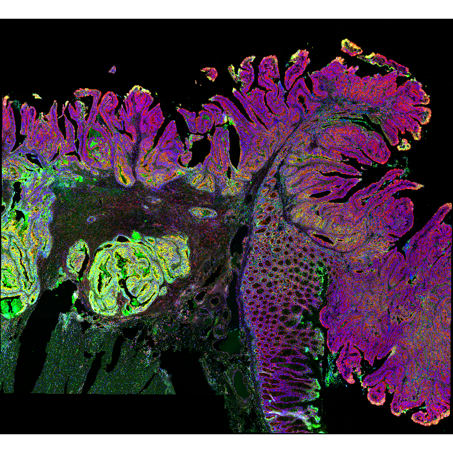
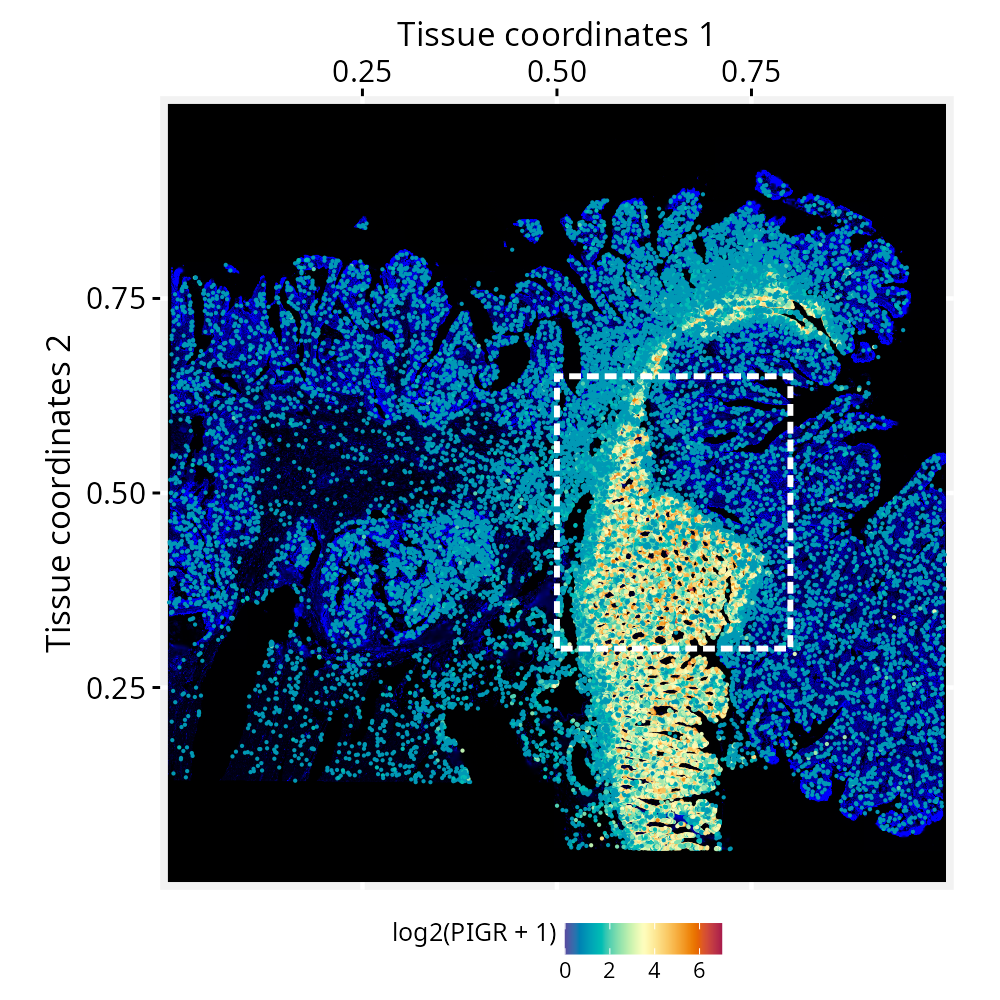
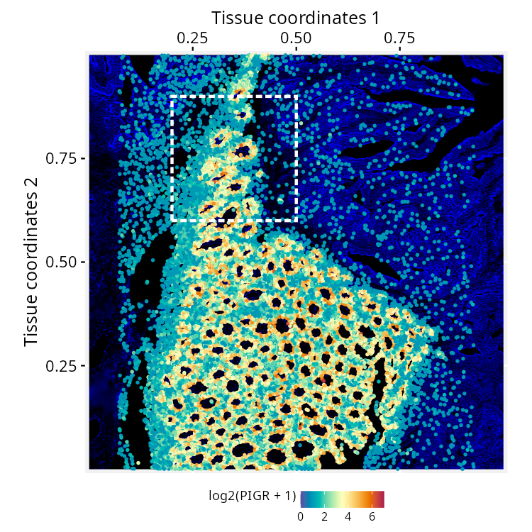
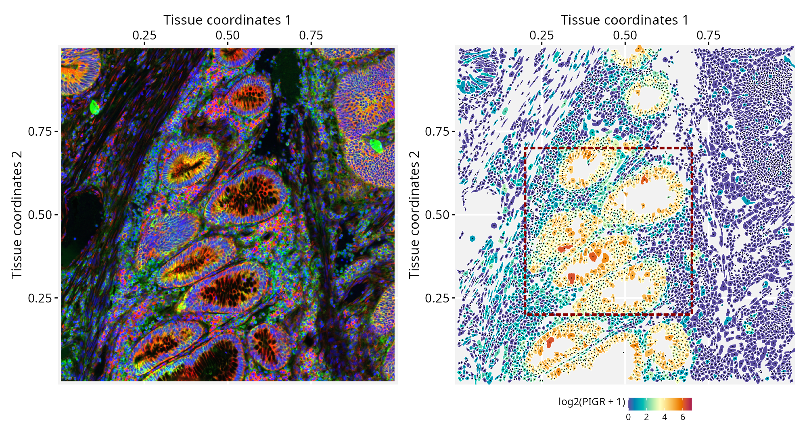

```{r setup, include=FALSE, purl=FALSE}
knitr::opts_chunk$set(
  echo = TRUE,
  collapse = TRUE,
  comment = "#>",
  fig.align = "center",
  fig.width = 7,
  fig.height = 5
  )
```

**Package**: RGraphSpace `r packageVersion('RGraphSpace')`
<br/>

# Overview

This tutorial demonstrates how *RGraphSpace* works with nested geometries and high-resolution images. We will use data from the same study on human colorectal cancer (CRC) tissue featured in our [*spatial-segmentation2*](spatial-segmentation2.html) vignette, but from the Xenium In Situ dataset [@oliveira2025]. Although this dataset targets a focused panel of ~420 genes (541 total features, including controls), it provides higher-resolution single-cell boundaries for mapping subcellular localization. To handle the large tissue image, *RGraphSpace* stores it as a lazy `SpatRaster` object and renders only the region under view, keeping memory manageable even for multi-gigapixel images.

# Before you start

This vignette assumes familiarity with [*SpatialExperiment*](https://www.bioconductor.org/packages/SpatialExperiment/){target="_blank" rel="noopener"} [@Righelli2022], particularly for handling Xenium spatial transcriptomics data.

`r fontawesome::fa("exclamation-triangle", fill = "orange")` **Note:** If you are new to *SpatialExperiment*, we recommend reviewing the OSTA's [Xenium Workflow](https://bioconductor.org/books/release/OSTA/pages/img-workflow-xenium.html){target="_blank" rel="noopener"} before proceeding.

**Computational requirement:**

* Hardware: Workstation with RAM ≥ 32 GB (≥ 64 GB for higher-resolution image levels)

* Software: R (≥4.5); RStudio recommended

# Required packages

`r fontawesome::fa("exclamation-triangle", fill = "orange")` Before proceeding, ensure that all packages described in the [*Installation Instructions*](install.html) are installed.

```{r Check required versions, eval=TRUE, message=FALSE}
# Check versions
if (packageVersion("RGraphSpace") < "1.5.4"){
  message("Need to update 'RGraphSpace' for this vignette")
  remotes::install_github("sysbiolab/RGraphSpace")
}
```

# Setting input data

```{r Load packages, eval=TRUE, message=FALSE}
# Load packages
library("RGraphSpace")
library("SpatialFeatureExperiment")
library("sf")
library("terra")
library("patchwork")
```

## Download the dataset

The **Xenium In Situ, Sample P2 CRC** dataset [@oliveira2025] is available from the [10x Genomics](https://www.10xgenomics.com/platforms/visium/product-family/dataset-human-crc) repository. The repository provides a batch download option from the terminal, using `wget` or `curl`; the `wget` command is reproduced below, selecting the relevant files for this tutorial.

```{bash Download dataset, eval=FALSE, message=FALSE, results='hide'}
# Download output files in a 'localdir' directory
wget https://cf.10xgenomics.com/samples/xenium/2.0.0/Xenium_V1_Human_Colon_Cancer_P2_CRC_Add_on_FFPE/Xenium_V1_Human_Colon_Cancer_P2_CRC_Add_on_FFPE_outs.zip

# Extract the outputs
unzip Xenium_V1_Human_Colon_Cancer_P2_CRC_Add_on_FFPE_outs.zip
```

## Loading with *SpatialFeatureExperiment*

We load the dataset with `readXenium()`, importing both the cell and nucleus segmentations, and assign unique gene symbols to the row names.

```{r , eval=FALSE, message=FALSE, results='hide', include=FALSE}
# localdir <- "~/Documents/RWork/xPackages/GraphSpace/devel/diversos/spatial_seg3/"
```

```{r , eval=FALSE, message=FALSE, results='hide'}
# Set path to data directory
localdir <- "path/to/data/directory"

# Load data from 'localdir'
sfe <- readXenium(localdir, segmentations = c("cell", "nucleus"), flip = "none")

# Assign unique symbols to rownames
rownames(sfe) <-  make.unique(rowData(sfe)$Symbol)
```

The Xenium image is a four-channel fluorescence stack, where each channel captures a different aspect of tissue morphology: DAPI (nuclei), membrane markers (cell boundaries), 18S rRNA (cytoplasm), and αSMA/Vimentin (stroma). To use it as a spatial background, we load the stack as a *SpatRaster* object, which lets us combine channels into a false-color RGB image.

```{r , eval=FALSE, message=FALSE, results='hide'}
# Xenium 'morphology_focus' is a 4-channel fluorescence image:
# [[1]] DAPI                         (nuclei)
# [[2]] ATP1A1 / E-Cadherin / CD45   (cell boundaries)
# [[3]] 18S rRNA                     (cytoplasm)
# [[4]] alphaSMA / Vimentin          (stroma)

# The downloaded image is an OME-TIFF pyramid consisting of four 
# files, each containing multiple resolution levels
bfi <- SpatialExperiment::getImg(sfe, image_id = "morphology_focus")

# Check resolution levels: 
# Smaller index = finer resolution (1L = full, 4L = coarse)
RBioFormats::read.metadata(imgSource(bfi))
#> series res sizeX sizeY sizeC sizeZ sizeT total
#> 1      1   31395 34224 4     1     1     4    
#> 1      2   15697 17112 4     1     1     4    
#> 1      3   7848  8556  4     1     1     4    
#> 1      4   3924  4278  4     1     1     4 
#> ...

# Extract one pyramid level and write it to disk at 4L
# (we used 2L resolution for the plots in this tutorial)
sri <- toSpatRasterImage(bfi, resolution = 4L)

# Read the extracted level as a SpatRaster, keeping the raster 
# data on disk until accessed
r_spat <- terra::rast(imgSource(sri))

# Quick visual check, rotated 90° clockwise. 
# We down-sample BEFORE rotating: Transforming the full-resolution 
# raster can cause a crash or memory overflow.
r_small <- terra::spatSample(r_spat, size = 4e5, 
  method = "regular", as.raster = TRUE)
terra::plotRGB(terra::trans(terra::flip(r_small, "vertical")),
  r = 3, g = 2, b = 1, stretch = "lin")
```

For this RGB image we set the fluorescence channels to show 'cytoplasm' in red, 'cell boundaries' in green, and 'nuclei' in blue.

```{r spe2_main.png, eval=FALSE, message=FALSE, echo=FALSE, include=FALSE, purl=FALSE}
# r_small <- terra::spatSample(r_spat, size = 4e6,
#   method = "regular", as.raster = TRUE)
# png("./vignettes/articles/figs_dev/spe2_main.png",
#   width = 750, height = 750)
# terra::plotRGB(terra::trans(terra::flip(r_small, "vertical")),
#   r = 3, g = 2, b = 1, stretch = "lin")
# dev.off()
```

```{r spe2_main, echo=FALSE, out.width = '90%', purl=FALSE}

```

# Creating a GraphSpace object

Convert the `SpatialFeatureExperiment` object into a `GraphSpace`.

```{r , eval=FALSE, message=FALSE, results='hide'}
# Coerce 'SpatialFeatureExperiment' to 'GraphSpace'
gs <- as.GraphSpace(sfe, assay = "counts")
```

## Attach tissue image and geometries

```{r , eval=FALSE, message=FALSE, results='hide'}
# Add tissue image
gs_image(gs) <- r_spat

# Add cell geometry 
gs_geometry(gs, "cell_geometry") <- cellSeg(sfe)

# Add nucleus geometry 
gs_geometry(gs, "nucleus_geometry") <- nucSeg(sfe)
```

Unlike datasets with pre-aligned image and coordinates, this Xenium data needs a pixel-per-micron scale factor to align the graph with the attached tissue image, converting between the node coordinates (in microns) and the image (in pixels). We derive this factor from the image's extent and dimensions: the square root of the pixel-to-micron area ratio gives pixels per micron.

```{r , eval=FALSE, message=FALSE, results='hide'}
# Image area in microns (from the spatial extent)
e <- terra::ext(r_spat)
area_microns <- (e$xmax - e$xmin) * (e$ymax - e$ymin)

# Image area in pixels (nrow x ncol)
d <- dim(r_spat)
area_pixels <- (d[1] * d[2])

# Linear scale factor: pixels per micron
lsf <- sqrt( area_pixels / area_microns )

#-- this print shows lsf computed for 4L resolution
#-- (see Xenium image load)
lsf
#> 0.5882353

# Set the scale factor on the GraphSpace object
gs_scale_factor(gs) <- lsf
```

## Normalize node and geometry coordinates

Next, we examine the spatial boundaries of the nodes relative to the image. The node coordinates fall within the image dimensions.

```{r , eval=FALSE, message=FALSE, results='hide'}
gs
#> A GraphSpace-class object for:
#> IGRAPH fec0602 UN-- 340837 0 -- 
#> + attr: x (v/n), y (v/n), name (v/c), nodeLabel (v/c), nodeSize (v/n),
#> | transcript_counts (v/n), control_probe_counts (v/n), control_codeword_counts
#> | (v/n), unassigned_codeword_counts (v/n), deprecated_codeword_counts (v/n),
#> | total_counts (v/n), cell_area (v/n), nucleus_area (v/n), sample_id (v/c),
#> | arrowType (e/n)
#> + node payload: 2 (cell_geometry, nucleus_geometry)
#> + features: 541 (ABCC8, ACP5, ACTA2, ADH1C, ...)
#> + samples: 340837 (aaaadaba-1, aaaadgga-1, ...)
#> + node spatial boundaries: raw graph
#> | x: [12, 3915] (cols)
#> | y: [11, 4277] (rows)
#> + image spatial boundaries: raw image
#> | x: [1, 3924] (cols)
#> | y: [1, 4278] (rows)
```

We normalize the node coordinates to the image space, with `norm.geometry = TRUE` so the cell and nucleus polygons are normalized alongside the nodes. We then rotate the object to match the orientation of the tissue image shown above.

```{r , eval=FALSE, message=FALSE, results='hide'}
# Normalize node coordinates to the image space
# -- this may take a few secs due to the large number of geometries!
gs <- normalizeGraphSpace(gs, mar = 0, norm.geometry = TRUE)

# Rotate to match the tissue image orientation
gs <- rotateGraphSpace(gs, clockwise = TRUE)
```

# Spatial feature visualization

```{r , eval=FALSE, message=FALSE, results='hide'}
# Inspect the data range
# log2(range(gs[["fdata"]]) + 1)

# Set color palette and data range for use across plots
cpal <- hcl.colors(100, palette = "Spectral", rev = T)
data_range <- c(0, 7)

# Set a reusable theme
my_theme <- theme_gspace_coords(theme = "th3", is_norm = TRUE, 
  xlab = "Tissue coordinates 1", ylab = "Tissue coordinates 2")
```

We now plot the full coordinate space with nodes colored by *PIGR* expression over the tissue image, and cells showing no expression made transparent. A box marks a region of interest to crop next. For this wide view, we set the background image to one channel, with 'cytoplasm' in blue.

```{r , eval=FALSE, message=FALSE, results='hide'}
# Plot node-level PIGR expression over the tissue image; 
# a box marks the region of interest
p <- ggplot(gs) + 
  annotation_gspace_image(gs, rgb_channels = c(NA, NA, 3)) + 
  geom_nodespace(mapping = aes(colour = log2(PIGR + 1), 
    alpha = as.numeric(PIGR > 0)  ), size = 0.3, pch = 19) +
  scale_colour_continuous(palette = cpal, limits = data_range) +
  scale_alpha_identity() + my_theme +
  annotate("rect", 
    xmin = 0.5, xmax = 0.8, 
    ymin = 0.3, ymax = 0.65, 
    colour = "white", fill = NA, 
    lty = "21", lwd = 1)

p
```

```{r spe2_seg1.png, eval=FALSE, message=FALSE, echo=FALSE, include=FALSE, purl=FALSE}
# ggsave(filename = "./vignettes/articles/figs_dev/spe2_seg1.png",
#   height=5, width=5, units="in", device="png", dpi=200, plot=p)
```

```{r spe_seg2, echo=FALSE, out.width = '90%', purl=FALSE}

```

As we crop into smaller regions, *RGraphSpace* re-renders the viewed window into a display canvas whose resolution is capped by `maxpixels`. Because this fixed pixel budget now covers a smaller area, zooming in yields progressively finer detail. The default works well in most cases.

```{r , eval=FALSE, message=FALSE, results='hide'}
# Current pixel budget for the display canvas (adjustable if needed)
gs_image_maxpixels(gs)
#> 4e+06

# Crop to the marked region and re-normalize coordinates to the new space
gs_crop1 <- cropGraphSpace(gs, 
  xmin = 0.5, xmax = 0.8, 
  ymin = 0.3, ymax = 0.65)
gs_crop1 <- normalizeGraphSpace(gs_crop1, mar = 0, norm.geometry = TRUE)
gs_crop1 <- rotateGraphSpace(gs_crop1, clockwise = TRUE)
```

Zooming further, a second box outlines a smaller region for a closer view.

```{r , eval=FALSE, message=FALSE, results='hide'}
# Plot the cropped region; a second box marks the next crop
p <- ggplot(gs_crop1) + 
  annotation_gspace_image(gs_crop1, rgb_channels = c(NA, NA, 3)) + 
  geom_nodespace(mapping = aes(colour = log2(PIGR + 1), 
    alpha = as.numeric(PIGR > 0)), size = 0.7, pch = 19) +
  scale_colour_continuous(palette = cpal, limits = data_range) +
  scale_alpha_identity() + my_theme +
  annotate("rect", 
    xmin = 0.2, xmax = 0.5, 
    ymin = 0.6, ymax = 0.9, 
    fill = NA, colour = "white", 
    lty = "21", lwd = 1)

p
```

```{r spe2_seg2.png, eval=FALSE, message=FALSE, echo=FALSE, include=FALSE, purl=FALSE}
# ggsave(filename = "./vignettes/articles/figs_dev/spe2_seg2.png",
#   height=5, width=5, units="in", device="png", dpi=150, plot=p)
```

```{r spe2_seg2, echo=FALSE, out.width = '90%', purl=FALSE}

```

Crop to this smaller region.

```{r , eval=FALSE, message=FALSE, results='hide'}
# Crop to the smaller region and re-normalize coordinates
gs_crop2 <- cropGraphSpace(gs_crop1, 
  xmin = 0.2, xmax = 0.5, 
  ymin = 0.6, ymax = 0.9)
gs_crop2 <- normalizeGraphSpace(gs_crop2, mar = 0, norm.geometry = TRUE)
gs_crop2 <- rotateGraphSpace(gs_crop2, clockwise = TRUE)
```

At this resolution, the real cell segmentation boundaries can be drawn side-by-side with the corresponding tissue image, alongside the node centroids. In this plot, we can observe the high-definition tissue image on the left and its correct alignment with cell segmentation on the right. The RGB image features 'cytoplasm' in red, 'cell boundaries' in green, and 'nuclei' in blue.

```{r , eval=FALSE, message=FALSE, results='hide'}
p1 <- ggplot(gs_crop2) + 
  annotation_gspace_image(gs_crop2, rgb_channels = c(3, 2, 1)) + 
  my_theme

p2 <- ggplot(gs_crop2) + 
  geom_sf( aes(geometry = cell_geometry, fill = log2(PIGR + 1) ), 
    colour = adjustcolor("white", 1)) +
  geom_nodespace(colour = "black", size = 0.1, pch = 19) +
  scale_fill_continuous(palette = cpal, limits = data_range) +
  scale_colour_identity() + my_theme +
    annotate("rect", 
    xmin = 0.2, xmax = 0.7, 
    ymin = 0.2, ymax = 0.7, 
    fill = NA, colour = "red4", 
    lty = "21", lwd = 1) 

p1 + p2
```

```{r spe2_seg3.png, eval=FALSE, message=FALSE, echo=FALSE, include=FALSE, purl=FALSE}
ggsave(filename = "./vignettes/articles/figs_dev/spe2_seg3.png",
  height=5.4, width=10, units="in", device="png", dpi=200, plot=p1 + p2)
```

```{r spe2_seg3, echo=FALSE, out.width = '100%', purl=FALSE}

```

```{r , eval=FALSE, message=FALSE, results='hide'}
# Crop to the smaller region and re-normalize coordinates
gs_crop3 <- cropGraphSpace(gs_crop2, 
  xmin = 0.2, xmax = 0.7, 
  ymin = 0.2, ymax = 0.7)
gs_crop3 <- normalizeGraphSpace(gs_crop3, mar = 0, norm.geometry = TRUE)
gs_crop3 <- rotateGraphSpace(gs_crop3, clockwise = TRUE)
```

Finally, we reach a zoom level that allows us to examine subcellular structures (left), with cell and nucleus segmentations overlaid as nested geometries (right). The cell geometries are filled according to *PIGR* expression levels, while the nucleus outlines are shown in semi-transparent black.

```{r , eval=FALSE, message=FALSE, results='hide'}
p1 <- ggplot(gs_crop3) + 
  annotation_gspace_image(gs_crop3, rgb_channels = c(3, 2, 1)) + 
  my_theme

p2 <- ggplot(gs_crop3) + 
  geom_sf( aes(geometry = cell_geometry, fill = log2(PIGR + 1) ), 
    colour = adjustcolor("white", 1)) +
  geom_sf( aes(geometry = nucleus_geometry), 
    fill = adjustcolor("black", 0.5), colour = NA) +
  scale_fill_continuous(palette = cpal, limits = data_range) +
  scale_colour_identity() + my_theme

p1 + p2
```

```{r spe2_seg4.png, eval=FALSE, message=FALSE, echo=FALSE, include=FALSE, purl=FALSE}
# ggsave(filename = "./vignettes/articles/cards/segmentation3.png",
#   height=3.5, width=3.5, units="in", device="png", dpi=200, plot=p2)
# #---
# ggsave(filename = "./vignettes/articles/figs_dev/spe2_seg4.png",
#   height=5.5, width=10, units="in", device="png", dpi=200, plot=p1 + p2)
```

```{r spe_seg4, echo=FALSE, out.width = '100%', purl=FALSE}
knitr::include_graphics("figs_dev/spe2_seg4.png")
```


```{r , eval=FALSE, message=FALSE, results='hide', include=FALSE}
# Downstream graph manipulation 

gs_crop3_subset <- gs_crop3 |> gs_subset_nodes(rank(-PIGR) <= 10)

ggplot(gs_crop3) + 
  geom_sf( aes(geometry = cell_geometry, fill = log2(PIGR + 1) ), 
    colour = adjustcolor("white", 1)) +
  geom_sf( aes(geometry = nucleus_geometry), 
    fill = adjustcolor("black", 0.5), colour = NA) +
  geom_nodespace(data=gs_crop3_subset, colour = "cyan", 
    size = 2, pch = 4, stroke = 2) +
  scale_fill_continuous(palette = cpal, limits = data_range) +
  scale_colour_identity() + my_theme

```


# Session information

```{r label='Session information', eval=TRUE, echo=FALSE}
sessionInfo()
```

# References

