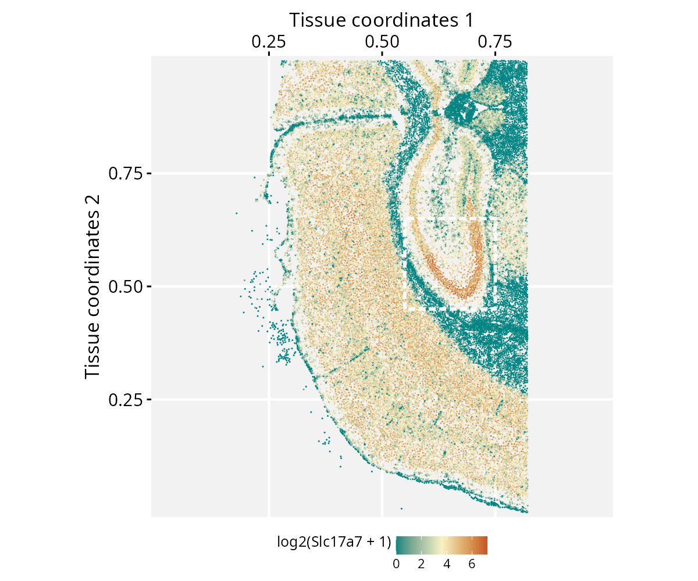

```{r setup, include=FALSE, purl=FALSE}
knitr::opts_chunk$set(
  echo = TRUE,
  collapse = TRUE,
  comment = "#>",
  fig.align = "center",
  fig.width = 7,
  fig.height = 5
  )
```

**Package**: RGraphSpace `r packageVersion('RGraphSpace')`
<br/>

# Overview

This vignette demonstrates how *RGraphSpace* renders *sf* features using spatial-segmented data pre-processed with the *Seurat* package [@Hao2024].

# Before you start

This vignette assumes familiarity with [*Seurat*](https://satijalab.org/seurat/){target="_blank" rel="noopener"} [@Hao2024], particularly for handling spatial transcriptomics data.

`r fontawesome::fa("exclamation-triangle", fill = "orange")` **Note:** If you are new to *Seurat*, we recommend reviewing its [spatial segmentation tutorials](https://satijalab.org/seurat/articles/seurat5_spatial_vignette_2){target="_blank" rel="noopener"} before proceeding.

**Computational requirement:**

* Hardware: Workstation with RAM >= 32 GB for large datasets

* Software: R (>=4.5); RStudio recommended

# Required packages

`r fontawesome::fa("exclamation-triangle", fill = "orange")` Before proceeding, ensure that all packages described in the [*Installation Instructions*](install.html) are installed.

```{r Check required versions, eval=TRUE, message=FALSE}
# Check versions
if (packageVersion("RGraphSpace") < "1.5.4"){
  message("Need to update 'RGraphSpace' for this vignette")
  remotes::install_github("sysbiolab/RGraphSpace")
}
if (packageVersion("Seurat") < "5.5.1"){
  message("Need to update 'Seurat' for this vignette")
  remotes::install_github("satijalab/Seurat")
}
```

# Setting input data

```{r Load packages, eval=TRUE, message=FALSE}
# Load packages
library("RGraphSpace")
library("Seurat")
library("SeuratObject")
library("sf")
library("patchwork")
```

## Download the dataset

We will use a dataset provided by 10x Genomics to demonstrate their [Xenium platform](https://www.10xgenomics.com/datasets/fresh-frozen-mouse-brain-for-xenium-explorer-demo-1-standard), consisting of spatial transcriptomics data from a fresh frozen mouse brain. The repository provides a batch download option from the terminal, using `wget` or `curl`; the `wget` command is reproduced below.

**The Xenium dataset can be downloaded from the 10x Genomics repository:**

* Repository URL: https://www.10xgenomics.com/datasets
* Dataset: [Fresh Frozen Mouse Brain for Xenium Explorer Demo](https://www.10xgenomics.com/datasets/fresh-frozen-mouse-brain-for-xenium-explorer-demo-1-standard){target="_blank" rel="noopener"}
* Where to find it: Output and supplemental files
* Download: "Tiny subset"
* File: Xenium_V1_FF_Mouse_Brain_Coronal_Subset_CTX_HP_outs.zip
* MD5: a39fa6d0a751db1f206c915b6419e329
* Size: 3.48 GB

```{bash Download dataset, eval=FALSE, message=FALSE, results='hide'}
# Download output files in a 'localdir' directory
wget https://cf.10xgenomics.com/samples/xenium/1.0.2/Xenium_V1_FF_Mouse_Brain_Coronal_Subset_CTX_HP/Xenium_V1_FF_Mouse_Brain_Coronal_Subset_CTX_HP_outs.zip

# Extract the outputs
unzip Xenium_V1_FF_Mouse_Brain_Coronal_Subset_CTX_HP_outs.zip
```

## Loading the dataset

```{r , eval=FALSE, message=FALSE, results='hide', include=FALSE}
# localdir <- "~/Documents/RWork/xPackages/GraphSpace/devel/diversos/spatial_seg/"
```

We load the Xenium dataset downloaded earlier, including its cell segmentation boundaries.

```{r Load dataset, eval=FALSE, message=FALSE, results='hide'}
# Set path to data directory
localdir <- "path/to/data/directory"

# Load the Xenium data
xenium.obj <- LoadXenium(localdir, fov = "fov", segmentations = "cell")
```

Seurat offers several downstream pre-processing steps at this stage, such as `SCTransform` normalization and dimensionality reduction. These are thoroughly documented in Seurat's own tutorials, so we do not repeat them here. This vignette focuses instead on using `RGraphSpace` to manipulate and visualize the segmented data directly, for which the raw data is sufficient.

```{r , eval=FALSE, message=FALSE, results='hide'}
## Optional: run the variance‐stabilizing transformation to use normalized data
# xenium.obj <- subset(xenium.obj, subset = nCount_Xenium > 0)
# xenium.obj <- SCTransform(xenium.obj, assay = "Xenium")
```

# Creating a GraphSpace object

Convert the `Seurat` object into a `GraphSpace`.

```{r , eval=FALSE, message=FALSE, results='hide'}
# Coerce 'Seurat' to 'GraphSpace'
gs <- as.GraphSpace(xenium.obj, space = "spatial", layer = "counts")
```

Extract the cell segmentation polygons from the `Seurat` object as an `sf` geometry column, attach it to the nodes, and normalize both the graph and the geometry together; since this geometry is real, spatially meaningful data (not arbitrary shapes), `normalizeGeometry()` is the right tool here, not `fitGeometry()`. We also rotate and flip the result to match the orientation used in Seurat's own related vignette.

```{r , eval=FALSE, message=FALSE, results='hide'}
# If available, add geometry
Images(xenium.obj)
cellseg <- xenium.obj[["fov"]]
cellseg <- cellseg$segmentations@polygons
cellseg <- SpatialPolygons(cellseg)
cellseg <- sf::st_as_sfc(cellseg)
cellseg <- sf::st_make_valid(cellseg)
gs_geometry(gs) <- cellseg

# Normalize graph and geometry coordinates
gs <- normalizeGraphSpace(gs, mar = 0)
gs <- normalizeGeometry(gs)

# Rotate and flip to follow Seurat's related vignette
gs <- rotateGraphSpace(gs)
gs <- flipGraphSpace(gs)
```

# Spatial feature visualization

With the full tissue now laid out, plot gene expression across all cells, marking a region of interest to zoom into next.

```{r , eval=FALSE, message=FALSE, results='hide'}
# Set color palette and data range for use across plots
cpal <- hcl.colors(100, palette = "Geyser", rev = FALSE)
data_range <- range(log2(gs[["fdata"]] + 1))

# Main plot, expression counts of a feature (Slc17a7);
# a box marks a region of interest
p <- ggplot(gs) + 
  geom_nodespace(mapping = aes(colour = log2(Slc17a7 + 1)), 
    size = 0.4, pch = 16) +
  scale_colour_continuous(palette = cpal, limits = data_range) +
  theme_gspace_coords(theme = "th3", is_norm = TRUE, 
    xlab = "Tissue coordinates 1", ylab = "Tissue coordinates 2") +
  annotate("rect", xmin = 0.55, xmax = 0.75, ymin = 0.45, ymax = 0.65, 
    fill = NA, colour = "white", lty = "21", lwd = 1)
p
```

```{r seurat_seg1.png, eval=FALSE, message=FALSE, echo=FALSE, include=FALSE, purl=FALSE}
# ggsave(filename = "./vignettes/articles/figs_dev/ggplot_seurat_seg1.png",
#   height=5, width=6, units="in", device="png", dpi=200, plot=p)
```

```{r ggplot_seurat_seg1, echo=FALSE, out.width = '100%', purl=FALSE}

```

Crop to the marked region. Cropping does not automatically re-align coordinates, so both the graph and the geometry need to be normalized again afterward.

```{r , eval=FALSE, message=FALSE, results='hide'}
# Crop the region of interest
gs_crop <- cropGraphSpace(gs, xmin = 0.55, xmax = 0.75, ymin = 0.45, ymax = 0.65)

# Re-normalize coordinates for cropping region
gs_crop <- normalizeGraphSpace(gs_crop, mar = 0)
gs_crop <- normalizeGeometry(gs_crop)

# Rotate and flip to follow the main plot orientation
gs_crop <- rotateGraphSpace(gs_crop)
gs_crop <- flipGraphSpace(gs_crop)
```

Finally, compare the two representations side by side: nodes alone versus the real cell segmentation shapes, with node centroids overlaid for reference.

```{r , eval=FALSE, message=FALSE, results='hide'}
# Plot nodes, representing cells
p1 <- ggplot(gs_crop) + 
  geom_nodespace(mapping = aes(colour = log2(Slc17a7 + 1)), 
    size = 1.5, pch = 19) +
  scale_colour_continuous(palette = cpal, limits = data_range) +
  theme_gspace_coords(theme = "th3", is_norm = TRUE, 
    xlab = "Tissue coordinates 1", 
    ylab = "Tissue coordinates 2")

# Plot geometries, representing cells
p2 <- ggplot(gs_crop) + 
  geom_sf(mapping = aes(geometry = geometry, fill = log2(Slc17a7 + 1) )) +
  scale_fill_continuous(palette = cpal, limits = data_range) +
  geom_nodespace(colour = "black", size = 0.2, pch = 19) +
  theme_gspace_coords(theme = "th3", is_norm = TRUE, 
    xlab = "Tissue coordinates 1", 
    ylab = "Tissue coordinates 2")

p1 + p2 +
  patchwork::plot_annotation(
    title = "RGraphSpace integration with sf geometries",
    theme = theme(plot.title = element_text(hjust = 0.5)))
```

```{r ggplot_seurat_seg2, eval=FALSE, message=FALSE, echo=FALSE, include=FALSE, purl=FALSE}
# ggsave(filename = "./vignettes/articles/cards/segmentation1.png",
#   height=3.5, width=3.5, units="in", device="png", dpi=200, plot=p2)
# 
# ##---
# 
# pp <- p1 + p2 +
#   patchwork::plot_annotation(
#     title = "RGraphSpace integration with sf geometries",
#     theme = theme(plot.title = element_text(hjust = 0.5)))
# ggsave(filename = "./vignettes/articles/figs_dev/ggplot_seurat_seg2.png",
#   height=5, width=10, units="in", device="png", dpi=400, plot = pp)
```

```{r seurat_seg1, echo=FALSE, out.width = '100%', purl=FALSE}
knitr::include_graphics("figs_dev/ggplot_seurat_seg2.png")
```

# Session information

```{r label='Session information', eval=TRUE, echo=FALSE}
sessionInfo()
```

# References

