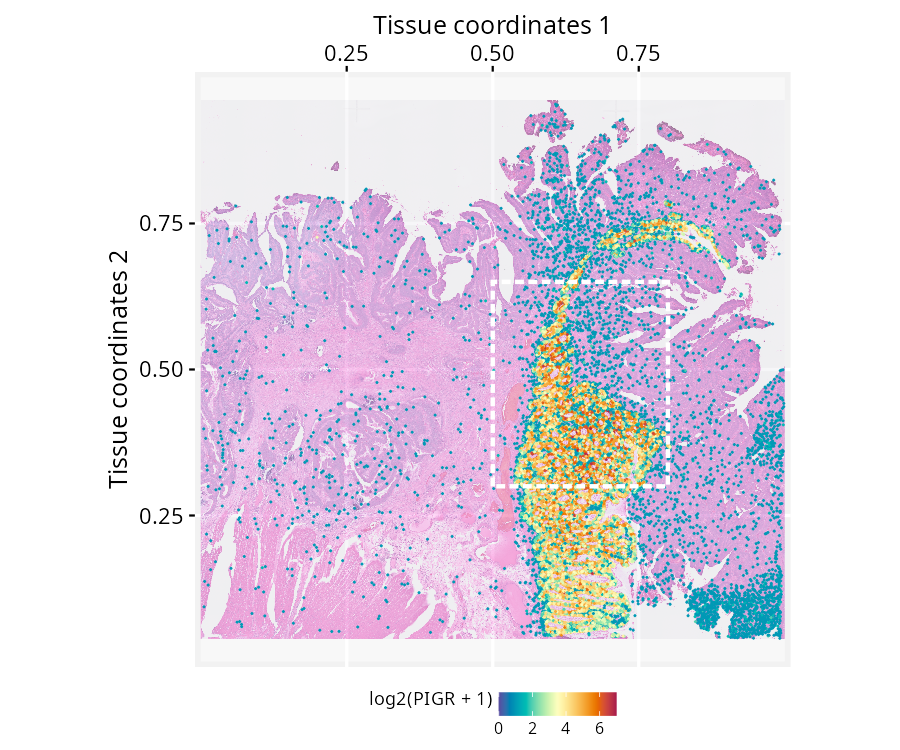
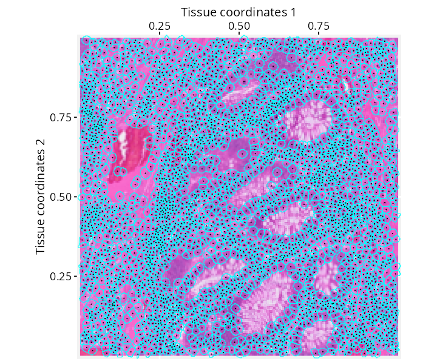

```{r setup, include=FALSE, purl=FALSE}
knitr::opts_chunk$set(
  echo = TRUE,
  collapse = TRUE,
  comment = "#>",
  fig.align = "center",
  fig.width = 7,
  fig.height = 5
  )
```

**Package**: RGraphSpace `r packageVersion('RGraphSpace')`
<br/>

# Overview
This vignette demonstrates how *RGraphSpace* renders *sf* features using spatial-segmented data pre-processed with the *SpatialExperiment* package [@Righelli2022] and OSTA [@Dong2026]. We will use a high-definition spatial transcriptomic dataset generated by @oliveira2025. This dataset consists of Visium HD spatial gene expression data from formalin-fixed paraffin-embedded (FFPE) human colorectal cancer (CRC) tissue, profiled at single-cell scale resolution (2-µm barcoded capture features) with matched cell segmentation boundaries derived from paired histology imaging.

# Before you start

This vignette assumes familiarity with [*SpatialExperiment*](https://www.bioconductor.org/packages/SpatialExperiment/){target="_blank" rel="noopener"} [@Righelli2022], particularly for handling Visium HD spatial transcriptomics data.

`r fontawesome::fa("exclamation-triangle", fill = "orange")` **Note:** If you are new to *SpatialExperiment*, we recommend reviewing the OSTA's [Visium HD Workflow](https://bioconductor.org/books/release/OSTA/pages/seq-workflow-visium-hd-seg.html){target="_blank" rel="noopener"} before proceeding.

**Computational requirement:**

* Hardware: Workstation with RAM >= 32 GB for large datasets

* Software: R (>=4.5); RStudio recommended

# Required packages

`r fontawesome::fa("exclamation-triangle", fill = "orange")` Before proceeding, ensure that all packages described in the [*Installation Instructions*](install.html) are installed.

```{r Check required versions, eval=TRUE, message=FALSE}
# Check versions
if (packageVersion("RGraphSpace") < "1.5.4"){
  message("Need to update 'RGraphSpace' for this vignette")
  remotes::install_github("sysbiolab/RGraphSpace")
}
```

# Setting input data

```{r Load packages, eval=TRUE, message=FALSE}
# Load packages
library("RGraphSpace")
library("SpatialExperiment")
library("OSTA.data")
library("VisiumIO")
library("patchwork")
library("sf")
```

## Loading the dataset

The original Visium HD dataset is available from the [10x Genomics](https://www.10xgenomics.com/platforms/visium/product-family/dataset-human-crc) repository. For convenience, we retrieve this dataset from the Open Science Framework (OSF) repository using OSTA, then load it into a `SpatialExperiment`.

```{r Download dataset, eval=FALSE, message=FALSE, results='hide'}
# Set a temporary directory for download
id <- "VisiumHD_HumanColon_Oliveira"
dir.create(td <- tempfile())

# Retrieve data from OSF repo
unzip(OSTA.data_load(id), exdir = td)

# Read into 'SpatialExperiment'
spe <- TENxVisiumHD(
  segmented_outputs = file.path(td, "segmented_outputs"),
  format = "h5", 
  images = "hires") |>
  import()

# Assign unique symbols to rownames
rownames(spe) <-  make.unique(rowData(spe)$Symbol)
```

At this point, [OSTA](https://bioconductor.org/books/release/OSTA/pages/seq-workflow-visium-hd-seg.html) provides several pre-processing recommendations, including converting to a `SpatialFeatureExperiment`, non-spatial and spatially-aware quality control, and cell type annotation. These are general best practices for preparing spatial data, already thoroughly demonstrated in the OSTA workflow itself, so we do not repeat them here. Instead, this vignette focuses on a possible downstream application using `RGraphSpace` to manipulate and visualize the segmented data directly. For this purpose, we will need only raw data.

# Creating a GraphSpace object

Convert the `SpatialExperiment` object into a `GraphSpace`.

```{r , eval=FALSE, message=FALSE, results='hide'}
# Coerce 'SpatialExperiment' to 'GraphSpace'
gs <- as.GraphSpace(spe, assay = "counts")
```

Attach the tissue image and its scale factor, then extract the cell segmentation polygons as an `sf` geometry column and attach them to the nodes.

```{r , eval=FALSE, message=FALSE, results='hide'}
# If available, add tissue image
gs_image(gs) <- SpatialExperiment::imgRaster(spe)

# This image requires to rescale node coordinates to its resolution
gs_scale_factor(gs) <- scaleFactors(spe, image_id = "hires")

# If available, add geometry
cellseg <- metadata(spe)$cellseg
cellseg <- cellseg$geometry[match(gs$name, cellseg$cell_id)]
gs_geometry(gs, "cellseg") <- sf::st_make_valid(cellseg)
```

Next, we examine the spatial boundaries of the nodes relative to the image. Some coordinates in this dataset fall outside the valid image range (e.g., negative values), a known artifact of tissue sampling at subcellular resolution (2 µm), where bins can extend beyond the tissue boundaries. The OSTA workflow addresses a related issue for some operations, filtering out bins that overlay empty tissue (see the [setup section](https://bioconductor.org/books/release/OSTA/pages/seq-workflow-visium-hd-bin.html)). These out-of-bounds nodes must also be removed here before the graph is normalized to the image space.

```{r , eval=FALSE, message=FALSE, results='hide'}
gs
#> A GraphSpace-class object for:
#> IGRAPH eed9b8c UN-- 220703 0 -- 
#> + attr: x (v/n), y (v/n), name (v/c), nodeLabel (v/c), nodeSize (v/n), 
#> | sample_id (v/c), arrowType (e/n)
#> + node payload: 2 (map, cellseg)
#> + features: 18132 (SAMD11, NOC2L, KLHL17, PLEKHN1, ...)
#> + samples: 220703 (cellid_000000003-1, cellid_000000004-1, ...)
#> + node spatial boundaries: raw graph
#> | x: [3237, 5199] (cols)
#> | y: [-1, 1810] (rows)
#> + image spatial boundaries: raw image
#> | x: [1, 6000] (cols)
#> | y: [1, 3886] (rows)
```

```{r , eval=FALSE, message=FALSE, results='hide'}
# Remove out-of-bounds nodes
gs <- gs[gs$y > 1, ] 

# Normalize node coordinates to the image space
gs <- normalizeGraphSpace(gs, mar = 0, equal.mar = TRUE) 
```

# Spatial feature visualization

```{r , eval=FALSE, message=FALSE, results='hide'}
# Inspect the data range
# log2(range(gs[["fdata"]]) + 1)

# Set color palette and data range for use across plots
cpal <- hcl.colors(100, palette = "Spectral", rev = T)
data_range <- c(0, 7)

# Set a reusable theme
my_theme <- theme_gspace_coords(theme = "th3", is_norm = TRUE, 
  xlab = "Tissue coordinates 1", ylab = "Tissue coordinates 2")
```

Plot the full tissue, nodes colored by *PIGR* expression over the tissue image, with cells showing no expression made transparent. A box marks a region of interest to crop next.

```{r , eval=FALSE, message=FALSE, results='hide'}
# Plot node-level PIGR expression over the tissue image; 
# a box marks the region of interest
p <- ggplot(gs) + 
  annotation_gspace_image(gs, opacity = 0.5) +
  geom_nodespace(mapping = aes(colour = log2(PIGR + 1), 
      alpha = as.numeric(PIGR > 0)  ), size = 0.3, pch = 19) +
  scale_colour_continuous(palette = cpal, limits = data_range) +
  scale_alpha_identity() + my_theme +
  annotate("rect", 
    xmin = 0.5, xmax = 0.8, 
    ymin = 0.3, ymax = 0.65, 
    fill = NA, colour = "white",
    lty = "21", lwd = 1)

p
```

```{r spe1_seg1.png, eval=FALSE, message=FALSE, echo=FALSE, include=FALSE, purl=FALSE}
# ggsave(filename = "./vignettes/articles/figs_dev/spe1_seg1.png",
#   height=5, width=6, units="in", device="png", dpi=150, plot=p)
```

```{r spe1_seg1, echo=FALSE, out.width = '100%', purl=FALSE}

```

Crop to the marked region and re-normalize node coordinates to the new space.

```{r , eval=FALSE, message=FALSE, results='hide'}
# Crop to the marked region and re-normalize coordinates
gs_crop1 <- cropGraphSpace(gs, 
  xmin = 0.5, xmax = 0.8, 
  ymin = 0.3, ymax = 0.65)
gs_crop1 <- normalizeGraphSpace(gs_crop1, mar = 0)
```

Zooming further, a second box marks a smaller region for a closer crop.

```{r , eval=FALSE, message=FALSE, results='hide'}
# Plot the cropped region; a second box marks a smaller region for a closer crop
p <- ggplot(gs_crop1) + 
  annotation_gspace_image(gs_crop1, opacity = 0.5) +
  geom_nodespace(mapping = aes(colour = log2(PIGR + 1), 
      alpha = as.numeric(PIGR > 0)), size = 0.7, pch = 19) +
  scale_colour_continuous(palette = cpal, limits = data_range) +
  scale_alpha_identity() + my_theme +
  annotate("rect", 
    xmin = 0.2, xmax = 0.5, 
    ymin = 0.5, ymax = 0.8, 
    fill = NA, colour = "white", 
    lty = "21", lwd = 1)

p
```

```{r spe1_seg2.png, eval=FALSE, message=FALSE, echo=FALSE, include=FALSE, purl=FALSE}
# ggsave(filename = "./vignettes/articles/figs_dev/spe1_seg2.png",
#   height=5, width=6, units="in", device="png", dpi=150, plot=p)
```

```{r spe1_seg2, echo=FALSE, out.width = '100%', purl=FALSE}
knitr::include_graphics("figs_dev/spe1_seg2.png")
```

Crop to this smaller region. This time, the geometry is also explicitly re-normalized, since it will be plotted directly in the next steps rather than just the node markers.

```{r , eval=FALSE, message=FALSE, results='hide'}
# Crop to the smaller region and re-normalize coordinates, including the geometry
gs_crop2 <- cropGraphSpace(gs_crop1, 
  xmin = 0.2, xmax = 0.5, 
  ymin = 0.5, ymax = 0.8)
gs_crop2 <- normalizeGraphSpace(gs_crop2, mar = 0)
gs_crop2 <- normalizeGeometry(gs_crop2, name = "cellseg")
```

At this resolution, the real cell segmentation boundaries can be drawn directly over the tissue image, alongside the node centroids. In this plot, we can observe the correct alignment between the geometry and the image.

```{r , eval=FALSE, message=FALSE, results='hide'}
# Plot segmentation boundaries over the tissue image, with node centroids
p <- ggplot(gs_crop2) + 
  annotation_gspace_image(gs_crop2, opacity = 1) +
  geom_sf( aes(geometry = cellseg), fill = NA, 
    linewidth = 0.3, colour = "cyan") +
  geom_nodespace(colour = "black", size = 0.1, pch = 19) +
  scale_fill_continuous(palette = cpal, limits = data_range) +
  my_theme
p
```

```{r spe1_seg3.png, eval=FALSE, message=FALSE, echo=FALSE, include=FALSE, purl=FALSE}
# ggsave(filename = "./vignettes/articles/figs_dev/spe1_seg3.png",
#   height=5, width=6, units="in", device="png", dpi=120, plot=p)
```

```{r spe1_seg3, echo=FALSE, out.width = '100%', purl=FALSE}

```

Finally, fill each cell's own segmented shape by its *PIGR* expression directly, with the tissue image dropped now that the shapes themselves carry the spatial detail.

```{r , eval=FALSE, message=FALSE, results='hide'}
# Fill each segmented shape by PIGR expression
p <- ggplot(gs_crop2) + 
  geom_sf( aes(geometry = cellseg, fill = log2(PIGR + 1) ), 
    colour = adjustcolor("white", 1)) +
  geom_nodespace(colour = "black", size = 0.1, pch = 19) +
  scale_fill_continuous(palette = cpal, limits = data_range) +
  scale_colour_identity() + my_theme
p
```

```{r spe1_seg4.png, eval=FALSE, message=FALSE, echo=FALSE, include=FALSE, purl=FALSE}
# ggsave(filename = "./vignettes/articles/cards/segmentation2.png",
#   height=3.5, width=3.5, units="in", device="png", dpi=200, plot=p)
# 
# ##---
# ggsave(filename = "./vignettes/articles/figs_dev/spe1_seg4.png",
#   height=5, width=6, units="in", device="png", dpi=150, plot=p)
```

```{r spe1_seg4, echo=FALSE, out.width = '100%', purl=FALSE}
knitr::include_graphics("figs_dev/spe1_seg4.png")
```


# Coercing *SpatialExperiment* objects {#sp-coercion}

Rather than relying on the `as.GraphSpace(spe, ...)` coercion method used earlier, a `GraphSpace` can also be built manually from a `SpatialExperiment`'s individual components. This mirrors what the coercion method does internally, and offers more direct control over what gets included and how. Note in particular that the expression matrix is attached to a dedicated `@fdata` slot via `gs_fdata()`, rather than merged into the node table, keeping the high-dimensional features available for aesthetic mapping without being treated as node attributes.

```{r , eval=FALSE, message=FALSE, results='hide'}
# Extract tissue coordinates
coords <- spatialCoords(spe)
colnames(coords) <- c("x", "y")

# Extract cell data
cdata <- colData(spe)

# Merge coordinates and cdata using common cell identifiers
ids <- intersect(rownames(coords), rownames(cdata))
coords <- cbind(coords[ids, ], cdata[ids, ])

# Construct a GraphSpace object
gs <- as.GraphSpace(coords)

# If available, add high-dimensional feature data
# Stored separately for lazy aesthetic mapping
gs_fdata(gs) <- as(SummarizedExperiment::assay(spe, "counts"), "dgCMatrix")

# If available, add tissue image and set a scale factor to node coordinates 
gs_image(gs) <- SpatialExperiment::imgRaster(spe)
gs_scale_factor(gs) <- scaleFactors(spe, image_id = "hires")

# If available, add geometry
cellseg <- metadata(spe)$cellseg
cellseg <- cellseg$geometry[match(gs$name, cellseg$cell_id)]
gs_geometry(gs, "cellseg") <- sf::st_make_valid(cellseg)
```

# Session information

```{r label='Session information', eval=TRUE, echo=FALSE}
sessionInfo()
```

# References

